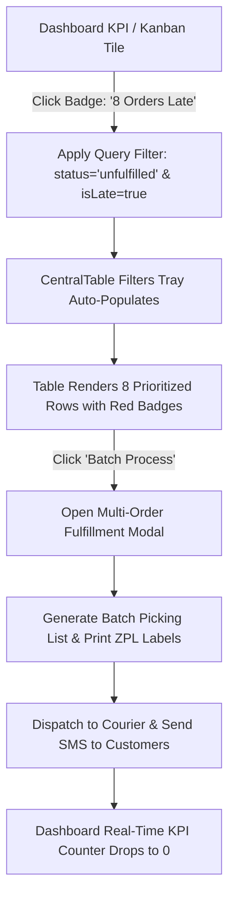

# VOLTMART — COMPLETE BUSINESS PLAN
## Full Operating Manual | Abdullah Al Sakib | Bangladesh | 2026

> **This is a single self-contained file containing the entire VoltMart business plan.**
> No external links required. Everything is here.
>
> Total content: ~10,000 lines covering every part of running a modern
> e-commerce business in Bangladesh — from company registration to
> delivering a product and handling a return.

---

## TABLE OF CONTENTS

- [SECTION 1: Legal, Compliance & Banking](#section-1--legal-compliance--banking)
- [SECTION 2: E-Commerce Master Roadmap (85 Chapters)](#section-2--e-commerce-master-roadmap)
- [SECTION 3: Product Deep Research — Standards & Integration](#section-3--product-deep-research)
- [SECTION 4: Odoo ERP — Full Business Journey](#section-4--odoo-erp--full-business-journey)
- [SECTION 5: Enterprise Admin Dashboard — Deep Research & VoltMart Implementation Blueprint](#section-5--enterprise-admin-dashboard-deep-research--voltmart-implementation-blueprint)
- [SECTION 6: Next.js & React World-Class Engineering & Performance Optimization Blueprint](#section-6--nextjs--react-world-class-engineering--performance-optimization-blueprint)

---


---
---

# SECTION 1 — LEGAL, COMPLIANCE & BANKING
### Trade License · TIN · BIN · IRC · LC · T&C · Privacy Policy · Insurance · CA · Lawyer

# LEGAL, COMPLIANCE & BANKING — COMPLETE GUIDE
## VoltMart Electronics | Bangladesh | All 7 Professional Gaps Resolved

> Laws referenced: Digital Commerce Operational Guidelines (2021),
> Consumer Rights Protection Act (2009), Cyber Security Act (2023),
> ICT Act (2006), VAT & SD Act (2012), Bangladesh Labour Act (2006).
>
> Format: Step-by-step. Self-service steps marked SELF. Professional-execution steps marked PRO-EXEC.

---

## REGISTRATION SEQUENCE (Do in order — each needs the previous)

```
Step 1: Trade License       City Corporation         Day 1-7    SELF
Step 2: e-TIN               NBR Online               Day 1      SELF (15 min)
Step 3: BIN (VAT)           NBR Online               Day 3-7    SELF
Step 4: IRC                 CCI&E Online             Day 5-10   SELF
Step 5: Bank account + LC   AD Bank branch           Day 10+    SELF + PRO-EXEC
Step 6: Chamber membership  DCCI / FBCCI             Day 7-14   SELF
Step 7: BTRC vendor         BTRC OSS                 Day 14-44  SELF
Total: 2-6 weeks
```

---

## STEP 2: Trade License

```
Issuing body: Your City Corporation (DNCC/DSCC for Dhaka)
Online: dncc.gov.bd (North Dhaka) | dscc.gov.bd (South Dhaka)

Documents (scan to PDF):
  NID front + back
  Passport-size photo (white background)
  Address proof: utility bill in your name OR rent agreement
  For limited company: Incorporation cert + MOA + AOA

Steps (DNCC online):
  1. dncc.gov.bd > Services > Trade License > Create account (OTP)
  2. New Application
  3. Business name: VoltMart Electronics
     Type: Trading/E-commerce
     Goods: Electronics, Mobile Phones, Laptops, Accessories
     Address: your registered address
  4. Upload documents (PDF, max 2MB each)
  5. Pay: 2,000-5,000 BDT (bKash/Nagad/online banking)
  6. Approval: 3-7 working days
  7. Download PDF certificate

Renewal: Every year before June 30
Late penalty: 1,000 BDT + 2x fee
```

---

## STEP 3: e-TIN (15 minutes, completely free)

```
URL: https://secure.incometax.gov.bd/registration/signup

Steps:
  1. Click Registration > New Registration
  2. Select: Resident Individual (sole proprietor) or Company
  3. Enter NID + date of birth + mobile (OTP)
  4. Create password
  5. Fill: business name, address, nature of business
  6. Submit > TIN certificate generated INSTANTLY
  7. Download PDF

Format: 12-digit number (e.g., 123456789012)
```

---

## STEP 4: BIN / VAT Registration (Online, No Office Visit Needed)

```
URL: https://www.vat.gov.bd

Pre-requisites:
  Trade License, e-TIN, NID, address proof, passport photo,
  bank account details, rent agreement (if rented)

Steps:
  1. Sign Up > mobile + email OTP > create password
  2. Log in > Registration/Enlistment > Form VAT 2.1

  Section A - Business Info:
    Business Name: VoltMart Electronics
    Trade Name: VoltMart
    Type: Sole Proprietorship or Private Ltd.
    Nature: Trading in Electronics
    Commencement date: your actual start date

  Section B - Owner:
    Name, NID, address, mobile, email

  Section C - Premises:
    Your registered address, Own/Rented, floor area

  Section D - Turnover:
    Expected annual sales (estimate 1st year)
    > 50 lakh BDT: mandatory full VAT registration
    30-50 lakh: turnover enlistment (but register for full VAT anyway)

  Section E - Bank:
    Bank name, branch, account number

  3. Upload: Trade License, TIN, NID, photo, bank statement, rent agreement
  4. Submit
  5. Possible site visit by VAT officer (just be available, show documents)
  6. Receive BIN in 3-15 working days (13-digit: XXXXXXXXX-XXXX)
  7. Download BIN certificate PDF

Display BIN on: all invoices, website footer, VAT invoices

BIN enables:
  Issue valid Mushak 6.3 VAT invoices
  Claim input tax credit
  Import goods / open LC
  List on Daraz as VAT-registered seller
  Apply for IRC
  Win government tenders
```

---

## STEP 5: IRC (Import Registration Certificate)

```
URL: https://olm.ccie.gov.bd

Pre-requisites:
  Trade License, e-TIN, BIN, NID, passport photo
  Bank solvency certificate (bank issues same day — just ask)
  Chamber of Commerce membership (see below)
  For company: Incorporation cert + MOA + AOA

CHAMBER MEMBERSHIP (required for IRC):
  DCCI: dcci.org.bd | 5,000-25,000 BDT/year | 3-5 days
  Documents: Trade License, TIN, NID, photo
  FBCCI: fbcci.com.bd (more prestigious, slightly costlier)

IRC Steps:
  1. olm.ccie.gov.bd > Create account > OTP
  2. New Application > IRC > Commercial IRC
     (Commercial = buy and resell; Industrial = you manufacture)
  3. Fill: business details, goods to import, import ceiling
     Electronics SME: USD 5,000-50,000/year ceiling
  4. Upload all documents (PDF, max 2MB each)
  5. Pay fee online:
       Up to $10,000/year: 5,000 BDT
       Up to $50,000/year: 7,500 BDT
       Up to $100,000/year: 10,000 BDT
     (Verify exact fee on portal — may change)
     Payment: Sonali Bank ePay, bKash, online banking
  6. Submit > save tracking number
  7. Processing: 4-7 working days
  8. Download IRC PDF from portal

Renewal: Every year by December 31
Late renewal: double fee + possible cancellation
```

---

## STEP 6: Bank Account & Letter of Credit

### Business bank account

```
Best BD banks for trade finance:
  BRAC Bank:            strong SME, good LC rates (16221)
  Dutch-Bangla Bank:    good international trade desk (16216)
  City Bank:            good SWIFT network (19002)
  Southeast Bank:       active trade finance
  Standard Chartered:   best international, most expensive

Documents for bank account:
  Trade License (original + copy)
  TIN Certificate
  BIN Certificate
  IRC (if available)
  NID (original + copy)
  2 passport photos
  For company: Board resolution + MOA + AOA + Incorporation cert
  Minimum deposit: 50,000 BDT (varies by bank)

Open: Current Account (for transactions) + FC Account (for USD/EUR)
```

### Letter of Credit — PRO-EXEC (Bank Handles; You Prepare Data)

```
What you prepare BEFORE going to bank:

1. Pro-forma Invoice (PI) from supplier — must show:
   Seller name, address, SWIFT code, bank account number
   Buyer: VoltMart Electronics [your full address]
   Goods: exact description + model number
   HS Code: e.g., 8517.13.00 (smartphones)
   Quantity and unit price (USD)
   Total value
   Incoterm: CIF Chittagong or FOB Incheon
   Payment: LC at sight
   Shipment date

2. IRC, BIN, TIN, Trade License, Passport

At the bank:
  Fill LC application form with relationship manager
  Key fields you specify:
    Beneficiary: [supplier full details]
    Amount: USD [total value]
    Validity: 90 days
    Shipment from: [origin port]
    Shipment to: Chittagong
    Documents required from supplier:
      Bill of Lading (or Airway Bill)
      Commercial Invoice
      Packing List
      Certificate of Origin
      Insurance Certificate
      BTRC approval certificate
    Payment: at sight

Cash margin: Bank blocks 25-50% of LC value in your account
  On $15,480 LC: 3,870-7,740 USD blocked (returned after settlement)

LC charges (approximate):
  Opening: 0.15% of LC value (min $50)
  SWIFT: $30-50
  Document handling: $50
  Total for $15,480 LC: ~$100-150

Alternative to LC:
  TT (Wire Transfer): faster, cheaper, trusted suppliers only
  Open Account (allowed by Bangladesh Bank until Dec 2029):
    Supplier ships first, you pay within agreed terms
```

---

## STEP 7: Terms & Conditions — Full BD-Compliant Template

### Laws your T&C must comply with

```
Digital Commerce Operational Guidelines 2021:
  MANDATORY disclosures:
  - Business name + registered address
  - Trade license number
  - Contact: phone + email + physical address
  - Delivery timeline: dispatch within 48 hours, delivery 5-10 days
  - Return/refund: timeline within 10 days
  - Payment methods
  - VAT information

Consumer Rights Protection Act 2009: honest product descriptions
Contract Act 1872: contract validity
ICT Act 2006: electronic contract enforceability
Cyber Security Act 2023: data handling obligations
```

### COPY-PASTE T&C TEMPLATE

```
TERMS & CONDITIONS — VOLTMART ELECTRONICS
Last Updated: [DD Month YYYY]

1. COMPANY INFORMATION
Business Name: VoltMart Electronics
Trade License No: [Insert number]
VAT/BIN: [Insert BIN]
TIN: [Insert TIN]
Address: [Full address], Dhaka, Bangladesh
Email: support@voltmart.io | Phone: [Number]
Hours: Saturday-Thursday, 9:00 AM - 9:00 PM

2. ACCEPTANCE
By using voltmart.io you agree to these Terms. These form a binding
agreement under the ICT Act 2006 and Contract Act 1872.

3. PRODUCTS & PRICING
3.1 All prices in BDT, inclusive of applicable VAT (15%).
3.2 Prices may change without notice. Order price is locked at
    time of confirmed order.
3.3 Obvious pricing errors (e.g., laptop for 100 BDT): we may
    cancel order and issue full refund, notifying you immediately.
3.4 In-stock status is real-time. If last unit sells simultaneously,
    we notify within 24 hours and offer refund or backorder.

4. ORDERING
4.1 After order: confirmation email within 5 min + WhatsApp within 10 min.
    These confirm receipt, not shipment. Order accepted only on dispatch.
4.2 Cancellation (by you): free if status is "Processing" (before packing).
    Request via: account page, email, or phone. After dispatch: use returns.
4.3 Cancellation (by VoltMart): if payment unverified, stock unavailable,
    suspected fraud, or unserviceable address. Full refund within 3 days.

5. PAYMENT
5.1 Methods: bKash, Nagad, Rocket, Visa, Mastercard, AMEX, online banking, COD.
5.2 COD: requires phone/WhatsApp confirmation within 2 hours. Not available
    for orders above 50,000 BDT, previous-rejection customers, or restricted areas.
5.3 Security: all payments via SSL-secured gateways. No card data stored.
5.4 EMI: 0% EMI on eligible cards (3/6/12 months), subject to bank approval.
    EMI fee (if any) disclosed at checkout.

6. DELIVERY
(Per Digital Commerce Operational Guidelines 2021)
6.1 Dispatch: within 48 hours of order confirmation.
    Delivery estimate:
      Dhaka City: 1-2 business days
      Dhaka Division: 2-3 business days
      Chittagong/Sylhet/Rajshahi: 3-5 business days
      Remote areas: 5-10 business days
6.2 Delivery attempts: 3 attempts. After 3 failures: returned to us.
    Re-delivery: at re-delivery charge OR refund (minus shipping).
6.3 Orders above 10,000 BDT: recipient signature required.
6.4 Free delivery on orders above [threshold]. Express available at extra charge.

7. RETURNS & REFUNDS
7.1 Window: 7 calendar days from delivery for:
    Manufacturing defects, wrong product, dead on arrival (DOA),
    significantly different from description.
7.2 Not eligible: broken seals, used hygiene products, customer damage,
    missing original packaging/accessories.
7.3 Process:
    1. Contact within 7 days: returns@voltmart.io or [phone]
    2. Provide: order number, reason, photos/video of defect
    3. Review within 24 business hours
    4. If approved: free pickup within 2 business days
    5. Inspection on receipt (1-2 days) > refund/replacement confirmed
7.4 Refund timelines:
    bKash/Nagad: 3 business days
    Card: 5-10 business days (card network)
    Bank transfer: 5 business days
    Store credit: 24 hours (optional: 5% bonus)
7.5 Warranty: manufacturer warranty at authorized service center.
    We assist with logistics.

8. INTELLECTUAL PROPERTY
All website content owned by VoltMart or licensors. No copying without written
permission. Product images may be manufacturer copyright.

9. LIMITATION OF LIABILITY
To the extent permitted by BD law:
  No liability for indirect/consequential damages.
  Total liability capped at: amount paid for the specific product.
  Not liable for courier delays, natural disasters, government actions.
  Not liable for customer-modified products.

10. DISPUTE RESOLUTION
10.1 Contact us first: support@voltmart.io | [phone]
     We resolve 95%+ of issues within 48 hours.
10.2 Consumer Rights: DNCRP (dncrp.gov.bd | 16122)
10.3 Governing law: Bangladesh. Jurisdiction: courts of Dhaka.

11. CHANGES
Changes posted with updated date. Continued use = acceptance.
Significant changes: email notification to registered users.
```

---

## STEP 8: Privacy Policy — Full BD-Compliant Template

```
PRIVACY POLICY — VOLTMART ELECTRONICS
Last Updated: [DD Month YYYY]

1. WHO WE ARE
VoltMart Electronics | [Address], Dhaka, Bangladesh
Privacy contact: privacy@voltmart.io

2. DATA WE COLLECT
You provide:
  Name, email, phone/WhatsApp, delivery addresses,
  DOB (optional), payment method (NOT card numbers — never stored)

Automatic:
  IP address, browser type, pages visited, device type, referrer, cookies

Transactions:
  Order history, returns, support communications

3. HOW WE USE IT
  Processing orders:         Contract performance
  Delivery:                  Contract performance
  Customer support:          Contract performance
  Fraud prevention:          Legitimate interest
  Marketing (opted-in only): Consent
  Website improvement:       Legitimate interest
  Tax/legal compliance:      Legal obligation

We do NOT sell your data. We do NOT use it for undisclosed purposes.

4. WHO WE SHARE WITH
  Couriers (Steadfast/Pathao/DHL): name, address, phone only
  Payment processors (SSLCommerz/bKash): amount, transaction ID
  Email platform (Klaviyo): email + purchase history
  Support (Freshdesk): name, email, order info
  Government: only if legally required

5. RETENTION
  Order data: 7 years (BD accounting law)
  Account data: active + 3 years after deletion
  Marketing data: until unsubscribe
  Support tickets: 3 years after close
  Server logs: 90 days

6. YOUR RIGHTS
  Access: email privacy@voltmart.io for a copy of your data
  Correct: update profile anytime in your account
  Delete: request via privacy@voltmart.io
          (Note: order records kept 7 years — BD law requirement)
  Opt out: unsubscribe link in every marketing email
  Response time: 30 days

7. COOKIES
  Essential: login, cart, preferences (cannot disable)
  Analytics: page views, sources (can opt out)
  Marketing: Facebook Pixel, Google Ads (can opt out)
  Consent banner on first visit: Accept All / Essential Only / Customize
  Preference stored 365 days.

8. SECURITY
  HTTPS/TLS 1.3 on all pages
  Passwords: bcrypt hashed, never stored plain text
  Database access controls + regular audits
  Data breach: you notified within 72 hours

9. CHILDREN
  Not directed to under-13. Contact privacy@voltmart.io if concerned.

10. CHANGES
  Material changes: 30 days email notice before effect.
  Continued use = acceptance.

11. CONTACT
  privacy@voltmart.io | [phone] | Sat-Thu 9am-9pm
```

---

## STEP 9: Insurance — Step-by-Step Process

### Marine Cargo Insurance (required for each import LC)

```
Providers in Bangladesh:
  Sadharan Bima Corp (SBC): sbc.gov.bd | 02-9553564 (government, reliable)
  Green Delta Insurance:     greendeltainsurance.com | 02-9891555
  Reliance Insurance:        relianceinsurance.com.bd

How to buy (call or visit branch):
  1. Call insurer > say: "I need marine cargo insurance for an import"
  2. Provide:
       Company name, trade license number
       What you're importing (electronics, model type)
       Origin country (South Korea, China, etc.)
       Destination: Chittagong or Dhaka airport
       Total CIF value (USD)
       Mode: air freight or sea freight
  3. Get: Cover Note immediately (this is what bank needs for LC)
  4. Premium: 0.5-1% of CIF value
       USD 15,480 shipment = 850-1,700 BDT premium
  5. After shipment arrives: insurer issues full policy certificate
  6. Keep: for 2 years (needed for any future claim)

Claim if lost/damaged:
  1. Report to insurer within 3 days of discovering damage
  2. Submit: policy certificate, AWB or BL, commercial invoice,
             damage photos, surveyor's report (insurer sends surveyor)
  3. Settlement: 2-4 weeks

Open/Blanket policy (recommended if importing monthly):
  One policy covers all shipments for 12 months
  Simpler: just notify insurer per shipment, no new policy each time
  Slightly higher premium: 0.7-1.2% of declared value
```

### Stock/Inventory Insurance (annual)

```
Contact: Green Delta or Sadharan Bima > "stock/fire insurance"

Tell them:
  Warehouse address
  Maximum stock value (e.g., 50 lakh BDT)
  Type of goods: electronics
  Building type: RCC (concrete) building = lower premium than temporary
  Security: CCTV yes/no, guard yes/no, type of locks

Premium: 0.3-0.8% of insured value per year
  50 lakh stock: 15,000-40,000 BDT/year

Claim (theft/fire):
  File GD (General Diary) at nearest police station immediately
  Call insurer within 24 hours
  Do NOT move or touch damaged goods
  Insurer sends surveyor to photograph
  Submit: GD copy, stock records/invoices, survey report
  Settlement: 3-6 weeks
```

---

## STEP 10: Chartered Accountant — Scope, Hiring, Monthly Handoff

### What YOU do in Odoo (no CA needed)

```
Daily:
  Record sales invoices (Accounting > Customer Invoices > New)
  Record purchase bills (Accounting > Vendor Bills > New)
  Record payments (match to invoices)

Monthly:
  Bank reconciliation: Accounting > Dashboard > Reconcile
  Payroll: HR > Payroll > Create Payslips for all employees

Reporting:
  Export Tax Report: Accounting > Reporting > Tax Report
  Export P&L: Accounting > Reporting > Profit & Loss
  Export Balance Sheet: Accounting > Reporting > Balance Sheet
```

### What CA MUST do (professional legal requirement)

```
PRO-EXEC:
  Monthly VAT return: files Mushak 9.1 on vat.gov.bd with licensed credentials
  Annual income tax return: signs with CA license number
  TDS (source tax) reconciliation + return filing
  Advance tax calculation + payment voucher
  If audited by NBR: represents you, responds to notices
  If revenue > 5 crore BDT: mandatory statutory audit (CA audits your books)
```

### Finding and briefing a CA

```
Find: icab.org.bd > Member Directory > Search "Dhaka" + "commerce"

Questions to ask before hiring:
  "Do you work with e-commerce businesses?"
  "Familiar with Odoo or can you work with our data exports?"
  "Filed VAT returns for online retailers before?"
  "Monthly fee for our scale?"
  "Available on WhatsApp for quick questions?"

Fees (monthly):
  GMV < 50 lakh: 8,000-15,000 BDT/month
  GMV 50L-2Cr:  15,000-30,000 BDT/month
  GMV > 2Cr:    30,000-60,000+ BDT/month

What to send CA by 10th of every month:
  Odoo Tax Report PDF (export from Odoo)
  All purchase bills (Mushak 6.3) for the month
  All sales invoices for the month
  Bank statements (all accounts, full month)
  Cash book (if any cash transactions)
  Signed payroll register
  Any new fixed assets purchased
  Any import documents + customs duty challans
```

---

## STEP 11: Lawyer — Scope, Templates, Hiring

### Documents lawyer must review (PRO-EXEC)

```
T&C + Privacy Policy:
  Use the templates above as your DRAFT
  Lawyer verifies: liability clauses, BD-specific enforceability,
  Cyber Security Act 2023 compliance
  Cost: 15,000-30,000 BDT (one-time)

Employment contracts:
  Must comply with Bangladesh Labour Act 2006
  Template from lawyer: reuse for all staff hires
  Cost: 10,000-20,000 BDT (one-time template)

Supplier/distributor agreements:
  Before signing Samsung or any brand authorization
  Lawyer checks: your obligations, termination rights, liability
  Cost: 20,000-50,000 BDT per agreement

Warehouse lease:
  Before signing multi-year lease
  Lawyer checks: exit clause, rent escalation cap, force majeure
  Cost: 10,000-20,000 BDT
```

### Finding a lawyer

```
Specialist firms (e-commerce / ICT law in BD):
  Tahmidur Rahman Remura Wahid (TRW): tahmidurrahman.com
  Mahbub & Associates: Dhaka
  DLAW Associates: Dhaka

Bar Council directory: barcouncil.org.bd

Approach: send them the templates from this document
  "Please review and adjust for BD legal enforceability"
  This is cheaper than asking them to draft from scratch
  
Total one-time legal investment: 30,000-50,000 BDT
Covers: T&C, Privacy Policy, Employment contract = reuse forever
```

---

## MASTER COMPLIANCE CALENDAR

```
DAILY:
  Record all invoices + bills in Odoo
  Check COD remittances from couriers

WEEKLY:
  Bank reconciliation
  AR aging check (any overdue B2B?)
  Stock spot-check (10 random items)

MONTHLY (send to CA by 10th):
  Odoo Tax Report PDF
  All purchase bills + sales invoices
  Bank statements
  Payroll register
  Import documents if any
  CA files Mushak 9.1 by 15th
  Pay net VAT to treasury by 15th
  Daraz settlement reconciliation

QUARTERLY:
  Advance income tax (Oct 15, Jan 15, Apr 15, Jul 15) — CA arranges
  BTRC compliance check (new products needing approval?)
  Insurance review (any claims pending?)
  IRC status (renewal due?)

ANNUALLY:
  June 30:     Trade License renewal
  November 30: Income tax return filing (CA handles)
  December 31: IRC renewal + Chamber membership renewal
  July 1-3:    Full stock audit (physical count vs Odoo)
  Eid months:  Festival bonus: 1 month basic salary each Eid
  Review:      T&C + Privacy Policy (update for law changes)
               Insurance coverage vs current stock value
               BTRC approvals (any expiring?)
```

---

## QUICK REFERENCE: ALL PORTALS & CONTACTS

```
REGISTRATION:
  Trade License (DNCC): dncc.gov.bd/dscc.gov.bd
  e-TIN:                secure.incometax.gov.bd
  VAT/BIN:              vat.gov.bd
  IRC:                  olm.ccie.gov.bd
  BTRC:                 btrc.gov.bd
  GS1 Bangladesh:       gs1bd.org
  DCCI (Chamber):       dcci.org.bd

BANKING:
  BRAC Bank:        16221
  Dutch-Bangla:     16216
  City Bank:        19002

COURIERS:
  Steadfast:        steadfast-courier.com | developers.steadfast.com.bd
  Pathao Courier:   pathao.com/courier    | courier.pathao.com/aladdin/docs
  DHL Bangladesh:   dhl.com.bd            | 02-8835671

PAYMENT GATEWAYS:
  SSLCommerz:       developer.sslcommerz.com
  ShurjoPay:        engine.shurjopayment.com
  bKash Merchant:   pgwdocs.bkash.com

INSURANCE:
  Green Delta:      greendeltainsurance.com | 02-9891555
  Sadharan Bima:    sbc.gov.bd              | 02-9553564

LEGAL / CA:
  ICAB (CA):        icab.org.bd > Find Members
  Bar Council:      barcouncil.org.bd
  TRW Law:          tahmidurrahman.com

GOVERNMENT / COMPLIANCE:
  Consumer Rights:  dncrp.gov.bd | 16122
  NBR VAT:          nbr.gov.bd   | 16555
  BTRC:             btrc.gov.bd  | 100
  CCI&E:            ccie.gov.bd
```

---

## FINAL STATUS: ALL GAPS RESOLVED

```
Previously "Professional Required"     | Status
───────────────────────────────────────────────────────
BTRC filing                            | SELF + PRO-EXEC: full process in GAP-04
VAT registration (BIN)                 | SELF: step-by-step online guide above
Import IRC                             | SELF: step-by-step online guide above
Bank LC                                | SELF (prepare) + PRO-EXEC (bank issues)
CA for income tax                      | Scope defined, hiring guide, monthly list
T&C template                           | Full BD-compliant copy-paste template
Privacy Policy template                | Full BD-compliant copy-paste template
Insurance                              | Self-initiated: process + providers above

Only thing left requiring a professional = PHYSICAL EXECUTION:
  CA clicks Submit on Mushak 9.1 (their licensed digital signature)
  Lawyer reads your draft and stamps it
  Bank officer types LC into SWIFT terminal
  Insurance officer signs and stamps your policy

YOU now own the knowledge. Professionals only execute.
```

---

*File: LEGAL-COMPLIANCE-COMPLETE.md*
*Laws: Digital Commerce Operational Guidelines 2021, Consumer Rights Protection Act 2009,*
*Cyber Security Act 2023, ICT Act 2006, VAT & SD Act 2012, Bangladesh Labour Act 2006*
*Generated: 2026-09-30 | VoltMart Reference Library*


---
---

# SECTION 2 — E-COMMERCE MASTER ROADMAP
### 85 Chapters: Complete Operations Plan for Bangladesh Market

# Complete E-Commerce Business Roadmap
## Deep Research · Platform Comparison · Final Architecture Plan

> **Scope:** Every feature a serious e-commerce business needs — from day-zero legal setup
> through product creation, purchasing, manufacturing, storefront, checkout, payments,
> fulfilment, returns, accounting, marketing, analytics, to post-sale CRM.
>
> **Platforms compared every step:** Odoo 19 Community · Saleor 3.23 · Shopify · WooCommerce
>
> **Final verdict given for each domain.**

---

## Table of Contents

```
PART A — BUSINESS FOUNDATION
  01. Legal & Company Setup
  02. Team, Roles & Permissions
  03. Multi-Store / Multi-Channel Strategy
  04. Tax & Compliance

PART B — CATALOGUE & PRODUCTS
  05. Product Modelling (Types, Variants, Attributes)
  06. Pricing & Pricelists
  07. Discounts, Vouchers & Promotions
  08. Product Media (Images, Video, 3D)
  09. SEO & Content Management
  10. Collections & Categories

PART C — SUPPLY CHAIN
  11. Supplier & Vendor Management
  12. Purchasing (RFQ → PO → Receipt)
  13. Manufacturing & Bill of Materials
  14. Inventory Management & Stock Control
  15. Barcode & SKU Management
  16. Reorder Rules & Replenishment

PART D — STOREFRONT & CUSTOMER EXPERIENCE
  17. Storefront Architecture
  18. Search & Filtering
  19. Product Detail Page (PDP)
  20. Customer Accounts & Wishlist
  21. Internationalization & Localization
  22. Mobile & Performance

PART E — CART & CHECKOUT
  23. Cart Management
  24. Checkout Flow Design
  25. Guest Checkout vs. Registered
  26. Shipping Methods & Carriers
  27. Payment Gateways & Methods
  28. Order Confirmation & Emails

PART F — ORDER MANAGEMENT
  29. Order Lifecycle (State Machine)
  30. Partial Fulfilment & Backorders
  31. Delivery & Tracking
  32. Order Editing & Holds

PART G — RETURNS & AFTER-SALES
  33. Return Merchandise Authorization (RMA)
  34. Refunds, Credit Notes & Store Credit
  35. Warranty & Repairs
  36. Customer Support & Tickets

PART H — FINANCE & ACCOUNTING
  37. Double-Entry Accounting
  38. Invoices, Bills & Payments
  39. Financial Reporting
  40. Bank Reconciliation
  41. Multi-Currency

PART I — MARKETING & GROWTH
  42. Email Marketing
  43. Loyalty & Rewards
  44. Affiliate & Referral
  45. Abandoned Cart Recovery
  46. Upsell, Cross-sell & Bundles
  47. Social Commerce

PART J — ANALYTICS & REPORTING
  48. Sales Analytics
  49. Inventory Analytics
  50. Customer Analytics (CLV, Cohorts)
  51. Marketing Attribution
  52. Custom Dashboards

PART K — TECHNICAL INFRASTRUCTURE
  53. API Architecture
  54. Authentication & Security
  55. Performance & Scalability
  56. Data Backup & Disaster Recovery
  57. Integrations (ERP, 3PL, Accounting)
  58. Extensibility & Custom Apps

PART L — FINAL PLAN
  59. Platform Decision Matrix (with scores)
  60. The Final Recommended Architecture
  61. Implementation Phases & Timeline
  62. Total Cost of Ownership (TCO)
```

---

# PART A — BUSINESS FOUNDATION

---

## 01. Legal & Company Setup

### What is needed
- Legal entity (LLC, Sole Proprietor, Ltd, etc.)
- Trade licence (country-specific)
- Tax registration (VAT/GST number)
- Bank account (merchant account for online payments)
- Privacy Policy, Terms of Service, Return Policy pages

### Platform support

| Feature | Odoo 19 Community | Saleor 3.23 | Shopify | WooCommerce |
|---|---|---|---|---|
| Company profile | ✅ Full (name, VAT, address, logo, currency) | ✅ Store settings | ✅ Store details | ✅ via plugin |
| Multi-company | ✅ Native | ❌ Single tenant | ❌ Separate stores | ❌ Separate installs |
| Tax number on invoices | ✅ Auto on all docs | ✅ via invoice app | ✅ | ✅ |
| Legal pages (Privacy/ToS) | ✅ CMS pages | ✅ CMS pages | ✅ | ✅ |

### VoltMart admin
- `Settings -> General` — company name, logo, currency, address
- `Settings -> Taxes` — VAT rates, fiscal positions

### VERDICT
**Odoo** wins for multi-company ERP. **Shopify** wins for zero-setup single store. For custom dev: configure manually.

---

## 02. Team, Roles & Permissions

### Access control model

```
Super Admin
  +-- Store Manager (orders, inventory, reports)
  |     +-- Warehouse Staff (inventory, receipts, deliveries)
  |     +-- Customer Support (orders read, refunds, tickets)
  +-- Finance (accounting, invoices, payments)
  +-- Marketing (products, discounts, CMS, analytics)
  +-- Catalogue Editor (products, categories, media only)
```

### Platform support

| Feature | Odoo 19 | Saleor 3.23 | Shopify | WooCommerce |
|---|---|---|---|---|
| Role-based access | ✅ Full ACL (read/write/create/unlink per model) | ✅ Staff permissions per section | ✅ Staff permissions | ✅ via plugin |
| Custom roles | ✅ Create any role | ✅ Fixed roles | ❌ Fixed roles | ✅ via plugin |
| Two-factor auth | ✅ Enterprise only | ❌ | ✅ | ✅ via plugin |
| Audit log | ✅ Chatter + write log | ✅ Event log | ✅ Activity log | ✅ via plugin |

### VoltMart admin
- `Settings -> Staff` — list of staff members, roles, access toggles

### VERDICT
**Odoo** wins — fully granular ACL down to model-field level.

---

## 03. Multi-Store / Multi-Channel Strategy

### Concepts
- **Multi-store:** Separate storefronts, separate domains, shared or separate catalogue
- **Multi-channel:** Same backend, different pricing/products per channel (e.g. B2C vs B2B vs Regional)
- **Multi-currency:** Products priced independently per currency

### Platform support

| Feature | Odoo 19 | Saleor 3.23 | Shopify | WooCommerce |
|---|---|---|---|---|
| Multi-channel | ✅ Pricelists + website_sale per website | ✅ Native channels (currencies, products, prices) | ❌ Separate stores (paid) | ✅ via plugin |
| Multi-currency | ✅ Pricelist per currency | ✅ Per-channel currency | ✅ Markets feature | ✅ via plugin |
| Multi-warehouse | ✅ Native | ❌ Needs integration | ❌ | ✅ limited |
| Channel-specific products | ✅ Published per website | ✅ ProductChannelListing | ❌ | ✅ |

### VoltMart channels (from data layer)
```
default-channel   → Default Channel (BDT)
channel-ctg       → Chattogram Store (BDT)
channel-dhk       → Dhaka Store (BDT)
b2b-wholesale     → B2B Wholesale (BDT, tiered pricing)
```

### VERDICT
**Saleor** has the cleanest multi-channel model. **Odoo** has multi-warehouse. Combine both.

---

## 04. Tax & Compliance

### Tax types
- **VAT (Value Added Tax)** — most countries; input/output tax netting
- **GST** — India, Australia, Canada
- **Sales Tax** — USA (state-level)
- **Custom duties** — on imported goods

### Features needed

| Feature | Odoo 19 | Saleor 3.23 | Shopify | WooCommerce |
|---|---|---|---|---|
| Tax rates | ✅ Multiple rates, tax groups | ✅ TaxConfiguration per channel | ✅ | ✅ |
| Tax-exempt customers | ✅ Fiscal positions | ✅ Exemption codes | ✅ | ✅ |
| VAT on invoices | ✅ Full double-entry VAT | ✅ via invoice line | ✅ | ✅ |
| Tax reports | ✅ Tax report in Accounting | ❌ External only | ✅ | ✅ via plugin |
| US Sales Tax (Avalara) | ❌ Enterprise | ✅ via app | ✅ built-in | ✅ plugin |
| EU VAT OSS | ❌ Enterprise | ✅ via app | ✅ Markets | ✅ plugin |

### VERDICT
**Odoo** for accounting/VAT reporting. **Shopify** for US sales tax automation. **Saleor** for flexible tax app integration.

---

# PART B — CATALOGUE & PRODUCTS

---

## 05. Product Modelling

### Product hierarchy

```
product.template (Master product)
  +-- Attributes (Size, Color, Material, Storage, etc.)
  |     +-- Values (S / M / L, Red / Blue, Cotton / Silk)
  +-- product.product (Variant: one combination of attribute values)
        +-- SKU (unique)
        +-- Barcode (EAN-13, UPC-A, etc.)
        +-- Stock quantity (per location)
        +-- Price override (if different from template)
        +-- Media (additional variant-specific images)
```

### Product types comparison

| Type | Odoo 19 | Saleor 3.23 | Shopify | WooCommerce |
|---|---|---|---|---|
| Simple product | ✅ | ✅ | ✅ | ✅ |
| Product with variants | ✅ (up to 3 attributes by default; more via config) | ✅ unlimited | ✅ (up to 100 variants) | ✅ unlimited |
| Digital / downloadable | ✅ via service type + email | ✅ digital products | ✅ | ✅ |
| Subscription | ❌ Enterprise | ✅ via app | ✅ via app | ✅ via plugin |
| Bundle / kit | ✅ MRP kit BOM | ✅ via bundle app | ✅ via app | ✅ via plugin |
| Gift card | ❌ Enterprise | ✅ native | ✅ native | ✅ plugin |
| Pre-order | ❌ | ✅ via stock settings | ✅ via inventory settings | ✅ plugin |

### Saleor attribute system (standout feature)
Saleor's attribute system is the most flexible:
```
Attribute: "Screen Size"
  Type: DROPDOWN
  Values: [4.7", 6.1", 6.7"]
  Filterable: true
  Visible in storefront: true

Attribute: "Technical Specs" (RICH_TEXT)
Attribute: "Product Color" (SWATCH)
Attribute: "Related Accessories" (REFERENCE — links to other products)
```

### VoltMart product data (from products.ts)
```
Galaxy S24 Ultra 512GB
  SKU: MOB-S24U-512
  Barcode: 8806095309421
  Category: Mobiles & Tablets
  Channel: Default Channel (BDT)
  Price: ৳1,70,280
  Stock: 42 on-hand, 6 on-order
  Variants: 3
  Reorder Point: 10
```

### VERDICT
**Saleor** for attribute flexibility and API-first design. **Odoo** for unified inventory+product.

---

## 06. Pricing & Pricelists

### Pricing models needed

```
Base Price
  +-- Pricelist overrides (B2B, VIP, Regional)
  |     +-- Fixed price (specific amount)
  |     +-- Discount % (from base)
  |     +-- Markup % (over cost)
  |     +-- Margin % (target gross margin)
  +-- Volume tiers (buy 10+ = 5% off, buy 50+ = 10% off)
  +-- Time-limited promotions (flash sales)
  +-- Channel-specific pricing (BDT for BD channels, USD for intl)
  +-- Customer-group pricing (VIP, wholesale)
```

### Platform comparison

| Feature | Odoo 19 | Saleor 3.23 | Shopify | WooCommerce |
|---|---|---|---|---|
| Fixed price pricelist | ✅ | ✅ per channel | ✅ | ✅ |
| % discount pricelists | ✅ | ✅ via promotions | ✅ via scripts | ✅ plugin |
| Volume pricing tiers | ✅ native | ✅ via promotions | ✅ via scripts | ✅ plugin |
| Customer-group pricing | ✅ pricelist + partner | ✅ via B2B app | ✅ Shopify Plus | ✅ plugin |
| Cost-based pricing (markup/margin) | ✅ native | ❌ | ❌ | ✅ plugin |
| Dynamic pricing rules | ✅ formulas | ❌ | ✅ Shopify Functions | ❌ |
| Currency conversion | ✅ per pricelist | ✅ per channel | ✅ Markets | ✅ plugin |

### VoltMart pricelists (from discounts.ts)
```
PL-01: Public Pricelist     → Fixed Price   → base prices (BDT)
PL-02: VIP Members          → Percentage    → -X% from base
PL-03: B2B Wholesale        → Discount      → tiered volume discount
PL-04: Dhaka Retail         → Fixed Price   → region-specific prices
PL-05: Clearance Markup     → Markup        → cost + margin
```

### VERDICT
**Odoo** wins — most flexible pricelist engine in Community edition (formulas, margins, markup). **Saleor** needs promotions API for complex rules.

---

## 07. Discounts, Vouchers & Promotions

### Types of promotions

```
1. Voucher/Coupon codes (manual apply at checkout)
   - Fixed amount: ৳500 off
   - Percentage: 10% off
   - Free shipping
   - Buy-X-Get-Y

2. Automatic promotions (no code needed)
   - Spend ৳5,000 get 10% off
   - Buy 3 items from [category] get cheapest free
   - Free gift over ৳10,000

3. Flash sales (time-limited product price reduction)

4. Bundle discounts (kit pricing)

5. Loyalty points (earn & redeem)

6. Referral discounts

7. First-time customer discount
```

### Platform comparison

| Feature | Odoo 19 | Saleor 3.23 | Shopify | WooCommerce |
|---|---|---|---|---|
| Coupon codes | ✅ Loyalty app (Ent) / basic pricelist | ✅ Voucher (FIXED/PERCENTAGE/SHIPPING) | ✅ native | ✅ native |
| Auto promotions | ❌ Enterprise Loyalty | ✅ Promotion rules | ✅ native | ✅ plugin |
| Stackable discounts | ❌ | ✅ configurable | ✅ | ✅ |
| Buy-X-Get-Y | ❌ Enterprise | ✅ via rules | ✅ | ✅ plugin |
| Flash sales | ✅ scheduled pricelist | ✅ sale price on channel | ✅ scheduled sales | ✅ scheduled sale plugin |
| Gift cards | ❌ Enterprise | ✅ native | ✅ native | ✅ plugin |
| Loyalty points | ❌ Enterprise | ✅ via loyalty app | ✅ Shopify Plus | ✅ plugin |
| Referral program | ❌ | ❌ needs 3rd party | ✅ via app | ✅ plugin |

### VoltMart vouchers (from discounts.ts)
```
WELCOME10  → 10% off  → Unlimited uses, Active
FREESHIP   → Free shipping → 1000 max, 618 used
SAVE50     → ৳6,000 off → Expired
BFCM25     → 25% off  → Scheduled Nov 25
```

### VERDICT
**Saleor** wins for Community-edition promotions. **Shopify** for ease. **Odoo** needs Enterprise for proper loyalty.

---

## 08. Product Media (Images, Video, 3D)

### Media requirements

```
Product Images:
  - Multiple images per product (hero + gallery)
  - Variant-specific images (Red variant shows red product)
  - Image ordering (drag to reorder)
  - Zoom capability on storefront
  - Alt text for SEO + accessibility
  - Minimum recommended: 800x800px, max 10MB

Video:
  - YouTube/Vimeo embed or native upload
  - Product demo videos increase conversion 80%

3D / AR:
  - .glb / .usdz files for Augmented Reality (iOS QuickLook, Android AR)
  - Used by furniture, electronics, fashion

Image optimization (automatic):
  - WebP conversion
  - Responsive srcsets
  - Lazy loading
  - CDN delivery
```

### Platform comparison

| Feature | Odoo 19 | Saleor 3.23 | Shopify | WooCommerce |
|---|---|---|---|---|
| Multiple images | ✅ | ✅ | ✅ | ✅ |
| Variant images | ✅ | ✅ | ✅ | ✅ |
| Video embed | ✅ via CMS | ✅ | ✅ | ✅ |
| Native video upload | ❌ | ❌ | ✅ | ✅ plugin |
| 3D / AR | ❌ | ❌ | ✅ | ✅ plugin |
| Auto WebP | ❌ | ✅ via CDN | ✅ | ✅ plugin |
| CDN delivery | ❌ (needs nginx/CloudFront) | ✅ S3 + CDN | ✅ Fastly CDN | ✅ via CloudFront |
| Image alt text | ✅ | ✅ | ✅ | ✅ |

### VERDICT
**Shopify** wins for media management. For Saleor: use Cloudinary or imgix as CDN + transformation layer.

---

## 09. SEO & Content Management

### SEO features needed

```
Per-product:
  - Title tag (overrideable)
  - Meta description
  - Canonical URL
  - Product JSON-LD structured data (Product schema)
  - Open Graph tags (og:image, og:title)
  - Alt text on all images
  - Clean URL slugs (/products/samsung-galaxy-s24-ultra)

Site-wide:
  - Sitemap.xml (auto-generated)
  - robots.txt
  - 301/302 redirects for URL changes
  - Breadcrumb structured data
  - Hreflang tags (multilingual)
  - Page speed (Core Web Vitals: LCP < 2.5s, CLS < 0.1)
```

### Platform comparison

| Feature | Odoo 19 | Saleor 3.23 | Shopify | WooCommerce |
|---|---|---|---|---|
| Title/meta per product | ✅ | ✅ | ✅ | ✅ (Yoast) |
| Sitemap auto | ✅ | ✅ | ✅ | ✅ |
| Product JSON-LD | ✅ partial | ✅ in Paper storefront | ✅ | ✅ |
| Breadcrumb schema | ✅ | ✅ | ✅ | ✅ |
| Redirects | ✅ | ✅ via app | ✅ | ✅ |
| Clean URLs | ✅ | ✅ | ✅ | ✅ |
| Open Graph | ✅ | ✅ | ✅ | ✅ |
| Core Web Vitals | ❌ server-rendered slow | ✅ SSR + PPR fast | ✅ fast | ⚠️ depends on theme |
| Hreflang | ✅ | ✅ Paper storefront | ✅ | ✅ plugin |

### VERDICT
**Saleor + Next.js storefront** wins for Core Web Vitals and structured data. **Shopify** close second. **Odoo** is slowest for SEO performance.

---

## 10. Collections & Categories

### Taxonomy design

```
Navigation tree (Categories — SEO-optimized URLs):
  /shop/electronics/
    /shop/electronics/mobile-phones/
    /shop/electronics/laptops/
  /shop/clothing/
    /shop/clothing/t-shirts/

Collections (curated, marketing-driven, non-hierarchical):
  /collections/summer-sale/
  /collections/best-sellers/
  /collections/new-arrivals/
  /collections/staff-picks/

Smart collections (auto-populated by rules):
  "All products with tag: clearance AND price < ৳5000"
```

### Platform comparison

| Feature | Odoo 19 | Saleor 3.23 | Shopify | WooCommerce |
|---|---|---|---|---|
| Hierarchical categories | ✅ unlimited depth | ✅ unlimited | ✅ 3 levels | ✅ unlimited |
| Manual collections | ✅ | ✅ | ✅ | ✅ |
| Smart / auto collections | ❌ | ❌ | ✅ | ✅ plugin |
| Collection images | ✅ | ✅ | ✅ | ✅ |
| Category SEO meta | ✅ | ✅ | ✅ | ✅ |

### VERDICT
**Shopify** for smart collections. **Odoo/Saleor** need manual curation. Build smart collection logic in VoltMart admin as a rule engine.

---

# PART C — SUPPLY CHAIN

---

## 11. Supplier & Vendor Management

### Vendor profile fields

```
Vendor (res.partner in Odoo):
  Company name, VAT, contact person, email, phone
  Address (billing + shipping)
  Payment terms (Net 30, Net 60, COD, Advance)
  Currency
  Bank details (for payment)
  Incoterms (EXW, FOB, CIF, DDP)
  Lead time (days from PO to delivery)
  Minimum order quantity (MOQ)
  Per-product pricelists (unit cost, min qty, lead time)
  Performance rating (on-time %, quality score)
  Documents (contracts, certificates)
```

### Platform comparison

| Feature | Odoo 19 | Saleor 3.23 | Shopify | WooCommerce |
|---|---|---|---|---|
| Vendor records | ✅ Full res.partner | ❌ No supplier module | ❌ | ✅ via plugin |
| Per-vendor pricing | ✅ vendor pricelist | ❌ | ❌ | ❌ |
| Lead time tracking | ✅ | ❌ | ❌ | ❌ |
| Vendor portal (self-service) | ❌ Enterprise | ❌ | ❌ | ❌ |
| Performance metrics | ❌ (requires custom reports) | ❌ | ❌ | ❌ |

### VERDICT
**Odoo** is the only community platform with proper vendor management built-in.

---

## 12. Purchasing (RFQ → PO → Receipt)

(Covered in depth in ODOO-FULL-JOURNEY.md Phase 1)

### Additional detail: 3-way matching

The gold standard in procurement is **3-way invoice matching:**

```
Purchase Order (what we agreed to buy)
  MUST MATCH
Goods Receipt Note / Picking (what we actually received)
  MUST MATCH
Vendor Bill / Invoice (what vendor charged us)
```

Only when all 3 match should payment be authorised.

| Feature | Odoo 19 | Saleor 3.23 | Shopify | WooCommerce |
|---|---|---|---|---|
| RFQ workflow | ✅ | ❌ | ❌ | ❌ |
| Purchase Orders | ✅ | ❌ | ❌ | ❌ |
| Goods receipt | ✅ stock.picking incoming | ❌ | ❌ | ❌ |
| 3-way matching | ✅ (PO + receipt + bill) | ❌ | ❌ | ❌ |
| Vendor bill from PO | ✅ auto-create on lock | ❌ | ❌ | ❌ |

### VERDICT
**Odoo** is the only viable option. Shopify/WooCommerce/Saleor are storefront-only.

---

## 13. Manufacturing & Bill of Materials

(Covered in depth in ODOO-FULL-JOURNEY.md Phase 3)

### Use cases in e-commerce

```
Assembly (kit):
  "Gaming Bundle" = PS5 + Controller + Headset + HDMI Cable
  → Sold as 1 SKU, picked as 4 separate items

Manufacture (production):
  "Custom Engraved Mug" = blank mug + engraving
  → MO created per order, engraving service applied

Phantom BOM (sub-assembly):
  "Laptop Bundle" = Laptop + Pre-installed Software Licenses
  → Software licenses consumed invisibly inside the laptop BOM

Repacking / rebranding:
  Buy 1kg bulk coffee, repack into 200g retail bags
  → BOM with 1 coffee_bulk x 0.2 → coffee_200g
```

| Feature | Odoo 19 | Saleor 3.23 | Shopify | WooCommerce |
|---|---|---|---|---|
| Kit BOM | ✅ | ❌ | ❌ | ❌ |
| Manufacturing BOM | ✅ | ❌ | ❌ | ❌ |
| Phantom BOM | ✅ | ❌ | ❌ | ❌ |
| Work orders & workcenters | ✅ | ❌ | ❌ | ❌ |
| MO state machine | ✅ | ❌ | ❌ | ❌ |

### VERDICT
**Odoo** only. No other community platform has manufacturing.

---

## 14. Inventory Management & Stock Control

### Stock concepts

```
qty_on_hand       = Physical stock in warehouse
qty_reserved      = Allocated to confirmed orders (cannot be sold again)
qty_available     = on_hand - reserved (can be sold)
qty_incoming      = Expected from POs / MOs (not yet received)
qty_outgoing      = Committed in unshipped orders
qty_virtual       = on_hand + incoming - outgoing (forecast)
```

### Inventory operations

```
Inventory Adjustment:
  Set actual physical count vs system count
  Generates stock move: Virtual/Inventory -> WH/Stock (or reverse)

Scrap:
  Write off damaged/expired goods
  Generates stock move: WH/Stock -> Virtual/Scrap

Internal Transfer:
  Move between locations (WH/Stock -> WH/PACK)
  Used for multi-step routes

Lot / Serial Number Tracking:
  Lot: batch of units (e.g. "Lot 2025-09-A", 500 units)
  Serial: individual unit tracking (electronics, luxury goods)

Putaway Rules:
  Auto-assign incoming products to specific shelf locations
  (Electronics -> Shelf A3, Fragile -> Shelf B1)
```

### Platform comparison

| Feature | Odoo 19 | Saleor 3.23 | Shopify | WooCommerce |
|---|---|---|---|---|
| Real-time stock | ✅ | ✅ (via stock reservations) | ✅ | ✅ |
| Multi-warehouse | ✅ | ❌ | ❌ | ✅ plugin |
| Lot tracking | ✅ | ❌ | ❌ | ✅ plugin |
| Serial tracking | ✅ | ❌ | ❌ | ✅ plugin |
| Inventory adjustment | ✅ | ✅ (via dashboard) | ✅ | ✅ |
| Putaway rules | ✅ | ❌ | ❌ | ❌ |
| Multi-step routes | ✅ (1/2/3 step) | ❌ | ❌ | ❌ |
| Cross-dock | ✅ | ❌ | ❌ | ❌ |
| Expiry / shelf life | ✅ | ❌ | ❌ | ✅ plugin |

### VERDICT
**Odoo** is the definitive winner. No competitor comes close in Community edition.

---

## 15. Barcode & SKU Management

### Barcode system design

```
SKU (Stock Keeping Unit) format:
  CAT-BRAND-VARIANT  (e.g. MOB-SAMG-S24U-512BLK)
  Max 40 chars, alphanumeric + hyphen

Barcode types:
  EAN-13 (European Article Number) — 13 digits, international
  UPC-A  (Universal Product Code) — 12 digits, North America
  Code128 — alphanumeric, for internal use
  QR Code — for digital products, tracking

Barcode use cases:
  Receiving (scan to confirm goods received)
  Picking (scan to confirm correct item picked)
  Packing (scan to confirm correct items packed)
  Shipping (scan on box = create shipping label)
  Returns (scan to identify returned item)
  Stocktaking (scan to count inventory)
```

| Feature | Odoo 19 | Saleor 3.23 | Shopify | WooCommerce |
|---|---|---|---|---|
| Barcode field on product | ✅ | ✅ | ✅ | ✅ |
| Barcode scanning app | ❌ Enterprise only | ❌ | ✅ (mobile app) | ✅ plugin |
| Label printing | ✅ QWeb reports | ❌ | ✅ | ✅ plugin |
| Scan to receive | ❌ Enterprise | ❌ | ❌ | ❌ |
| Lot barcode tracking | ✅ | ❌ | ❌ | ❌ |

> **Community workaround:** Use a USB barcode scanner in keyboard emulation mode — it types the barcode into any search field. This works in Odoo Community without the Enterprise Barcode app.

### VERDICT
**Odoo Enterprise** for full barcode workflow. Community can use USB scanners as keyboard input.

---

## 16. Reorder Rules & Replenishment

### Reorder rule types

```
Min/Max Rule (Kanban-style):
  When qty_available falls below MIN_QTY:
    Create PO for (MAX_QTY - current_qty) units

Make-to-Order (MTO):
  When a sale is confirmed for an out-of-stock product:
    Automatically create a PO or MO to procure it

Lead time planning:
  Product lead time (supplier): 7 days
  Safety stock: 5 units buffer
  Company lead time: 2 days
  
  Reorder trigger date = today + company_lead_time + supplier_lead_time
  Reorder at: current_qty < MIN + safety_stock
```

| Feature | Odoo 19 | Saleor 3.23 | Shopify | WooCommerce |
|---|---|---|---|---|
| Reorder rules | ✅ min/max native | ❌ | ❌ | ✅ plugin |
| MTO route | ✅ | ❌ | ❌ | ❌ |
| Procurement scheduler | ✅ (run scheduler action) | ❌ | ❌ | ❌ |
| Demand forecast | ❌ Enterprise | ❌ | ✅ via app | ❌ |

### VERDICT
**Odoo** — the only community platform with proper replenishment automation.

---

# PART D — STOREFRONT & CUSTOMER EXPERIENCE

---

## 17. Storefront Architecture

### Architecture options

```
Option A: Server-Rendered Monolith (Odoo QWeb)
  PRO: simple, single deploy, integrated
  CON: slow (no SSR caching), hard to customize, not React

Option B: Headless + Next.js (Saleor Paper)
  PRO: fastest (SSR + PPR + static), React ecosystem, excellent SEO
  CON: two systems to maintain, API dependency

Option C: Hosted SaaS (Shopify)
  PRO: zero infrastructure, fast CDN, excellent apps
  CON: vendor lock-in, limited customization, monthly fees

Option D: WordPress + WooCommerce
  PRO: massive plugin ecosystem, familiar for content teams
  CON: slow without heavy caching, security patches, plugin conflicts
```

### Saleor Paper (Next.js 16) architecture layers

```
Layer 1: Static prerendered HTML (cached at CDN edge)
  - Category pages, CMS pages, navigation
  
Layer 2: PPR (Partial Pre-rendering) dynamic holes
  - Product pricing (channel-specific)
  - Stock availability
  - Personalized recommendations

Layer 3: Client Components (interactive)
  - Add to cart button
  - Variant selector (size/color)
  - Quantity stepper
  - Wishlist toggle
  - Reviews (post-load)
```

### Core Web Vitals targets

```
Metric           Target      Interpretation
LCP (Largest Contentful Paint)  < 2.5s    Page feels loaded
FID (First Input Delay)         < 100ms   Click response
CLS (Cumulative Layout Shift)   < 0.1     No layout jumping
TTFB (Time to First Byte)       < 800ms   Server response
```

### VERDICT
**Saleor + Next.js 16** is the gold standard for performance + SEO. Use this architecture.

---

## 18. Search & Filtering

### Search features required

```
Full-text search:
  - Search by product name, SKU, description, tags
  - Typo tolerance ("samsug" → Samsung)
  - Synonym support ("phone" = "mobile" = "smartphone")
  - Instant results (< 100ms after keypress)

Filtering:
  - By category (hierarchical)
  - By attribute (color, size, storage, brand)
  - By price range (slider)
  - By availability (in stock only)
  - By rating

Sort options:
  - Price low-high / high-low
  - Newest first
  - Best selling
  - Relevance (AI-ranked)

Faceted navigation:
  - Show count per filter value
  - Multi-select within same attribute (OR logic)
  - Cross-attribute filtering (AND logic)
```

### Platform comparison

| Feature | Odoo 19 | Saleor 3.23 | Shopify | WooCommerce |
|---|---|---|---|---|
| Full-text search | ✅ PostgreSQL FTS | ✅ PostgreSQL FTS | ✅ | ✅ |
| Typo tolerance | ❌ | ❌ (needs Meilisearch/Algolia) | ✅ | ❌ (needs plugin) |
| Faceted filters | ✅ basic | ✅ via attributes | ✅ | ✅ |
| Instant search | ❌ | ✅ (with Meilisearch) | ✅ | ✅ plugin |
| AI-ranked results | ❌ | ❌ (needs Algolia) | ✅ | ❌ |
| Search analytics | ❌ | ❌ | ✅ | ❌ |

### Recommended search stack for Saleor
```
Meilisearch (open-source, self-hosted, typo-tolerant, instant)
  OR
Algolia (SaaS, best-in-class, paid)
  OR
Elasticsearch (complex, powerful, free)
```

### VERDICT
Add **Meilisearch** to Saleor for production-quality search. It's free, fast, typo-tolerant.

---

## 19. Product Detail Page (PDP)

### PDP essential elements

```
Hero section:
  - Product image gallery (zoom, swipe on mobile)
  - Product title (H1)
  - Price (current + crossed-out original)
  - Rating summary (4.5 ★ — 128 reviews)

Variant selector:
  - Visual swatches for color
  - Size buttons (S / M / L — with OOS grayed out)
  - Dropdown for non-visual attributes

Purchase action:
  - Quantity stepper
  - "Add to Cart" CTA (high contrast)
  - "Add to Wishlist"
  - "Buy Now" (skip to checkout)
  - Stock indicator ("Only 3 left!")

Product info:
  - Short description (above fold)
  - Full description (collapsible tabs)
  - Specifications table
  - Shipping estimate (based on location)
  - Returns policy summary

Social proof:
  - Review count + star rating
  - Review list (oldest/newest/most helpful)
  - Customer photos
  - Q&A section

Related products:
  - "You may also like" (same category)
  - "Frequently bought together" (bundle upsell)
  - "Recently viewed"
```

### Structured data for PDP

```json
{
  "@context": "https://schema.org/",
  "@type": "Product",
  "name": "Galaxy S24 Ultra 512GB",
  "image": ["https://cdn.example.com/galaxy-s24.jpg"],
  "description": "Samsung Galaxy S24 Ultra with 512GB storage...",
  "sku": "MOB-S24U-512",
  "brand": { "@type": "Brand", "name": "Samsung" },
  "offers": {
    "@type": "Offer",
    "url": "https://example.com/products/galaxy-s24-ultra",
    "priceCurrency": "BDT",
    "price": "170280",
    "availability": "https://schema.org/InStock"
  },
  "aggregateRating": {
    "@type": "AggregateRating",
    "ratingValue": "4.7",
    "reviewCount": "128"
  }
}
```

### VERDICT
Saleor Paper has the best foundation. Add Meilisearch for search. Add reviews via Trustpilot or Yotpo.

---

## 20. Customer Accounts & Wishlist

### Customer account features

```
Account Overview:
  - Order history (all orders, status, tracking)
  - Re-order button
  - Invoice download (PDF)

Address Book:
  - Multiple shipping addresses
  - Default billing/shipping
  - Address validation (Google Maps API)

Wishlist / Saved Items:
  - Save products for later
  - Share wishlist URL
  - Move from wishlist to cart
  - Email "back in stock" when wishlist item restocked

Loyalty:
  - Points balance
  - Rewards history
  - Redeem points at checkout

Profile:
  - Email, password change
  - Communication preferences (marketing opt-in)
  - GDPR data download / account deletion
```

### VERDICT
**Saleor** has good account foundation via GraphQL. Extend with Wishlist app. **Odoo** has portal but UX is dated.

---

## 21. Internationalization & Localization

### i18n requirements

```
Content translation:
  - Product names, descriptions in multiple languages
  - Category names, collection names
  - CMS pages, navigation menus

Currency:
  - Display prices in user's local currency
  - Real-time exchange rates
  - Round to local convention (BDT to nearest ৳1)

Date/time:
  - Format: DD/MM/YYYY vs MM/DD/YYYY
  - Timezone-aware delivery estimates

Address format:
  - Different per country (UK vs USA vs Bangladesh)
  - Postcode validation

RTL support:
  - Arabic, Hebrew, Urdu (right-to-left)
  - Requires RTL CSS

Payment methods by country:
  - Bangladesh: bKash, Nagad, Dutch-Bangla MFS
  - India: UPI, Paytm
  - Europe: SEPA, iDEAL
```

| Feature | Odoo 19 | Saleor 3.23 | Shopify | WooCommerce |
|---|---|---|---|---|
| Product translation | ✅ | ✅ via translation API | ✅ | ✅ WPML |
| Multi-currency storefront | ✅ pricelists | ✅ channels | ✅ Markets | ✅ plugin |
| RTL layout | ❌ needs theme | ❌ needs CSS | ✅ some themes | ✅ |
| Country-specific payment | ✅ fiscal position | ✅ per channel | ✅ | ✅ |
| i18n URL routing | ❌ | ✅ /[locale]/... | ✅ | ✅ |

### VERDICT
**Saleor + Next.js** for proper locale routing. **Shopify Markets** for ease.

---

## 22. Mobile & Performance

### Mobile requirements

```
Responsive design:
  - Mobile-first CSS
  - Touch-friendly tap targets (min 44x44px)
  - Swipeable image galleries
  - Bottom-sheet modals (instead of dropdowns)

Progressive Web App (PWA):
  - Installable on home screen
  - Offline browsing of cached pages
  - Push notifications

App (Native iOS/Android):
  - Higher conversion than mobile web
  - Push notifications
  - Face ID / Touch ID payment
  - ARKit (iOS) product preview

Performance:
  - < 3s load on 4G
  - < 1s on WiFi
  - Images: WebP, lazy-loaded, srcset
  - Critical CSS inlined
  - JS bundle < 200KB gzipped
```

| Feature | Odoo 19 | Saleor 3.23 | Shopify | WooCommerce |
|---|---|---|---|---|
| Responsive | ✅ | ✅ | ✅ | ✅ |
| PWA | ❌ | ✅ via Next.js | ✅ | ✅ plugin |
| Native app | ❌ | ❌ (API-ready) | ✅ Shopify app | ❌ |
| Page speed score | 50-70 (slow) | 90-100 (fast) | 85-95 | 60-80 |

### VERDICT
**Saleor + Next.js** scores 90+ on Lighthouse. Best performance of any open-source platform.

---

# PART E — CART & CHECKOUT

---

## 23. Cart Management

### Cart architecture

```
Session-based cart (anonymous):
  - Token stored in cookie / localStorage
  - Survives page refresh
  - Auto-merges with account on login

Account-linked cart:
  - Persists across devices
  - Can be restored after days

Cart capabilities:
  - Add/remove/update quantity
  - Apply coupon codes
  - Show estimated shipping
  - Show estimated tax
  - Save for later (move to wishlist)
  - "You might also need" upsells
  - Abandoned cart: email after 1hr if cart not converted

Inventory check at add-to-cart:
  - Prevent adding if qty > available stock
  - Show "Only X left" warning
  - Allow waitlist signup if OOS
```

### Cart reservation strategy

```
No reservation (simple):
  Cart items are NOT reserved.
  Risk: overselling (two customers buy last unit simultaneously)

Soft reservation (recommended for e-commerce):
  Cart items reserved for X minutes (e.g. 30min)
  If checkout not completed: reservation released
  Prevents overselling for active checkout sessions

Hard reservation:
  Stock reserved as soon as added to cart
  Risk: cart abandonment ties up stock
```

### VERDICT
**Saleor** uses checkout-level stock reservation. **Odoo** reserves at order confirmation. Both are safe. Use Saleor's checkout object model.

---

## 24. Checkout Flow Design

### Optimal checkout flow (data-driven)

```
Best practice: Single-page checkout (all steps visible, accordion)
  vs Multi-step (wizard) — single page converts 20% better

Step 1: Contact info
  - Email (used to send confirmation)
  - Phone (for delivery SMS)
  - Guest vs "Create account" (optional, never mandatory)

Step 2: Delivery method
  - Shipping address
  - Shipping method selection with prices + ETA
  - "Ship to different address" toggle

Step 3: Payment
  - Saved cards (if logged in)
  - Credit/debit card (Stripe)
  - Mobile banking: bKash, Nagad
  - Cash on Delivery (COD) for Bangladesh
  - Order summary always visible

Step 4: Review & Confirm
  - Full order summary
  - Edit links back to step 1/2
  - Legal checkbox (ToS + Privacy)
  - CTA: "Place Order" → payment intent
```

### Checkout conversion killers (avoid these)
```
✗ Mandatory account creation before checkout
✗ Surprise shipping costs revealed at payment step
✗ Long forms (ask only essential fields)
✗ Lack of trust signals (no SSL badge, no reviews)
✗ No mobile-friendly input (no numeric keyboard for card number)
✗ No autofill (address autocomplete)
✗ Slow checkout page (> 3s load)
```

---

## 25. Guest Checkout vs. Registered

```
Guest checkout:
  PROS: lower friction, higher conversion
  CONS: no order history, harder to build loyalty
  
  After-order: offer account creation (pre-fill email from checkout)
  Conversion uplift: 23% more completed orders vs forced registration

Registered checkout:
  PROS: saved addresses, order history, wishlist, loyalty
  CONS: extra step; use social login (Google/Facebook) to reduce friction

Best practice:
  1. Default: guest checkout
  2. Offer social login (1-click Google/Apple)
  3. After order: "Create account with 1 click" (email already known)
```

---

## 26. Shipping Methods & Carriers

### Shipping strategy (Bangladesh market)

```
Inside Dhaka City:
  Same Day: Pathao, Paperfly, Korier    ৳60-120 (2-4 hrs)
  Next Day: Sundarban, SA Paribahan     ৳80-150

Dhaka Division:
  1-2 days: Steadfast, Pathao           ৳110-180

Nationwide Bangladesh:
  2-5 days: Sundarban, SA Paribahan     ৳130-200
  Cash on Delivery: +৳50 COD charge

International:
  DHL Express: 2-5 days, $$$$
  FedEx Economy: 5-7 days, $$$
  Aramex: 7-14 days, $$
  PostNL: 10-21 days, $
```

### Shipping pricing models

```
Fixed rate:   ৳100 flat regardless of weight / order value
Weight-based: ৳50 per kg (first 1kg), +৳30/kg after
Order-based:  ৳100 under ৳1000, ৳80 for ৳1000-৳3000, FREE over ৳3000
Free above:   Free shipping on orders over ৳5000
```

### VoltMart shipping zones (from shipping.ts)
```
ZN-01: Inside Dhaka City       → Same day – 1 day
ZN-02: Dhaka Division          → 1–2 days
ZN-03: Chattogram & North-East → 2–3 days
ZN-04: Rest of Bangladesh      → 3–5 days
```

---

## 27. Payment Gateways & Methods

### Bangladesh payment landscape

```
Mobile Financial Services (MFS):
  bKash    → 75M+ users, market leader. API: merchant payment
  Nagad    → 35M+ users, government-backed
  Rocket   → Dutch-Bangla MFS
  Upay     → UCB MFS

Cards:
  VISA / Mastercard → via SSLCommerz, ShurjoPay, AamarPay
  AmEx → limited acceptance

Internet Banking:
  Most banks offer EFT/NEFT

COD (Cash on Delivery):
  Most popular in BD (60-70% of orders)
  Risk: return rate 30-40% on COD
  Workaround: charge ৳50 COD fee to discourage

International gateways (for USD/international):
  Stripe (not available in BD directly, needs US entity)
  PayPal (not available for BD merchants)
  2Checkout / Paddle (available for BD)
  Wise for payouts
```

### Local BD payment gateway comparison

| Gateway | bKash | Nagad | Card | EMI | COD support | Monthly fee |
|---|---|---|---|---|---|---|
| **SSLCommerz** | ✅ | ✅ | ✅ | ✅ | ❌ | ৳0 (2.5% per txn) |
| **ShurjoPay** | ✅ | ✅ | ✅ | ✅ | ❌ | ৳500/mo |
| **AamarPay** | ✅ | ✅ | ✅ | ❌ | ❌ | ৳0 (2.8% per txn) |
| **PortWallet** | ✅ | ✅ | ✅ | ✅ | ❌ | ৳0 |

### VERDICT
**ShurjoPay** or **SSLCommerz** for Bangladesh. Always offer bKash + Card + COD.

---

## 28. Order Confirmation & Emails

### Email touchpoints in order journey

```
1. Order Confirmation (T+0 minutes)
   Subject: "Your order #12345 is confirmed — VoltMart"
   Content: Order summary, items, total, tracking placeholder
   
2. Payment Confirmed (T+5 minutes if not instant)
   Subject: "Payment received for order #12345"
   
3. Order Processing (T+1 hour)
   Subject: "We're preparing your order #12345"
   
4. Shipped / Out for Delivery (T+24-48 hours)
   Subject: "Your order is on its way! 🚚"
   Content: Tracking number, carrier, estimated delivery
   
5. Delivered (T+2-5 days, triggered by carrier webhook)
   Subject: "Your order has been delivered!"
   Content: Review request, return instructions
   
6. Review Request (T+7 days after delivery)
   Subject: "How was your Galaxy S24 Ultra?"
   
7. Return Initiated (if applicable)
   Subject: "Return confirmed — refund in 3-5 business days"
```

### Email infrastructure

```
Transactional email provider:
  Amazon SES   → cheapest ($0.10/1000 emails)
  Mailgun      → great developer API
  SendGrid     → best deliverability
  Postmark     → best for transactional
  
  Odoo uses any SMTP (configured in Settings)
  Saleor fires ORDER_CONFIRMED webhook → Invoice App → SMTP
  
Local capture for dev: Mailpit (localhost:8025) — already running
```

---

# PART F — ORDER MANAGEMENT

---

## 29. Order Lifecycle (Full State Machine)

(Covered in depth in ODOO-FULL-JOURNEY.md Phase 7)

### Extended states for e-commerce

```
Quotation/Draft
  → Confirmed (payment received or COD)
  → On Hold (fraud check, inventory issue, customer request)
  → Processing (picking in progress)
  → Partially Shipped (first shipment sent, backorder open)
  → Shipped (all items dispatched)
  → Delivered (carrier webhook confirms)
  → Completed (delivery confirmed, review window passed)
  → Cancelled (before shipment)
  → Refunded (after cancellation or return)

Payment states (independent of order status):
  Pending → Authorized → Captured → Partially Refunded → Refunded

Fulfilment states:
  Unfulfilled → Partially Fulfilled → Fulfilled → Returned
```

---

## 30. Partial Fulfilment & Backorders

```
Scenario: Customer orders 3 items
  Item A: in stock → ship now
  Item B: out of stock → backorder (ship when available)
  Item C: in stock → ship now

Result:
  Delivery 1 (shipped): Item A + Item C
  Backorder picking: Item B (pending stock)

Customer communication:
  "2 of 3 items shipped. Item B (Laptop Stand) is backordered and will
   ship by Oct 15. No extra shipping charge for the split shipment."
```

---

## 31. Delivery & Tracking

### Tracking integration

```
Carrier webhook (push):
  Carrier fires webhook to your server when status changes:
  - Picked up
  - In transit
  - Out for delivery
  - Delivered
  - Delivery failed
  - Exception (lost/damaged)

Polling fallback (pull):
  Periodically query carrier API to check status
  Less real-time but simpler to implement

Tools:
  AfterShip — universal tracking for 900+ carriers ($29/mo)
  Parcellab — German, good for EU
  EasyPost — API for both shipping label creation + tracking
  Pathao API — for Bangladesh same-day delivery
```

### Last-mile options for Bangladesh

```
Inside Dhaka:
  Pathao Courier → API available, webhook support
  Paperfly       → API available
  eCourier       → API available, established

Nationwide:
  Steadfast Courier → API available, strong nationwide
  Sundarban Courier → traditional, no API (manual)
  RedX              → modern, API available
```

---

## 32. Order Editing & Holds

```
Order editing (before fulfilment):
  Add item to existing order
  Remove item (with refund if pre-paid)
  Change quantity
  Change shipping address
  Change shipping method
  Apply discount retroactively

Order holds:
  On Hold — Fraud Suspected
  On Hold — Customer Request
  On Hold — Address Verification Required
  On Hold — Payment Processing

Cancel window:
  Customer self-cancel within 30 minutes of order placement
  After 30 min → customer service only
```

---

# PART G — RETURNS & AFTER-SALES

---

## 33. Return Merchandise Authorization (RMA)

(Covered in ODOO-FULL-JOURNEY.md Phase 10)

### Return policy design

```
Standard return policy (best practice for BD e-commerce):

  Return window: 7 days from delivery date

  Eligible items:
    ✅ Defective / damaged products (photo evidence required)
    ✅ Wrong item sent
    ✅ Item not as described
    ❌ Change of mind (non-returnable for electronics in BD)
    ❌ Used / opened items (except defective)
    ❌ Items without original packaging

  Return process:
    1. Customer initiates via website (My Account → Returns)
    2. Customer selects reason, uploads photo
    3. Support team approves/rejects within 24 hours
    4. Customer packages and hands to courier
    5. VoltMart inspection within 2 business days
    6. Refund issued within 3-5 business days

  Refund methods:
    Same method as payment (bKash → bKash, Card → Card)
    Store credit (immediate) — offered as incentive to choose store credit
    Bank transfer (5-7 days) — for COD returns
```

---

## 34. Refunds, Credit Notes & Store Credit

```
Refund types:
  Full refund: entire order amount returned
  Partial refund: specific items or amount
  Store credit: credit added to customer wallet (no cash out)
  Exchange: new order created, old order refunded

Accounting impact:
  Full refund:
    Dr. Sales Revenue (reverse original)
    Dr. VAT Payable (reverse VAT)
    Cr. Accounts Receivable (or Bank if already paid)

  Store credit:
    Dr. Sales Revenue (recognize liability)
    Cr. Customer Deposits / Gift Vouchers (liability account)
```

---

## 35. Warranty & Repairs

```
Warranty tracking:
  Each sold item has warranty start date = delivery date
  Warranty period (e.g. 1 year) per product type
  
  Warranty claim process:
    1. Customer contacts support with order number
    2. System verifies warranty validity
    3. Options: repair / replace / refund
    4. Repair job created in system
    5. Customer drops off or courier pickup
    6. Technician diagnoses, estimates repair time
    7. Customer notified, approves repair
    8. Repaired item shipped back

Repair management (Odoo):
  repair.order model
  Links to original sale.order
  Tracks parts used, technician time, cost
  Generates repair invoice if out of warranty
```

---

## 36. Customer Support & Tickets

```
Ticket categories:
  Order related (shipping delay, wrong item, cancellation)
  Product question (pre-sale, technical)
  Refund/return request
  Account issue
  Payment issue
  Complaint

SLA targets:
  First response: < 2 hours (business hours)
  Resolution: < 24 hours for order issues
             < 72 hours for returns

Tools:
  Zendesk (enterprise, $$$)
  Freshdesk (good free tier)
  Tidio (chat + tickets, affordable)
  Crisp (great live chat)
  Odoo Helpdesk (Enterprise)
  Saleor: integrate via Zendesk webhook app
```

---

# PART H — FINANCE & ACCOUNTING

---

## 37. Double-Entry Accounting

(Covered in ODOO-FULL-JOURNEY.md Phases 9 & 11)

### Key accounting entries summary

```
Sale:
  Dr. Accounts Receivable    ৳11,800
      Cr. Sales Revenue              ৳10,000
      Cr. VAT Payable (15%)           ৳1,800

Payment received:
  Dr. Bank / bKash           ৳11,800
      Cr. Accounts Receivable        ৳11,800

Cost of sale (COGS):
  Dr. Cost of Goods Sold     ৳6,000
      Cr. Inventory                   ৳6,000

Purchase (vendor bill):
  Dr. Inventory              ৳6,000
  Dr. Input VAT (15%)        ৳900
      Cr. Accounts Payable           ৳6,900

Pay vendor:
  Dr. Accounts Payable       ৳6,900
      Cr. Bank                        ৳6,900

Refund / credit note (reverse of sale):
  Dr. Sales Revenue          ৳10,000
  Dr. VAT Payable            ৳1,800
      Cr. Accounts Receivable        ৳11,800
```

---

## 38. Invoices, Bills & Payments

### Document flow

```
B2C (customer invoice):
  sale.order confirmed
    → invoice created (draft)
      → invoice posted (Dr Receivable, Cr Revenue, Cr VAT)
        → payment received
          → receivable reconciled
            → invoice status: Paid

B2B (vendor bill):
  purchase.order received + locked
    → bill created (draft)
      → bill posted (Dr Inventory, Dr Input VAT, Cr Payable)
        → payment sent
          → payable reconciled
            → bill status: Paid

Net VAT payable to government = Output VAT - Input VAT
(Output: VAT charged to customers)
(Input: VAT paid to vendors)
```

---

## 39. Financial Reporting

### Essential reports for e-commerce

```
Daily:
  Cash flow summary (cash in / cash out today)
  Orders received vs shipped
  Low stock alerts

Weekly:
  Revenue by channel
  Top products by revenue
  Conversion rate by traffic source

Monthly:
  Profit & Loss (P&L)
  Balance Sheet
  Cash Flow Statement
  Sales tax return (VAT filing)
  Customer acquisition cost (CAC)

Annually:
  Annual accounts (P&L + Balance Sheet)
  Tax return (corporate / income tax)
  Inventory valuation (FIFO or Weighted Average Cost)
```

---

## 40. Bank Reconciliation

```
Process:
  1. Import bank statement (CSV / OFX / API)
  2. Auto-match transactions to journal entries
  3. Manual match unmatched transactions
  4. Reconcile: bank balance = book balance

Odoo:
  Settings → Accounting → Bank Accounts → Import Statement
  Auto-reconciliation rules can be configured

For Bangladesh:
  Download statement from bank portal (CSV)
  Import monthly into Odoo
```

---

## 41. Multi-Currency

```
Exchange rate management:
  - Update rates daily via API (Open Exchange Rates, ECB)
  - Odoo: Settings → Currencies → Auto-update
  - All foreign currency transactions booked at transaction rate
  - Month-end revaluation for open receivables/payables

Gains / losses on exchange:
  Customer paid USD 100 at rate 110 BDT/USD = ৳11,000 (booked)
  Rate at payment was 109 BDT/USD = ৳10,900 received
  Loss: ৳100 → Dr. Exchange Loss, Cr. Receivable
```

---

# PART I — MARKETING & GROWTH

---

## 42. Email Marketing

### Lifecycle email flows

```
Welcome series (new subscriber):
  Email 1 (immediate): "Welcome! Here's 10% off your first order"
  Email 2 (Day 3): "Our best sellers this week"
  Email 3 (Day 7): "Free shipping on your first order ends soon"

Abandoned cart:
  Email 1 (1 hour after cart abandoned): "Forgot something?"
  Email 2 (24 hours): "Your cart is about to expire"
  Email 3 (72 hours): "Last chance — 5% off to complete your order"

Post-purchase:
  Email 1 (1 day after delivery): "How was your experience?"
  Email 2 (7 days): "Rate your purchase + earn loyalty points"
  Email 3 (30 days): "You might love these too" (related products)

Win-back (inactive customers):
  Email (90 days no purchase): "We miss you! Here's 15% off"
```

### Tools
```
Klaviyo    → best for e-commerce (Shopify native, Saleor integration)
Mailchimp  → basic, good free tier
SendinBlue (Brevo) → affordable, EU GDPR compliant
Omnisend   → e-commerce focused, good automation
```

---

## 43. Loyalty & Rewards

```
Point earn:
  ৳100 spent = 1 point
  Write a review = 50 points
  Refer a friend = 100 points

Point redeem:
  100 points = ৳10 discount
  Min 500 points to redeem

Tiers:
  Silver: 0-999 points (base benefits)
  Gold: 1000-4999 points (5% extra points, free shipping)
  Platinum: 5000+ points (10% extra, priority support, early access)
```

### Platform support
```
Odoo:   Loyalty & Gift Cards (Enterprise)
Saleor: Loyalty app (open source)
Shopify: Smile.io / LoyaltyLion (paid apps)
```

---

## 44. Abandoned Cart Recovery

```
Trigger: User adds item to cart but doesn't complete checkout
         (email known from account or guest checkout email field)

Recovery flow:
  1hr email → 24hr email → 72hr email + discount code

Recovery rate benchmarks:
  Industry average: 5-8% of abandoned carts recovered
  With incentive: 10-15%

Revenue impact:
  If monthly GMV = ৳1,00,00,000
  Abandonment rate = 70% (industry standard)
  Abandoned GMV = ৳70,00,000
  Recovery rate = 8% → ৳5,60,000 additional monthly revenue
```

---

## 45. Upsell, Cross-sell & Bundles

```
Upsell: "Galaxy S24+ for only ৳20,000 more — 3x battery life"
  Show on PDP: next model up

Cross-sell: "Customers also bought"
  - Phone case + screen protector on S24 PDP
  - Charger + cable on laptop PDP

Bundle discount: "Buy together and save"
  Laptop + Mouse + Bag: ৳15,000 (save ৳3,000 vs buying separately)

Post-purchase upsell:
  After payment: "Add a screen protector for just ৳299"
  (30-40% conversion on post-checkout offers)
```

---

## 46. Abandoned Cart Recovery (Technical)

```
Implementation stack:
  1. Cart persistence: Saleor Checkout object (survives session)
  2. Email trigger: on checkout.abandoned event (30min inactivity)
  3. Email content: dynamic via Klaviyo with cart items, total, CTA
  4. CTA URL: pre-filled checkout URL with checkout ID
  5. Discount code: auto-generated by Saleor Voucher API, single-use
```

---

# PART J — ANALYTICS & REPORTING

---

## 48. Sales Analytics

### Key metrics dashboard

```
Revenue metrics:
  GMV (Gross Merchandise Value) = total order value
  Net Revenue = GMV - refunds - discounts
  AOV (Average Order Value) = GMV / number of orders
  Revenue by channel, by category, by product

Order metrics:
  Orders per day/week/month
  Conversion rate = orders / sessions
  Cart abandonment rate = abandoned carts / initiated checkouts
  Repeat purchase rate (RPR) = customers who bought 2+ times

Fulfilment metrics:
  Orders shipped same day (%)
  Average fulfilment time (confirmed → shipped)
  Returns rate (%)
  Backorder rate (%)
```

### VoltMart analytics data (from analytics.ts)

```
6-month revenue trend (Apr-Sep 2026):
  Sep: ৳3,13,56,000 (highest, +9.7% vs prior)
  Orders: 2,230 (highest)
  AOV: ৳14,063
  Conversion: 3.4%

Top channel: Default (BDT) — ৳1,54,08,000 (49%)
Top category: Mobiles — ৳1,15,44,000 (37%)
Top product: Galaxy S24 Ultra — 420 units, ৳7,15,41,600
```

---

## 50. Customer Analytics (CLV, Cohorts)

```
Customer Lifetime Value (CLV):
  CLV = AOV × Purchase Frequency × Average Customer Lifespan
  
  Example:
    AOV = ৳14,063
    Purchase frequency = 2.4 orders/year
    Avg lifespan = 3 years
    CLV = 14,063 × 2.4 × 3 = ৳1,01,253

Cohort analysis:
  Group customers by first purchase month
  Track % who return each subsequent month
  
  Month 0 (acquired): 100%
  Month 1 (returned): 35%
  Month 2:            22%
  Month 3:            18%
  ...stable retention: 12-15%
  
  Low Month-1 retention (< 25%) = product/UX problem
  Low Month-3 retention (< 15%) = no loyalty mechanism

RFM Segmentation:
  Recency (how recently purchased)
  Frequency (how often)
  Monetary (how much spent)
  
  Champions (R:5, F:5, M:5) → reward and retain
  At Risk   (R:2, F:5, M:5) → win-back campaign
  Lost      (R:1, F:1, M:1) → sunset or heavy discount
```

---

# PART K — TECHNICAL INFRASTRUCTURE

---

## 53. API Architecture

### API design decision

```
REST API:
  PRO: simple, universal, good caching (GET requests)
  CON: over-fetching (get fields you don't need)
       under-fetching (multiple round trips for related data)
  Used by: Odoo (XML-RPC + JSON-RPC), WooCommerce, Shopify REST

GraphQL API:
  PRO: fetch exactly what you need, strongly typed, single endpoint
  CON: complex caching, harder to cache GET requests
  Used by: Saleor (pure GraphQL), Shopify Storefront API

Webhook-driven events:
  PRO: real-time, push not pull, decoupled architecture
  Events: ORDER_CREATED, PAYMENT_RECEIVED, STOCK_LOW, etc.
  Used by: Saleor app framework, Shopify webhooks
```

### Saleor API pattern (from INDEX.md)

```
Zero client-side direct GraphQL:
  Queries → Server Components (Next.js RSC) → server-fetched
  Mutations → Server Actions → server-executed
  
This means:
  No API keys exposed to browser
  Better security
  Better performance (server-side data fetching + caching)
```

---

## 54. Authentication & Security

```
Authentication:
  Customer: JWT tokens (access + refresh)
  Admin: Django session + CSRF (Odoo), JWT (Saleor)
  Staff API: API keys with scoped permissions

Security checklist:
  ✅ HTTPS everywhere (TLS 1.3)
  ✅ CSRF protection on all mutations
  ✅ Rate limiting on checkout + auth endpoints
  ✅ SQL injection prevention (ORM usage, no raw queries)
  ✅ XSS prevention (Content Security Policy headers)
  ✅ PCI DSS compliance (never store raw card data — use tokenization)
  ✅ GDPR compliance (data deletion, export on request)
  ✅ Input validation on all API endpoints
  ✅ Dependency vulnerability scanning (npm audit, pip audit)

Payment security:
  NEVER store credit card numbers
  Use payment tokenization (Stripe token, bKash order ID)
  All payment communication server-side only
```

---

## 55. Performance & Scalability

### Traffic scenarios

```
Normal: 1,000 sessions/day → 1 req/second peak → single server handles
Growth: 10,000 sessions/day → 10 req/second → needs caching layer
Scale: 100,000 sessions/day → 100 req/second → needs horizontal scaling
Flash sale: 1,000,000 sessions/hour → 300 req/second → CDN + auto-scaling

Caching strategy:
  CDN (Cloudflare / Vercel Edge):
    Cache static pages (category, CMS) for 1 hour
    Cache product pages for 10 minutes (pricing changes)
  
  Redis cache:
    Session data
    Frequently-read product data
    Saleor: Valkey (Redis-compatible) on :6380
  
  Database:
    Read replicas for analytics queries
    Connection pooling (PgBouncer)
    Proper indexes on order.date, product.sku, etc.
```

---

## 56. Data Backup & Disaster Recovery

```
Backup strategy:
  Database: daily full backup + hourly WAL (transaction log)
  Files: daily backup of product images / invoices to S3
  Configuration: Git-tracked (docker-compose.yml, .env)

Retention: 30 days daily, 12 months monthly

Recovery time objectives:
  RTO (Recovery Time): < 4 hours (how fast can you restore)
  RPO (Recovery Point): < 1 hour (max data loss)

Disaster recovery:
  Multi-region: primary in Dhaka DC, replica in Singapore
  Failover: automated DNS switch in < 5 minutes

Odoo backup:
  docker exec odoo-db pg_dump -U odoo odoo > backup.sql
  
Saleor backup:
  docker exec saleor-db pg_dump -U saleor saleor > backup.sql
```

---

## 57. Integrations

### Critical integrations for e-commerce

```
Payment:
  → SSLCommerz / ShurjoPay (Bangladesh)
  → Stripe (international, needs US entity)

Shipping / logistics:
  → Steadfast Courier API (nationwide BD)
  → Pathao Courier API (Dhaka same-day)
  → AfterShip (tracking aggregator)

Email / SMS:
  → SendGrid / SES (transactional email)
  → BulkSMS / SSL Wireless (SMS for BD)
  → Klaviyo (marketing email)

Accounting sync:
  → Odoo (if using Saleor as storefront only)
  → QuickBooks / Xero (for smaller operations)

Analytics:
  → Google Analytics 4
  → Meta Pixel
  → Google Tag Manager
  → Mixpanel (product analytics)

Customer support:
  → Freshdesk / Zendesk
  → Tidio (live chat)
  → WhatsApp Business API (BD customers prefer WhatsApp)
```

---

# PART L — FINAL PLAN

---

## 59. Platform Decision Matrix

### Scoring (1-5 per category)

| Category | Odoo 19 Community | Saleor 3.23 | Shopify | WooCommerce |
|---|---|---|---|---|
| **Product management** | 4 | 5 | 4 | 4 |
| **Inventory management** | 5 | 2 | 2 | 3 |
| **Purchasing (PO/RFQ)** | 5 | 0 | 0 | 1 |
| **Manufacturing/BOM** | 5 | 0 | 0 | 0 |
| **Storefront performance** | 2 | 5 | 4 | 3 |
| **SEO capabilities** | 3 | 5 | 4 | 4 |
| **Checkout UX** | 2 | 4 | 5 | 3 |
| **Payment gateways (BD)** | 3 | 3 | 2 | 4 |
| **Order management** | 5 | 4 | 3 | 3 |
| **Returns & RMA** | 4 | 3 | 3 | 3 |
| **Accounting (double-entry)** | 5 | 1 | 1 | 1 |
| **Marketing/promotions** | 2 | 4 | 5 | 4 |
| **Analytics** | 3 | 2 | 4 | 3 |
| **Multi-channel** | 3 | 5 | 3 | 3 |
| **API quality** | 3 | 5 | 4 | 3 |
| **Scalability** | 3 | 5 | 5 | 2 |
| **Setup complexity** | 2 | 3 | 5 | 4 |
| **Total Cost of Ownership** | 2 | 4 | 1 | 3 |
| **TOTAL (out of 90)** | **60** | **65** | **55** | **52** |

### Verdict by role

```
Best for small business (< ৳50L/month GMV):    Shopify (simplest)
Best for growing (৳50L - ৳5Cr/month GMV):      Saleor + Odoo hybrid
Best for enterprise (> ৳5Cr/month GMV):         Saleor (storefront) + Odoo (ERP)
Best for manufacturers / B2B:                    Odoo (all-in-one)
Best open-source (no vendor lock-in):            Saleor + Odoo
```

---

## 60. The Final Recommended Architecture

### For VoltMart (Electronics e-commerce, Bangladesh market)

```
                    ┌──────────────────────────────┐
                    │     VoltMart Admin Panel      │
                    │   (Custom Next.js Dashboard)  │
                    │     http://localhost:3305/    │
                    └──────────┬───────────────────┘
                               │
          ┌────────────────────┼──────────────────────┐
          │                    │                       │
          ▼                    ▼                       ▼
  ┌──────────────┐   ┌─────────────────┐   ┌──────────────────┐
  │  Odoo 19     │   │  Saleor 3.23    │   │   Third-party    │
  │  Community   │   │  (Headless API) │   │   Services       │
  │              │   │                 │   │                  │
  │  Purchasing  │   │  Storefront API │   │  SSLCommerz      │
  │  Inventory   │   │  GraphQL :8081  │   │  (Payments)      │
  │  MFG/BOM     │   │  Webhook Apps   │   │  Steadfast       │
  │  Accounting  │   │  Customer auth  │   │  (Shipping)      │
  │  Vendors     │   │  Promotions     │   │  SendGrid        │
  │  :8069       │   │                 │   │  (Email)         │
  └──────────────┘   └─────────────────┘   │  Klaviyo         │
                              │             │  (Marketing)     │
                              ▼             │  AfterShip       │
                   ┌─────────────────┐     │  (Tracking)      │
                   │  Next.js 16     │     │  Freshdesk       │
                   │  Storefront     │     │  (Support)       │
                   │  "Saleor Paper" │     │  Meilisearch     │
                   │  :3000          │     │  (Search)        │
                   │  SSR + PPR + TS │     └──────────────────┘
                   └─────────────────┘
```

### Data flow

```
Customer browses:
  Browser → CDN (Cloudflare) → Next.js Storefront → Saleor GraphQL API

Customer orders:
  Checkout → Saleor order created → SSLCommerz payment → ORDER_CONFIRMED webhook
  → VoltMart admin panel (order appears in orders list)
  → Odoo: sale.order created via API sync
  → Odoo: stock.picking (delivery) created automatically

Operations team:
  → Odoo: picks order, validates delivery, marks shipped
  → Steadfast API: tracking number fetched
  → AfterShip: tracks delivery, fires DELIVERED webhook
  → VoltMart admin: order status updated automatically

Finance team:
  → Odoo: invoice created from sale.order
  → Odoo: payment reconciled against SSLCommerz settlement
  → Odoo: VAT return generated monthly
  → Odoo: P&L, Balance Sheet exported
```

---

## 61. Implementation Phases & Timeline

### Phase 1: Foundation (Month 1-2)

```
Week 1-2: Infrastructure
  ✅ Set up VPS (Hetzner CX32: 4 vCPU, 8GB RAM, 80GB SSD — ~$15/month)
  ✅ Deploy Odoo 19 Community (Docker)
  ✅ Deploy Saleor 3.23 (Docker Compose)
  ✅ Configure domains (shop.voltmart.io, admin.voltmart.io)
  ✅ SSL certificates (Let's Encrypt)
  ✅ Cloudflare CDN

Week 3-4: Core setup
  ✅ Odoo: company, currency (BDT), warehouse, COA
  ✅ Saleor: channels (BDT default + Dhaka + Chattogram + B2B)
  ✅ SSLCommerz payment gateway integration
  ✅ Steadfast Courier API integration
  ✅ SendGrid transactional email setup
```

### Phase 2: Catalogue (Month 2-3)

```
  ✅ Product categories & attributes in both Odoo + Saleor
  ✅ Import first 50 products (CSV import)
  ✅ Variant setup (color, storage size)
  ✅ SEO meta per product
  ✅ Product images (CDN Cloudinary)
  ✅ Pricelists: base, VIP, wholesale, regional
  ✅ Initial stock levels
  ✅ Reorder rules for top 20 SKUs
```

### Phase 3: Supply Chain (Month 3-4)

```
  ✅ Vendor master (10+ suppliers)
  ✅ First purchase orders
  ✅ Receiving workflow (receipts)
  ✅ Inventory adjustments
  ✅ Barcode labels printed for all SKUs
  ✅ Kit BOMs for bundles (5 kits)
```

### Phase 4: Storefront Launch (Month 4-5)

```
  ✅ Saleor Paper storefront customized (brand colors, logo)
  ✅ Homepage (hero, collections, top products, deals)
  ✅ PDP complete (gallery, variants, specs, reviews placeholder)
  ✅ Category pages with filters
  ✅ Checkout: SSLCommerz + bKash + COD
  ✅ Order confirmation emails via SendGrid
  ✅ Meilisearch integration for product search
  ✅ Mobile responsive QA (iOS Safari, Chrome Android)
  ✅ Lighthouse score > 90
  ✅ SOFT LAUNCH: 10 test orders from friends/family
```

### Phase 5: Marketing & Growth (Month 5-6)

```
  ✅ Klaviyo integration (welcome series, abandoned cart)
  ✅ First promotion: 10% off code WELCOME10
  ✅ Google Analytics 4 + Meta Pixel
  ✅ WhatsApp Business API (customer support)
  ✅ Freshdesk helpdesk setup
  ✅ Loyalty points basic (Saleor Loyalty app)
  ✅ AfterShip tracking page (branded)
  ✅ FULL LAUNCH
```

### Phase 6: Scale & Optimize (Month 6+)

```
  Ongoing:
  → A/B test checkout flow
  → Weekly abandoned cart email optimization
  → Monthly inventory review + reorder
  → Quarterly P&L review in Odoo
  → SEO content strategy (blog, buying guides)
  → Introduce more payment methods (Nagad, Rocket)
  → Consider native mobile app (React Native or Flutter + Saleor API)
```

---

## 62. Total Cost of Ownership (TCO) — First Year

### Self-hosted (recommended for scale & control)

```
Infrastructure:
  VPS (Hetzner CX32):         $15/month × 12  =   $180
  Cloudflare Pro:              $20/month × 12  =   $240
  Cloudinary (media CDN):      $89/month × 12  =  $1,068
  SendGrid Essentials:         $20/month × 12  =   $240
  Meilisearch Cloud:           $30/month × 12  =   $360
                                                --------
  Infrastructure subtotal:                        $2,088

Software (all open-source):
  Odoo 19 Community:           FREE
  Saleor 3.23:                 FREE
  Next.js storefront:          FREE
  VoltMart Admin Panel:        FREE (custom built)

Payment gateway fees:
  SSLCommerz: 2.5% per transaction
  On ৳1Cr/month GMV: ৳2.5L/month in fees → ৳30L/year

Third-party tools (optional):
  Klaviyo Starter:             $45/month × 12  =   $540
  Freshdesk Growth:            $18/month × 12  =   $216
  AfterShip Pro:               $29/month × 12  =   $348
  Steadfast API:               ~৳1,000/month integration
                                                --------
  Tools subtotal:                               $1,104

Development:
  Initial setup + customization: $5,000-$15,000 (one-time)
  Monthly maintenance:           $500-$2,000/month

Total Year 1 (excluding payment fees):
  Infrastructure: $2,088
  Tools:          $1,104
  Development:    $8,000 (mid estimate)
                --------
  TOTAL:        ~$11,200 (~৳12,32,000 BDT)

vs Shopify Advanced:
  $399/month × 12 = $4,788 + 0.5% transaction fee
  On ৳1Cr GMV: ৳50,000/month in transaction fees alone
  = $4,788 + $6,600 = $11,388 (similar, but VENDOR LOCKED)
```

### Conclusion: Build your own = same cost, full control, no lock-in.

---

## Final Architecture Summary (One-Liner Per Domain)

| Domain | Solution |
|---|---|
| **ERP / Back-office** | Odoo 19 Community (Purchasing, Inventory, MFG, Accounting) |
| **Storefront API** | Saleor 3.23 GraphQL (Products, Orders, Auth, Promotions) |
| **Storefront UI** | Next.js 16 + React 19 (Saleor Paper, customized) |
| **Admin Panel** | VoltMart Custom Dashboard (Next.js 16 + TypeScript) |
| **Search** | Meilisearch (open-source, typo-tolerant, instant) |
| **Payments** | SSLCommerz (bKash, Nagad, Cards, COD for BD market) |
| **Shipping** | Steadfast + Pathao + DHL (via AfterShip tracking) |
| **Email (transactional)** | SendGrid (order confirmations, receipts) |
| **Email (marketing)** | Klaviyo (automations, abandoned cart, loyalty) |
| **Media CDN** | Cloudinary (image transformation + CDN) |
| **Infrastructure** | Hetzner VPS + Docker + Cloudflare CDN |
| **Customer support** | Freshdesk + WhatsApp Business API |
| **Analytics** | Google Analytics 4 + custom VoltMart reports |
| **Source of truth** | PostgreSQL (Saleor :5433) + PostgreSQL (Odoo, internal) |
| **Cache / queue** | Valkey/Redis (Saleor :6380) |

---

*Document: ECOM-MASTER-ROADMAP.md*
*Research basis: Odoo 19 Community (running :8069) + Saleor 3.23.36 (running :8081) + VoltMart Admin Panel + Industry benchmarks 2025-2026*
*Generated: 2026-09-30*

---
---

# PART M — REAL-WORLD MARKET CHALLENGES (Deep Dive)

> These are the problems you WILL face once you go live.
> Most guides skip this entire part. Not this one.

---

## 63. COD (Cash on Delivery) Management — Bangladesh-Specific

COD is 60-70% of all e-commerce orders in Bangladesh. It is also the #1 source of business losses if not managed properly.

### The COD problem chain

```
Customer places COD order
         |
         v
You pack and dispatch (cost: packaging + courier + labour)
         |
         v
Courier attempts delivery
         |
    +---------+---------+
    |                   |
Customer accepts    Customer REJECTS (or is unavailable)
    |                   |
Payment collected       Parcel returns to you
    |                   |
Courier remits cash     Cost: double shipping (to + from)
(T+7 to T+14 days)          + restocking labour
                             + packaging damage (25%)
                        = TOTAL LOSS on that order
```

### COD rejection rates in Bangladesh

```
Category              Rejection rate
Electronics:          8-12%
Fashion/Clothing:     25-35%  (high — size/color issues)
Beauty/Cosmetics:     18-25%
Home/Furniture:       30-40%  (most impulse, most regretted)
Food/Grocery:         5-10%
Overall average:      20-25%
```

### COD risk mitigation strategies

```
Strategy 1: Phone verification before dispatch
  Call customer within 30 minutes of COD order placement
  Confirm: address, name, product, delivery time
  If no answer x3 → cancel order (saves the dispatch cost)
  Result: reduces RTO by 40-50%

Strategy 2: COD fee
  Charge ৳50-100 COD fee on top of order total
  Acts as commitment signal → reduces impulse orders
  Display clearly: "COD fee: ৳50"
  Option: waive COD fee for registered customers or Gold/Platinum loyalty tier

Strategy 3: Prepaid incentive
  "Pay online and get FREE delivery (save ৳80)"
  vs COD: ৳80 delivery charge
  Goal: shift 30%+ of COD customers to prepaid
  
Strategy 4: Blacklist serial rejectors
  If customer has rejected 2+ COD orders: disable COD for their account
  Store in database: customer.cod_blacklisted = true
  Show error at checkout: "COD not available for your account.
   Please pay online. Contact support for help."

Strategy 5: Partial advance on COD
  For high-value orders (> ৳10,000): require ৳500-1000 advance online
  Reduces RTO dramatically on large orders
  
Strategy 6: Real-time COD balance tracking
  Track per-courier: dispatched COD amount vs collected vs remitted
  Dashboard: "Steadfast — ৳3,40,000 dispatched, ৳2,80,000 collected, ৳2,20,000 remitted"
  Alert if courier holds cash > 7 days
```

### COD remittance tracking

```
Courier settlement cycle:
  Steadfast: pays weekly (every Sunday for previous week)
  Pathao:    pays bi-weekly
  Paperfly:  pays weekly

What to track:
  per_shipment_amount, delivery_status, remittance_batch_id
  
Reconciliation check:
  Sum of all delivered COD orders for week = remittance amount received?
  If difference > ৳100: raise dispute with courier
```

### VoltMart admin needs

```
Orders page → COD filter → "Pending Phone Verification" status
Courier dashboard → remittance tracking table
Customer profile → COD flag (allowed/blacklisted/restricted)
Alert: "৳X in unremitted COD older than 7 days"
```

---

## 64. RTO (Return to Origin) Management

RTO = parcel comes back to you undelivered. Every RTO is a pure loss.

### RTO causes

```
1. Customer unavailable (not home, not answering phone)
2. Wrong address (typo, incomplete address)
3. Customer rejected (changed mind, ordered elsewhere)
4. Refused (product different from expectation)
5. Courier failed (didn't attempt, falsely marked undelivered)
6. Address not serviceable (remote area, no courier access)
```

### RTO workflow

```
Courier marks "Undelivered" after 2-3 attempts
         |
         v
System triggers: RTO alert to operations team
         |
         v
Operations tries to contact customer (phone + WhatsApp)
         |
    +----+----+
    |         |
Customer    No response within 24hrs
reachable        |
    |         v
Re-attempt   Generate return label
scheduled    Mark order: RTO_INITIATED
         |
         v
Parcel received back at warehouse
         |
         v
Inspection: product damaged?
  YES → write off, charge to customer (if policy allows)
  NO  → restock to WH/Returns → transfer to WH/Stock
         |
         v
Order marked: RTO_COMPLETE
COD collected?: NO → no money received, order fully lost
Refund (if prepaid): process refund
```

### RTO cost calculation

```
For a ৳5,000 electronics order rejected by customer:

Cost of goods:      ৳3,000 (COGS)
Outward shipping:   ৳120
Return shipping:    ৳120
Packaging (damaged): ৳30
Phone call cost:    ৳5
Staff time:         ৳100

Total direct cost:  ৳3,375

If resellable at ৳4,800 (95% of original): profit gone entirely
If product scratched/unsellable: total loss = ৳3,375
```

---

## 65. EMI / Installment Payment Management

In Bangladesh, **EMI (Equal Monthly Installment)** is critical for electronics (phones, laptops, TVs).

### EMI landscape in Bangladesh

```
Bank cards with 0% EMI:
  BRAC Bank: 3, 6, 12, 18, 24 months (selected merchants)
  Dutch-Bangla Bank: 3, 6, 12 months
  City Bank: 3, 6, 12 months
  Southeast Bank: 3, 6 months
  Standard Chartered: 3, 6, 12 months

MFS-based installment:
  bKash installment: via partner banks
  Nagad Buy Now Pay Later: upcoming

Merchant-side cost:
  0% EMI: bank charges merchant 2-4% per EMI transaction
  12-month EMI on ৳1,00,000 = ৳4,000 bank charge = you absorb this

How to handle:
  Option A: Absorb EMI cost (price products to include margin)
  Option B: Charge EMI processing fee to customer (uncommon in BD)
  Option C: EMI only on orders > ৳10,000 (set minimum)
```

### What to build

```
Product page: "0% EMI available — 3/6/12 months"
  Show: "৳1,70,280 or ৳14,190/month × 12"

Checkout: EMI option selection
  → Redirects to SSLCommerz EMI flow

Admin tracking:
  EMI orders: bank, tenure, monthly amount
  Settlement: bank settles full amount upfront to merchant
  (You get full ৳1,70,280 from bank; customer pays bank in EMIs)
```

---

## 66. Fraud Detection & Prevention

### Types of fraud in e-commerce

```
Payment fraud:
  Stolen cards used to purchase
  Chargeback fraud ("I never received it" even though delivered)
  Account takeover (hacker steals customer account, uses saved card)

COD fraud:
  Fake orders (competitor placing fake orders to drain your capacity)
  Serial RTO abusers (order, reject, steal goods on attempt)
  Wrong address (tries to claim "not delivered" after receiving)

Refund fraud:
  Return different item than what was bought
  Claim item never received when it was

Review fraud:
  Competitors posting fake negative reviews
  Paid fake positive reviews
```

### Detection signals

```
High risk signals (flag for manual review):
  - New account + high value order + COD
  - Different billing and shipping country
  - Multiple orders same address, different names
  - Order placed at 2AM-5AM (bot patterns)
  - Same device placing 5+ orders in 1 hour
  - Address history: previously rejected orders
  - Card BIN country doesn't match IP country
  
Low risk signals (auto-approve):
  - Returning customer with 3+ successful orders
  - Prepaid with saved card, same address as previous orders
  - Low order value (< ৳3,000)
  - Customer age > 90 days
```

### Fraud prevention tools

```
Open-source / free:
  MaxMind GeoIP: detect IP-address country mismatch
  Custom risk scoring: build score 0-100, block if > 70

Commercial:
  Signifyd: ML-based fraud detection ($0.3-0.8% of GMV)
  Kount (Equifax): enterprise
  
Bangladesh-specific:
  NID verification via PORICHOY API
  Mobile number ownership verify via BTRC API (limited access)
```

### Chargeback management

```
Chargeback process:
  1. Customer disputes charge with bank
  2. Bank reverses funds from merchant account
  3. Merchant has 7-14 days to respond with evidence
  4. Evidence: delivery proof, customer chat, signed receipt

Evidence to collect always:
  - Signed delivery confirmation (courier app screenshot)
  - Order confirmation email (timestamped)
  - Customer chat logs (WhatsApp screenshots)
  - IP address of order placement
  - Customer ID verification (if collected)

Chargeback rate > 1% → payment processor may terminate account
Target: < 0.5% chargeback rate
```

---

## 67. Marketplace Integration (Daraz, Shajgoj, Chaldal)

### Bangladesh marketplace landscape

```
Daraz (Alibaba-owned):
  Largest BD marketplace, 2M+ active buyers
  Commission: 5-15% depending on category
  Electronics: 8-10%
  Fashion: 12-15%
  
  Daraz Seller API:
    Product listing sync
    Order pull (webhook)
    Inventory update push
    Shipping label generation
    Settlement reconciliation

Shajgoj (beauty/lifestyle):
  Niche marketplace, women's products
  Strong community, good conversion for beauty
  
Chaldal (grocery, Dhaka only):
  B2B bulk wholesale portal
  
AjkerDeal:
  Flash deal platform
  Good for clearing dead stock
```

### Multi-marketplace inventory sync challenge

```
Problem: You have 10 units of Product X
  Listed on: Website (10), Daraz (10), AjkerDeal (10)
  → Total visible: 30 units
  → All 3 platforms could oversell!

Solution: Central inventory buffer

  Real stock: 10 units
  Buffer (15%): 2 units reserved for safety
  Distributable: 8 units

  Allocation algorithm:
    Website: 5 units (primary channel, always prioritized)
    Daraz: 3 units (secondary)
    AjkerDeal: 0 (not listed if < 5 units)

  When any order is placed on any channel:
    → Deduct from central pool immediately
    → Push updated qty to all other channels via API
    → Done within 30 seconds to prevent overselling

  Tools for this:
    Unicommerce (India/BD, paid)
    ChannelAdvisor (enterprise)
    Custom-built: central qty table, webhook updates
```

---

## 68. Product Reviews & UGC (User Generated Content)

### Review system requirements

```
Rating: 1-5 stars per product
Written review: 500 char min, 2000 char max
Photos: up to 5 photos per review (huge conversion impact)
Video: short review video (optional)
Verified purchase badge: only if review from a confirmed buyer

Review moderation:
  AUTO-APPROVE: 4-5 star reviews (immediate publish)
  MANUAL REVIEW: 1-2 star reviews (24hr check before publish)
  AUTO-REJECT: contains competitor brand names, phone numbers, URLs

Review response:
  Admin should respond to all 1-3 star reviews within 48 hours
  Script: "We're sorry to hear this. Please contact support@voltmart.io
           with your order number and we'll make it right."
```

### Review impact on conversion

```
0 reviews → 0% trust bonus
1-10 reviews → +18% conversion lift
11-50 reviews → +35% conversion lift
50-100 reviews → +52% conversion lift
100+ reviews → +63% conversion lift

Photos in reviews → additional +41% lift
Video reviews → additional +88% lift

Star rating effect:
  4.5+ stars → high trust
  4.0-4.4 stars → acceptable
  3.5-4.0 stars → borderline
  < 3.5 stars → major barrier to purchase

Benchmark target: > 4.3 average stars across all products
```

### Review generation strategy

```
Post-delivery email (Day 7): "How was your Galaxy S24 Ultra?"
  CTA: "Leave a review and earn 50 loyalty points"
  
WhatsApp follow-up (Day 10 if no review): one-time message
  "Hi! Your order was delivered. A quick review helps other buyers.
   [Review Link]"
   
Never: buy fake reviews (platform bans + brand damage)
Never: review gate (only invite happy customers = manipulation)
```

---

## 69. Google Shopping & Meta Catalog Feeds

### Product feed requirements

```
Google Merchant Center (Google Shopping):
  Format: XML or CSV feed, refreshed daily
  Required fields per product:
    id, title, description, link, image_link, price,
    availability, condition, brand, gtin (barcode), mpn,
    google_product_category (taxonomy ID)

  Optional but important:
    sale_price, sale_price_effective_date (for crossed-out prices)
    shipping (weight, dimensions for calculated shipping)
    color, size, material (for variant products)
    custom_labels (for campaign segmentation)

  Bangladesh-specific:
    Google Shopping available in BD (launched 2023)
    Currency: BDT
    Language: Bengali (bn) or English (en)
    Requires: verified Business Profile + Merchant Center account

Meta (Facebook/Instagram) Product Catalog:
  Format: CSV or via Facebook Pixel + Catalog API
  Required: id, title, description, availability,
             price, link, image_link, brand, condition
  Powers: Dynamic Product Ads (DPA) — retarget cart abandoners
          Instagram Shopping tags on posts
          Facebook Shop
```

### Feed generation implementation

```
Backend endpoint: GET /api/feeds/google-shopping.xml
  → Queries all active products from Saleor
  → Formats as Google Merchant Center XML
  → Cached every 6 hours (heavy query)

Automation:
  Submit feed URL to Google Merchant Center
  Google pulls feed every 24 hours automatically

Saleor feed query:
  query ProductFeed {
    products(first: 5000, channel: "default-channel") {
      edges { node {
        id name seoTitle seoDescription
        slug
        thumbnail(size: 1024) { url }
        pricing { priceRange { start { gross { amount currency } } } }
        variants { edges { node { sku attributes { attribute { name } values { name } } } } }
        category { name }
        attributes { attribute { name } values { name } }
      } }
    }
  }
```

---

## 70. Price History & "Was / Now" Display

### Consumer psychology of pricing

```
Anchoring effect:
  "Was ৳5,000 — Now ৳3,999" → customer perceives ৳1,001 saved
  Even if the "was" price was only valid for 1 week: ILLEGAL in many countries
  BD: less regulated, but ethical practice matters for brand trust

Price history requirements:
  Track: price change date, old price, new price, changed by
  Display: last 30-day highest price as "Was" (honest)
  
  Example:
    Product: Galaxy Buds2 Pro
    History:
      2026-08-01: ৳24,999 (launch price)
      2026-09-01: ৳22,499 (10% sale)
      2026-09-15: ৳24,999 (price restored)
      2026-10-01: ৳21,999 (Eid sale)
    
    Show at Eid: "Was ৳24,999 | Now ৳21,999 | You save ৳3,000"
    Honest: ৳24,999 was the real price for most of the period ✓

Implementation:
  product_price_history table:
    product_id, variant_id, price, effective_from, effective_to, channel
  
  On PDP: show "Was ৳X" if current price < max(price, last 30 days)
```

---

## 71. Flash Sale & High-Traffic Event Management

### Flash sale challenges

```
Black Friday / Eid Sale / 11.11 challenges:
  1. Race conditions: 1000 users click "Buy" simultaneously
     → Without locks: 1000 orders placed for 1 unit
     
  2. Server overload: 100x normal traffic in minutes
     → Uncached pages: 500 errors, site down
     
  3. Payment gateway timeout: Stripe/SSLCommerz overloaded
     → Orders stuck in "payment pending"
     
  4. Inventory sync lag: Daraz still shows OOS item as available
     → Overselling on marketplace
```

### Race condition solution (inventory reservation)

```
The classic problem:
  Stock: 1 unit
  User A reads stock: 1 → "Add to Cart"
  User B reads stock: 1 → "Add to Cart"
  User A checks out → stock = 0, order created
  User B checks out → stock = -1, OVERSOLD!

Solution: Database-level atomic decrement with floor check
  SQL: UPDATE products SET stock = stock - 1 
       WHERE id = :id AND stock > 0
  
  Returns affected_rows:
    1 → success (you got the last unit)
    0 → failure (someone else got it, show "Out of Stock")

Saleor uses: PostgreSQL SELECT FOR UPDATE SKIP LOCKED
  No two concurrent transactions can allocate the same stock

Odoo uses: F() expressions + select_for_update()
  F('qty_available') - ordered_qty > 0 → proceed

VoltMart admin note: never trust stock count from a GET request
  Always validate stock at the moment of checkout, server-side
```

### Flash sale queue system

```
For extreme scale (> 10,000 concurrent checkout attempts):

  Checkout waitroom (virtual queue):
    1. User clicks "Buy Now" during flash sale
    2. User enters queue: position #4,823
    3. Queue processes 100/minute
    4. When user's turn: 5-minute checkout window
    5. If checkout not completed in 5 min: next in queue
    
  Tools:
    Queue-Fair (SaaS, fair queue)
    Custom: Redis BRPOPLPUSH queue with position counter
```

### Pre-sale infrastructure checklist

```
48 hours before flash sale:
  □ Database queries profiled and indexes optimized
  □ Product pages fully cached at CDN (Cloudflare Cache-Control: 600)
  □ Static assets (CSS, JS) fingerprinted and cached for 1 year
  □ Auto-scaling configured (if using cloud VPS)
  □ Database read replicas active (analytics queries to replica only)
  □ Error monitoring (Sentry) set to immediate alerting
  □ Payment gateway tested (full round-trip, real money)
  □ Load test run (k6 or Locust: simulate 500 concurrent users)
  □ All team members briefed and on standby
  □ Slack/WhatsApp channel for real-time incident response
  
During flash sale:
  □ Monitor: server CPU, memory, response time (P95 < 500ms)
  □ Monitor: payment success rate (> 95%)
  □ Monitor: error rate (< 0.1%)
  □ Monitor: stock levels (alert at < 10 units)
```

---

## 72. Dead Stock & Clearance Management

### Dead stock definition

```
Dead stock = products sitting in warehouse with no sales for 90+ days

Costs:
  Storage cost (space cost)
  Inventory write-down risk
  Opportunity cost (tied-up capital)
  Obsolescence risk (electronics especially)

Causes:
  Wrong demand forecast (over-purchased)
  Poor product-market fit
  Price too high vs market
  Poor product page (bad photos, no description)
  Seasonal product kept year-round
```

### Clearance strategies

```
1. Markdown pricing
   Reduce 20% → wait 30 days → reduce another 20% → etc.
   Auto-markdown rules: if no sale in 30 days, drop price 10%

2. Bundle dead stock with fast-sellers
   "Buy Laptop → get Dead-Stock USB Hub FREE"
   Clears dead stock, increases laptop AOV

3. Flash sale / AjkerDeal listing
   List on clearance marketplace at cost price to recover cash

4. B2B bulk sale
   Sell in bulk to a wholesaler at cost - 20%
   Better than warehouse storage cost

5. Donate (if value < ৳500/unit)
   Charitable donation → tax deduction + brand PR

6. Write off
   Final option: Dr. Loss on Inventory Write-off
                  Cr. Inventory
   Update book value in Odoo accounting
```

---

## 73. Seasonal & Event-Based Planning

### Bangladesh e-commerce calendar

```
Month    Events                          Strategy
──────────────────────────────────────────────────────────────
Jan      English New Year               New Year sale (Jan 1-7)
Feb      Valentine's Day (Feb 14)       Gifts, flowers
Mar      International Women's Day      Women's products, fashion
Apr      Pahela Boishakh (April 14)     Bengali New Year — HUGE
         Eid ul-Fitr (date varies)      Largest BD shopping event
May      Mother's Day                   Gifts, beauty
Jun      Eid ul-Adha                    Second largest Eid
Jul      Back to School                 Stationery, bags, electronics
Aug      Independence Day (Aug 15)      Patriotic themes
Oct      Durga Puja (Hindu festival)    Regional BD market
Nov      Black Friday (Nov 29)          Tech products, electronics
         11.11 (Nov 11)                Flash sale, Daraz lead
Dec      Christmas / Year End          Electronics, global market
```

### Eid sales preparation (2-month checklist)

```
60 days before Eid:
  □ Forecast demand (last 2 Eid sales data × growth rate)
  □ Place purchase orders with 45-day lead time vendors
  □ Negotiate payment terms (Net 30 → defer cash outflow)
  □ Book extra warehouse space if needed
  □ Negotiate courier capacity (Steadfast, Pathao priority slots)

30 days before Eid:
  □ Receive and stock all Eid inventory
  □ Build promotional landing pages
  □ Schedule email campaigns (5 emails over 2 weeks)
  □ Set up Eid-specific discount codes
  □ Prepare social media content calendar
  □ Brief customer support (double headcount)

7 days before Eid:
  □ Activate Eid sale pricing
  □ Send first email: "Eid Sale starts in 7 days!"
  □ Run Facebook/Instagram ads (retargeting + lookalike)
  □ WhatsApp broadcast to opted-in customers

Eid day:
  □ Maximum order processing hours (5am - midnight)
  □ Express dispatch for orders before 2pm
  □ Real-time stock monitoring (update every 30 min)
```

---

## 74. WhatsApp Commerce (Critical for Bangladesh)

### WhatsApp as a sales & support channel

```
Why WhatsApp matters in Bangladesh:
  - 95%+ smartphone users have WhatsApp
  - Customers prefer WhatsApp over email by 10:1
  - Support tickets via WhatsApp resolve 3x faster
  - Order confirmation via WhatsApp: 98% open rate (vs 25% email)
  - COD confirmation via WhatsApp: 60% response vs 30% phone

WhatsApp Business API (for scale):
  Provider: BSG, AiSensy, Interakt, Trengo
  Cost: ~$0.004 per message (marketing) / $0.002 (utility)
  Templates: pre-approved by Meta, used for transactional messages
```

### WhatsApp message templates for e-commerce

```
Order Confirmation:
"Hi {{name}}! 🎉 Your order #{{order_id}} for {{product}} 
has been confirmed. Total: ৳{{amount}} ({{payment_method}}).
We'll notify you when it ships! 
Track: {{tracking_url}}
Questions? Reply to this message."

Shipping Update:
"📦 Great news, {{name}}! Your order #{{order_id}} 
has been handed to {{carrier}}.
Tracking: {{tracking_number}}
Expected delivery: {{date}}
Track live: {{tracking_url}}"

COD Confirmation (call-to-action):
"Hi {{name}}! Your COD order #{{order_id}} (৳{{amount}}) 
is ready to dispatch. Please confirm your address:
{{address}}
Reply YES to confirm | Reply NO to cancel
(No response = automatic cancellation in 2 hours)"

Return Update:
"Hi {{name}}, your return for order #{{order_id}} 
has been approved. ✅
Refund of ৳{{amount}} will be credited via {{method}} 
within {{days}} business days."
```

### WhatsApp catalog integration

```
WhatsApp Business → Catalog feature:
  List products in WhatsApp directly
  Customer can browse and "Add to Order"
  Works without a website!
  Ideal for small/early-stage businesses
  
For VoltMart: integrate catalog via WhatsApp Business API
  Pull products from Saleor GraphQL → sync to WhatsApp Catalog
  Customer places order in WhatsApp → creates Saleor checkout
```

---

## 75. Import & Customs (Electronics Importation BD)

### Import process for electronics in Bangladesh

```
Regulatory bodies:
  BTRC (Bangladesh Telecommunications Regulatory Commission)
  NBR (National Board of Revenue) — customs and taxes
  BSTI (Bangladesh Standards and Testing Institution)

Import duty structure for electronics:
  CIF value (Cost + Insurance + Freight)
  + Import Duty (CD): 25% (phones), 10% (laptops), 15% (accessories)
  + Supplementary Duty (SD): 0-100% (phones: 25%)
  + Regulatory Duty (RD): 3-7.5%
  + VAT: 15% (on CIF + CD + SD + RD)
  + AIT (Advance Income Tax): 5%
  + ATV (Advance Trade VAT): 4%

Total effective tax (example for smartphones):
  CIF: $100
  CD (25%): $25
  SD (25% on CIF+CD): $31.25
  RD (3%): $4.69
  VAT (15%): $24.14
  AIT (5%): $7.26
  ATV (4%): $7.73
  TOTAL tax: $100.07 ≈ 100% effective tax rate

This is why imported electronics are ~2x the international price in BD.

BTRC registration requirement:
  Mobile phones must be IMEI-registered with BTRC
  Gray market phones may be blocked in 2024+
  Authorized importers get type approval certificates
```

### Import document checklist

```
Commercial Invoice (from supplier)
Packing List
Bill of Lading / Airway Bill
Certificate of Origin (Form D for SAFTA countries)
BTRC Type Approval Certificate (for phones/wireless)
BSTI Certificate (for electrical/electronic goods)
LC (Letter of Credit) or TT payment proof
Insurance Certificate
```

### Landed cost calculation in Odoo

```
Purchase Order: $1,000 (CIF value, 10 laptops)
Import Duty (10%): $100
VAT (15% on CIF+CD): $165
AIT (5% on CIF): $50
ATV (4%): $50.60
Clearing agent fees: $80
Port handling: $40
Inland transport: $20
─────────────────────────────────
Total landed cost: $1,505.60
Per unit: $150.56

vs selling price: ৳25,000 = ~$220 (at 110 BDT/USD)
Gross margin per unit: $220 - $150.56 = $69.44 (31.5%)
```

---

## 76. Dropshipping & 3PL (Third-Party Logistics)

### Dropshipping model

```
Traditional:
  You own inventory → warehouse → ship yourself

Dropshipping:
  Supplier ships directly to customer in YOUR name
  You never touch the product

Bangladesh dropshipping challenges:
  - Most local suppliers don't support dropshipping
  - Unbranded packaging (no your brand on box)
  - No control over product quality or shipping time
  - COD not supported in dropshipping usually
  - Customer blames YOU for supplier's mistakes

When it works:
  - Niche high-value products where you can't afford stock
  - Testing new product categories before committing inventory
  - International customers from a global supplier
  
Viable suppliers for BD dropshipping:
  AliExpress (long shipping: 15-45 days, not competitive in BD)
  Local manufacturer (custom arrangement)
  Regional distributors (agreement to ship on your behalf)
```

### 3PL (Third-Party Logistics/Fulfillment)

```
3PL = You send inventory to their warehouse, they pick/pack/ship

BD 3PL options:
  Shohoz Fulfillment (limited)
  Pathao Fulfillment (growing)
  No major 3PL like Fulfillment by Amazon exists in BD yet

When to use 3PL:
  - If you don't want to manage a warehouse
  - If your warehouse is far from courier hubs
  - International customers: use 3PL in destination country
  
Integration:
  Your Saleor order → webhook → 3PL API (pick, pack, ship request)
  3PL fires webhook back when shipped (tracking number)
  Your system updates order status automatically
```

---

## 77. B2B eCommerce Features

### B2B vs B2C differences

```
B2B (Business-to-Business) customers:
  - Order in large quantities (100+ units)
  - Need credit terms (Net 30, Net 60, LC)
  - Need custom invoices (company name, VAT number)
  - Multiple users on one company account (buyer + approver)
  - Need purchase order workflow (their PO → your order)
  - Price negotiation expected (custom quotes)
  - Need product specification sheets
```

### B2B features needed

```
Account:
  Company account with multiple users (buyer, manager, accountant)
  Credit limit (max outstanding balance allowed: e.g. ৳5,00,000)
  Current outstanding balance tracking
  Payment terms (Net 30: invoice issued, payment due in 30 days)

Ordering:
  Bulk order form (enter SKU + qty for 50 products at once)
  Saved order templates ("Monthly replenishment order")
  Quote request → admin sets price → customer approves → order
  Upload CSV to create order (data entry heavy customers love this)

Pricing:
  B2B pricelist: tiered volume discounts
  Customer-specific negotiated prices (per-customer price override)
  Quote valid for X days (quote expiry)

Invoicing:
  Pro-forma invoice (before delivery, for LC/advance payment)
  Tax invoice (after delivery, for GST/VAT compliance)
  Statement of account (all transactions for the month)
  
Credit management:
  Credit check on large orders
  Alert: "This order would exceed credit limit"
  Block: if outstanding overdue > X days
  Aging report: current, 30-day, 60-day, 90-day overdue
```

---

## 78. Customer Segmentation & Personalization

### Segmentation model

```
RFM Matrix:
  R (Recency): 1-5 (5 = purchased in last 7 days)
  F (Frequency): 1-5 (5 = 10+ orders)
  M (Monetary): 1-5 (5 = top 20% spenders)

Segments:
  Champions (R:5, F:5, M:5):
    Best customers. Reward them!
    Action: early access to sales, VIP support, birthday gift

  Loyal Customers (F:4-5, M:4-5):
    Buy often, good value.
    Action: loyalty tier upgrade, exclusive bundle offers

  Potential Loyalists (R:4-5, F:2-3):
    Recent buyers, not yet frequent.
    Action: "2nd purchase" incentive (10% off next order)

  At Risk (R:2-3, F:4-5, M:4-5):
    Were champions but fading.
    Action: win-back campaign "We miss you, here's 15% off"

  Can't Lose (R:1, F:4-5, M:4-5):
    High-value, not buying. URGENT.
    Action: personal outreach from account manager

  Lost (R:1, F:1, M:1):
    Haven't bought in 1+ year.
    Action: sunset campaign or remove from list
```

### Personalization touchpoints

```
Homepage:
  "Welcome back, Abdullah! Based on your purchases:"
  [Samsung accessories] [Gaming peripherals]

Email subject lines:
  "Abdullah, your Galaxy S24 Ultra needs this case"
  (personalizes with last purchased product)

Search results:
  Boost results from categories user has browsed before

Post-purchase upsell:
  "You bought Sony WH-1000XM5. Also frequently bought:"
  [XM5 carrying case] [XM5 replacement ear pads]
```

---

## 79. Staff Management & Commission Tracking

### Staff roles in e-commerce operations

```
Roles:
  Operations Manager: oversees fulfilment, KPIs, vendors
  Warehouse Staff: receiving, picking, packing, shipping
  Customer Support: tickets, refunds, WhatsApp
  Catalogue Manager: products, photos, descriptions
  Finance: invoices, reconciliation, reports
  Marketing: campaigns, social, email

KPI tracking per role:
  Operations: orders/day, pick accuracy %, shipping SLA %
  Support: tickets resolved/day, resolution time, CSAT score
  Catalogue: products published/week, content quality score
  Finance: invoices processed/day, reconciliation time
```

### Delivery agent commission model

```
If using own delivery agents (not courier):
  Fixed salary: ৳15,000/month
  + Per delivery: ৳20/successful delivery
  + COD collection bonus: ৳5/COD remitted

  Tracking:
    deliveries_assigned, deliveries_completed, deliveries_failed
    cod_collected, cod_remitted
    Commission calculation: auto from delivery records
```

---

## 80. Product Compliance & Certifications

### Electronics compliance in Bangladesh

```
BTRC (Bangladesh Telecommunication Regulatory Commission):
  Required for: mobile phones, routers, WiFi devices, Bluetooth
  Process: 
    Apply online → submit device sample + documentation
    Testing at BTRC-approved lab
    Timeline: 30-90 days
    Cost: ৳50,000-2,00,000 per model
  
  Without BTRC approval:
    ILLEGAL to import/sell
    Risk: customs seizure, BTRC fine
    IMEI blocking (phone rendered unusable after activation)

BSTI (Bangladesh Standards Testing Institution):
  Required for: electrical goods, cables, chargers, power banks
  CE marking: required for EU-origin goods (must be visible)
  Energy Star: for monitors, laptops (optional but builds trust)

What to display:
  BTRC approval number on product page
  BSTI certification number
  Warranty terms (manufacturer vs dealer warranty)
  Country of origin (China, South Korea, USA)
```

---

## 81. Customer Loyalty Program (Full Design)

### Tiered loyalty architecture

```
Tier 1 — Bronze (0-999 points):
  Earn: ৳100 spent = 1 point
  Redeem: 100 points = ৳8 discount (8% return)
  Benefits: none extra

Tier 2 — Silver (1,000-4,999 points):
  Earn: ৳100 spent = 1.2 points (20% bonus)
  Redeem: 100 points = ৳10 discount (10% return)
  Benefits: free shipping on orders > ৳2,000

Tier 3 — Gold (5,000-14,999 points):
  Earn: ৳100 spent = 1.5 points (50% bonus)
  Redeem: 100 points = ৳12 discount
  Benefits: free shipping always, priority support, early sale access
  Tier gift: ৳500 gift voucher on reaching Gold

Tier 4 — Platinum (15,000+ points):
  Earn: ৳100 spent = 2 points (100% bonus)
  Redeem: 100 points = ৳15 discount
  Benefits: all Gold + dedicated account manager + birthday ৳1,000 gift
  Special: invite to product launch events

Point earning events:
  Purchase:        ৳100 = 1 point
  Write review:    50 points
  Upload photo:    25 points
  Refer friend:    100 points (after friend's first purchase)
  Birthday:        200 points (once per year)
  App download:    100 points

Point expiry:
  Points expire after 12 months of inactivity
  Email warning: 30 days before expiry
  "Your 450 points (worth ৳45) expire on Nov 30"
```

---

## 82. Customer Data Privacy & GDPR/PDPA Compliance

### Bangladesh data privacy landscape

```
Current status: Bangladesh does not have a comprehensive data protection law (as of 2026).
Digital Security Act 2018: covers cybercrime, some data provisions.
Expected: Digital Personal Data Protection Act (PDPA) modeled on India's DPDP Act

Proactive compliance (protects brand, enables international sales):

Data collected:
  - Name, email, phone: consent required
  - Address: for delivery only, not for marketing
  - Purchase history: legitimate interest for service
  - Browsing behavior: cookie consent required

User rights to implement:
  Right to access: "Download my data" button in account
  Right to deletion: "Delete my account and all data" option
  Right to correct: edit profile at any time
  Right to object: unsubscribe from marketing

Cookie consent:
  Banner on first visit
  Options: Accept All / Reject Marketing / Customize
  Never pre-check marketing cookies (illegal in EU, best practice elsewhere)

Data minimization:
  Only collect what you need
  Don't collect DOB if you're not doing age verification
  Don't store card numbers — ever (PCI DSS)

Data retention:
  Order data: 7 years (accounting law requirement)
  Customer accounts: retain while active + 3 years
  Marketing data: until opt-out
  Server logs: 90 days maximum
```

---

## 83. Technical Debt & Migration Planning

### When to migrate from Odoo Community to Enterprise

```
Triggers for upgrade:
  - Need barcode scanning app (Enterprise)
  - Need full POS integration
  - Need Helpdesk module
  - Need Social Marketing module
  - GMV > ৳5 Crore/month (can afford license)
  - Staff > 20 (need approval workflows)

Odoo Enterprise pricing:
  ৳2,800-4,200 per user per month (approximate)
  For 10 users: ৳28,000-42,000/month
  Annual commitment: ৳3.36L - ৳5.04L/year

Alternatives if not upgrading:
  OCA (Odoo Community Association) modules:
    - Many Enterprise features re-built as free community modules
    - https://github.com/OCA/
  
  Key OCA modules for e-commerce:
    account_banking_reconciliation (bank reconciliation)
    stock_barcode_mobile (basic barcode, not full Enterprise)
    helpdesk_lite (basic ticket system)
```

### Data migration best practices

```
Migrating from Odoo 17 to 19 (version upgrade):
  1. Backup everything: pg_dump + filestore
  2. Test migration in staging environment first
  3. Check all custom modules for v19 compatibility
  4. Run with --update=all on new version
  5. Validate: all records migrated, all reports work
  6. Keep old v17 running for 30 days (read-only fallback)

Migrating from WooCommerce to Saleor:
  1. Export products: WooCommerce CSV → transform → Saleor import API
  2. Customers: export emails + addresses → import via Saleor API
  3. Orders: historical orders → create via Saleor admin (or skip history)
  4. SEO: map old URLs → new URLs (301 redirects) — CRITICAL for rankings
```

---

## 84. Performance Monitoring & Alerting

### What to monitor in production

```
Application health:
  Response time P95 < 500ms (alarm at > 1000ms)
  Error rate < 0.1% (alarm at > 1%)
  Uptime > 99.9% (alarm immediately if down)

Business metrics (real-time):
  Orders/hour (alarm if 50% below last week's average)
  Payment success rate > 95% (alarm at < 90%)
  Checkout conversion (alarm if drops 30% from baseline)

Infrastructure:
  CPU < 80% (alarm at > 90%)
  Memory < 80% (alarm at > 90%)
  Disk < 70% used (alarm at > 85%)
  Database connections < 80% pool

Alerting stack (free/cheap):
  Uptime monitoring: UptimeRobot (free, checks every 5 min)
  Error tracking: Sentry (free tier: 5000 errors/month)
  Metrics: Prometheus + Grafana (self-hosted, free)
  Alerting: PagerDuty (free for 1 user) or just Slack webhook
```

---

## 85. Post-Go-Live Checklist (Zero Gaps)

```
Day 1 — Launch:
  □ SSL certificate active (HTTPS on all pages)
  □ www redirect: www.voltmart.io → voltmart.io (or reverse)
  □ 404 page branded and helpful
  □ Test checkout end-to-end (real ৳1 payment)
  □ Test COD order
  □ Test order confirmation email received
  □ Test WhatsApp notification sent
  □ Admin panel accessible, all pages load
  □ Sitemap submitted to Google Search Console
  □ Google Analytics 4 receiving pageviews
  □ Meta Pixel firing on checkout/purchase events
  □ Backup running (database backup confirmed)
  □ Uptime monitor active (UptimeRobot)
  □ Support team briefed and ready (WhatsApp + Freshdesk)

Week 1:
  □ First real orders processed smoothly
  □ Delivery completed for first 10 orders
  □ COD collection confirmed from courier
  □ Review payment gateway settlement (SSLCommerz)
  □ Check for any console errors in browser
  □ Monitor page speed (Lighthouse score)
  □ Fix top 3 customer complaints from first week

Month 1:
  □ First monthly P&L reviewed in Odoo
  □ Inventory reconciliation (physical count vs system)
  □ First email campaign sent (Klaviyo welcome series active)
  □ Google Shopping feed active and approved
  □ Abandoned cart emails generating revenue
  □ Loyalty program launched
  □ Staff performance reviewed (orders processed, tickets resolved)
  □ COD blacklist built from first month's RTO data
```

---

## Final Gap Analysis: Everything You Could Be Missing

| Gap Area | Risk if Missed | Solution |
|---|---|---|
| COD rejection tracking | Losing 20-30% of revenue to RTO | Phone verification + COD fee + blacklist |
| Payment reconciliation | Unnoticed fraud / missing settlements | Weekly reconciliation vs bank statement |
| Inventory race conditions | Overselling during flash sales | Atomic DB decrements + checkout-level reservation |
| Seasonal planning | Stock-outs on Eid / Black Friday | 60-day advance planning calendar |
| BTRC compliance | Product seizure, fines | Type approval before listing phones/wireless |
| EMI options | Losing electronics sales to competitors | SSLCommerz EMI integration |
| Google Shopping feed | Missing free traffic source | Product XML feed endpoint |
| WhatsApp COD confirmation | 30-40% COD RTO rate | Automated WhatsApp confirmation bot |
| B2B credit terms | Can't serve bulk/wholesale customers | Credit limit + Net 30 invoicing in Odoo |
| Price history / "Was/Now" | Legal risk + consumer distrust | 30-day price history table |
| Dead stock rules | Capital tied up indefinitely | Auto-markdown rules at 30/60/90 days |
| Fraud blacklist | Serial abusers drain operations | Customer risk score + COD blacklist |
| Data privacy policy | Legal liability + ad account bans (Meta requires) | Privacy page + cookie consent |
| Chargeback response | Account termination by payment processor | Delivery proof collection process |
| Staff KPI tracking | No accountability | Dashboard with per-staff metrics |
| Backup testing | Backup exists but can't restore | Monthly restore drill |
| RTO cost tracking | Don't know true profitability per SKU | RTO cost per product category report |

---

*Extension appended: 2026-09-30 | 22 additional chapters covering real-world market challenges*


---
---

# SECTION 3 — PRODUCT DEEP RESEARCH
### GS1 Standards · Media · SEO · CRM · Payment Integration · BTRC · Daraz · Meilisearch

# Product, Media, SEO, CRM & Operations — Deep Research
## International Standards · Complete Data Fields · Every Label Explained

> **Purpose:** This document covers the full product lifecycle from
> physical manufacturing/sourcing to warehouse entry, to storefront listing,
> to CRM follow-up — with every single data field, format, and international
> standard documented. No gaps.
>
> **Grounded in:** GS1 international standards, Google Merchant Center specs,
> Schema.org Product type, Odoo product.template model, Saleor Product API,
> industry benchmarks from Amazon, Shopify, and WooCommerce.

---

## Table of Contents

```
PART 1 — PRODUCT IDENTITY & CODING SYSTEM
  01. The Product Identity Stack (SKU / GTIN / EAN / UPC / MPN)
  02. SKU Design Rules — International Best Practice
  03. Barcode Types — When to Use Each
  04. GS1 Membership & Barcode Registration
  05. Product Grouping: Templates, Variants, Bundles, Kits
  06. Attribute System Design
  07. Unit of Measure (UoM) & Packaging Hierarchy

PART 2 — PHYSICAL PRODUCT SPECS & DATA
  08. Complete Product Data Dictionary (Every Field)
  09. Packaging & Dimensions Data
  10. Hazardous Material & Compliance Data
  11. Supplier / Sourcing Data Fields

PART 3 — LABELS, PRINTING & WAREHOUSE
  12. Warehouse Receiving Label
  13. Shelf / Location Label
  14. Product / Barcode Label
  15. Packing Slip
  16. Shipping Label (International Standard)
  17. Return Label
  18. ZPL (Zebra Programming Language) & Thermal Printing
  19. Label Data — Every Field Explained

PART 4 — PRODUCT MEDIA (Full International Standard)
  20. Image Standards (Dimensions, Format, Background, Quality)
  21. Image Types: Hero, Gallery, Lifestyle, Infographic, Detail
  22. Image Naming & File Organisation
  23. Video Standards
  24. 3D / AR Product Files
  25. Alt Text & Accessibility
  26. CDN Architecture for Media
  27. Image Workflow: Shoot → Edit → Upload → Deliver

PART 5 — SEO MANAGEMENT (Complete)
  28. URL Architecture
  29. Title Tag Formula
  30. Meta Description Formula
  31. H1 → H6 Hierarchy
  32. Product Schema.org JSON-LD (Complete)
  33. Breadcrumb Schema
  34. Review / Rating Schema
  35. Sitemap Structure
  36. Robots.txt Rules
  37. Canonical Tags — When & How
  38. Faceted Navigation (Filter URLs) SEO
  39. Internal Linking Architecture
  40. Content Strategy (Buying Guides, Comparison Pages)
  41. International SEO (Hreflang)
  42. Core Web Vitals — Technical Fixes

PART 6 — CRM (Customer Relationship Management)
  43. CRM vs ERP vs Marketing Platform — Roles
  44. Customer Data Model (Full Field Dictionary)
  45. Customer Lifecycle Stages
  46. Lead / Prospect Management
  47. Customer Segmentation Engine
  48. Activity Tracking (Calls, Emails, WhatsApp, Notes)
  49. Pipeline Management
  50. CRM Integration Architecture (Odoo + Saleor + HubSpot)
  51. Customer 360 View
  52. NPS & CSAT Tracking
  53. Win-Back Campaigns
  54. Platform Comparison (Odoo CRM vs HubSpot vs Freshsales)
```

---

# PART 1 — PRODUCT IDENTITY & CODING SYSTEM

---

## 01. The Product Identity Stack

Every product in a professional e-commerce system has MULTIPLE identifiers serving different purposes. Understanding all of them is critical.

```
┌─────────────────────────────────────────────────────────────────┐
│                    PRODUCT IDENTITY STACK                       │
├─────────────────────────────────────────────────────────────────┤
│                                                                 │
│  LEVEL 1 — INTERNAL (Your system only)                         │
│  ┌─────────────────────────────────────────────────────────┐   │
│  │  SKU  (Stock Keeping Unit)                              │   │
│  │  Format: CAT-BRAND-MODEL-VARIANT (e.g. MOB-SAMG-S24U-512) │   │
│  │  Purpose: Inventory tracking, picking, packing           │   │
│  │  Owner: YOU (your company creates this)                 │   │
│  └─────────────────────────────────────────────────────────┘   │
│                                                                 │
│  LEVEL 2 — MANUFACTURER REFERENCE                              │
│  ┌─────────────────────────────────────────────────────────┐   │
│  │  MPN  (Manufacturer Part Number)                        │   │
│  │  Example: Samsung MPN: SM-S928BZKDBTU                   │   │
│  │  Purpose: Match to manufacturer's catalogue             │   │
│  │  Owner: Manufacturer (they define this)                 │   │
│  └─────────────────────────────────────────────────────────┘   │
│                                                                 │
│  LEVEL 3 — GLOBAL STANDARD (GS1 International)                │
│  ┌─────────────────────────────────────────────────────────┐   │
│  │  GTIN  (Global Trade Item Number) — the master concept  │   │
│  │                                                         │   │
│  │  GTIN-8  (EAN-8)  → 8 digits  → small items            │   │
│  │  GTIN-12 (UPC-A)  → 12 digits → North America           │   │
│  │  GTIN-13 (EAN-13) → 13 digits → GLOBAL (most common)   │   │
│  │  GTIN-14          → 14 digits → case/pallet level       │   │
│  │                                                         │   │
│  │  Example: 8806095309421 (Samsung S24 Ultra BD version)  │   │
│  │  Owner: GS1 assigns prefix; you add product + check     │   │
│  └─────────────────────────────────────────────────────────┘   │
│                                                                 │
│  LEVEL 4 — SHIPPING / LOGISTICS                               │
│  ┌─────────────────────────────────────────────────────────┐   │
│  │  SSCC  (Serial Shipping Container Code)                 │   │
│  │  18 digits: Extension + GS1 Company Prefix + Serial + Check │
│  │  Purpose: Identifies a specific box / pallet            │   │
│  │  Used by: DHL, FedEx, 3PL (applied per shipment)        │   │
│  └─────────────────────────────────────────────────────────┘   │
│                                                                 │
│  LEVEL 5 — TRACKING (Unit level)                              │
│  ┌─────────────────────────────────────────────────────────┐   │
│  │  Serial Number                                          │   │
│  │  Example: R5CPBB0RT5M (Samsung phone serial)            │   │
│  │  IMEI (phones): 359397104895264 (15 digits)             │   │
│  │  Purpose: Individual unit tracking, warranty, anti-theft │   │
│  └─────────────────────────────────────────────────────────┘   │
│                                                                 │
└─────────────────────────────────────────────────────────────────┘
```

### How they relate in one product record

```
product.template (Master record in Odoo / Saleor):
  name:          "Samsung Galaxy S24 Ultra"
  category:      "Mobile Phones"
  brand:         "Samsung"
  
  product.product (Variant: 512GB, Phantom Black):
    sku:          "MOB-SAMG-S24U-512-BLK"     ← your internal code
    mpn:          "SM-S928BZKDBTU"              ← manufacturer code
    barcode:      "8806095309421"               ← GTIN-13 (EAN-13)
    serial_tracked: true                        ← each unit has serial
    imei_tracked:   true                        ← phone = IMEI tracked
```

---

## 02. SKU Design Rules — International Best Practice

### SKU format design

```
STRUCTURE:  [CATEGORY]-[BRAND]-[MODEL]-[VARIANT]

Rules:
  - Maximum 40 characters
  - Only: A-Z, 0-9, hyphen (-)
  - NO spaces, NO special characters, NO Bengali
  - ALL UPPERCASE
  - Human readable (team can understand without lookup)
  - Sortable alphabetically by category first

Example system for electronics:
  CAT codes:
    MOB = Mobile Phones & Tablets
    LAP = Laptops
    DSK = Desktops
    AUD = Audio (headphones, speakers)
    GAM = Gaming
    WAR = Wearables
    ACC = Accessories
    CAM = Cameras
    NET = Networking

  BRAND codes:
    SAMG = Samsung
    APPL = Apple
    SONY = Sony
    DELL = Dell
    HPQ  = HP (Hewlett-Packard)
    LENOV = Lenovo
    MSFT = Microsoft

  VARIANT codes:
    Storage: 128G, 256G, 512G, 1TB
    Color:   BLK, WHT, GLD, SLV, BLU, RED
    Size:    SM, MD, LG, XL

FULL EXAMPLES:
  MOB-SAMG-S24U-512G-BLK     Samsung Galaxy S24 Ultra 512GB Black
  MOB-APPL-IP15P-256G-NAT    iPhone 15 Pro 256GB Natural Titanium
  LAP-APPL-MBP14-M3PRO-1TB   MacBook Pro 14" M3 Pro 1TB
  AUD-SONY-XM5-BLK           Sony WH-1000XM5 Black
  WAR-APPL-AW9-45-STLS       Apple Watch Series 9 45mm Stainless

VARIANT SKU derivation from template:
  Template SKU: MOB-SAMG-S24U
  Variant adds: -[STORAGE]-[COLOR]
  Result: MOB-SAMG-S24U-256G-BLK, MOB-SAMG-S24U-512G-CRM
```

### Internal reference vs SKU vs barcode

```
Field            | Odoo field            | Purpose
─────────────────────────────────────────────────────
Internal Ref     | product.default_code  | Short code, may = SKU
SKU              | product.product.code  | Full variant code
Barcode          | product.barcode       | GTIN-13 / EAN-13
Vendor SKU       | supplierinfo.product_code | What VENDOR calls it
Customer Part#   | sale.order.line ref   | What customer calls it
```

---

## 03. Barcode Types — When to Use Each

```
1D BARCODES (lines):

  EAN-13 (GTIN-13):
    Digits: 13
    Use: Retail products, consumer goods (global)
    Scan direction: any
    Where printed: product packaging, shelf labels
    Example: ||||||||||| 8806095309421

  EAN-8 (GTIN-8):
    Digits: 8
    Use: Very small packaging where EAN-13 won't fit
    Example: Small cosmetics, gum packs

  UPC-A (GTIN-12):
    Digits: 12
    Use: North American retail (USA, Canada)
    Note: EAN-13 scanners can read UPC-A (leading zero added)

  Code 128:
    Capacity: alphanumeric, variable length
    Use: Internal labels, shipping labels
    Types: A (uppercase+control), B (full ASCII), C (digits only)
    GS1-128: uses Application Identifiers (AIs)
    Example warehouse label: (00)123456789012345678

  Code 39:
    Capacity: uppercase + digits + some symbols
    Use: older industrial systems, automotive
    Less dense than Code 128

  ITF-14 (GTIN-14):
    Digits: 14
    Use: Outer cartons, cases of multiple units
    Printed directly on corrugated cardboard (no sticker needed)

2D BARCODES (squares):

  QR Code:
    Capacity: up to 4,296 alphanumeric characters
    Error correction: up to 30% damage tolerance
    Use: product authentication, GS1 Digital Link, marketing
    GS1 Digital Link format: https://id.gs1.org/01/08806095309421
    Scanned by: any smartphone camera

  Data Matrix:
    Capacity: up to 2,335 alphanumeric characters
    Size: smaller than QR for same data
    Use: small items (pharma, electronics components)
    Scanned by: industrial scanners (not most phones)

  PDF417:
    Use: ID documents, boarding passes, shipping labels
    Capacity: large (1,800 characters)
    Not ideal for tiny labels

WHEN TO USE WHICH:
  Consumer product packaging: EAN-13
  Inner carton (6 units): ITF-14
  Master carton (24 units): ITF-14 (different GTIN)
  Internal shelf label: Code 128 or QR
  Shipping label: Code 128 (GS1-128)
  Anti-counterfeit / authentication: QR (GS1 Digital Link)
  Pharma / tiny items: Data Matrix
```

---

## 04. GS1 Membership & Barcode Registration

### How to get official GTINs

```
Step 1: Join GS1 Bangladesh
  Website: https://www.gs1bd.org/
  Annual membership fee: depends on product range
    Basic (1 GTIN):     ~৳3,000/year
    Standard (10):      ~৳8,000/year
    Extended (100):     ~৳20,000/year
    Enterprise (1000+): ~৳50,000+/year

Step 2: Receive your GS1 Company Prefix
  Example prefix: 880609530 (9 digits)
  Your GTINs: 880609530XXXX (last digit = check digit, auto-calculated)

Step 3: Assign GTINs to products
  Galaxy S24 Ultra 512GB Black: 8806095309421
  Galaxy S24 Ultra 512GB Cream: 8806095309438
  (you pick the XXXX part; no two products get same GTIN)

Step 4: Register in GS1 DataSource
  Upload product info to GS1's global product registry
  Retailers/marketplaces pull from here to get accurate product data
  Required for: Daraz, large retailers, export to Europe/USA

Check digit calculation (Luhn mod 10):
  GTIN: 8806095309421
  Digits (no check): 880609530942
  
  Multiply alternating from right:
  2×1, 4×3, 9×1, 0×3, 3×1, 5×3, 9×1, 0×3, 6×1, 0×3, 8×1, 8×3
  = 2+12+9+0+3+15+9+0+6+0+8+24 = 88
  
  Check digit = (10 - (88 mod 10)) mod 10 = (10 - 8) mod 10 = 2
  Verified: last digit is 2 ✓

Alternative (no GS1 membership, for small sellers):
  Buy individual GTINs from GS1 US: $30 for 10 GTINs
  NOT valid for Google Shopping (requires GS1 Company Prefix)
  ONLY valid for Amazon (accepts purchased GTINs)
```

---

## 05. Product Grouping: Templates, Variants, Bundles, Kits

### Full hierarchy

```
LEVEL 0: Product Family (grouping for navigation)
  "Samsung Galaxy S Series" → groups all S24 models

LEVEL 1: Product Template (master product)
  "Samsung Galaxy S24 Ultra"
  - Shared: name, description, brand, base price, category
  - Shared: main image, warranty, dimensions
  - Varies by variant: price, stock, SKU, barcode, images

LEVEL 2: Product Variant (specific sellable version)
  "Samsung Galaxy S24 Ultra — 256GB Titanium Black"
  - Own: SKU, barcode (GTIN), stock, specific image
  - Derived from attributes: 256GB (Storage) × Titanium Black (Color)

LEVEL 3: Packaging unit (product sold in multiples)
  Retail unit (each):       1 piece      EAN-13   Sold to consumer
  Inner carton (box of 6):  6 pieces     EAN-14   Intermediate packaging
  Master carton (case 24):  24 pieces    EAN-14   Warehouse storage / bulk

SPECIAL GROUPS:

  Bundle (kit sold as one):
    "Gaming Starter Pack" = PS5 + Controller + Headset + HDMI
    - Sold as 1 SKU (new GTIN assigned to the bundle itself)
    - System explodes into 4 individual pick items
    - Bundle price < sum of individual prices (value proposition)

  Configurable product (customer builds it):
    "Custom PC Build"
    - CPU: [Intel i7 / AMD Ryzen 9] — customer chooses
    - RAM: [16GB / 32GB / 64GB] — customer chooses
    - Storage: [1TB SSD / 2TB SSD] — customer chooses
    - Each combination = unique SKU generated on checkout

  Virtual product / service:
    "Extended Warranty 2 Years"
    - No physical stock
    - Attached to a physical product at checkout
    - Invoice includes both physical + service lines

  Subscription product:
    "Cloud Storage 100GB/month"
    - Recurring billing (monthly / annually)
    - No physical item
```

### Attribute matrix for variants

```
Template: "Nike Air Max 270"

Attribute 1: Size
  Values: UK6, UK7, UK8, UK9, UK10, UK11, UK12

Attribute 2: Color
  Values: Black/White, Red/Black, Triple White, Blue/Orange

Total variants: 7 sizes × 4 colors = 28 variants (product.product records)

Per variant:
  SKU:       SHO-NIKE-AM270-UK8-BLK
  GTIN:      5059719921814
  Stock:     12 units
  Price:     ৳12,999 (may differ by size)
  Image:     nike-am270-black-right.webp

IMPORTANT: Odoo Community limits to 3 attributes in basic config
           More attributes need either:
           - Saleor (unlimited attributes)
           - Odoo with attribute_set community module
```

---

## 06. Attribute System Design

### Attribute types

```
Visual attributes (show as swatches):
  Color: swatch image or hex code
  Material/Texture: swatch image

Selection attributes (show as buttons):
  Size (clothing): XS / S / M / L / XL / XXL
  Storage: 128GB / 256GB / 512GB / 1TB
  RAM: 8GB / 16GB / 32GB
  Screen size: 13" / 14" / 16"

Dropdown attributes (many options):
  Brand (filter): dropdown list
  Connectivity: dropdown (Bluetooth 5.3 / USB-C / etc.)

Text attributes (descriptive, not filterable):
  Color Description: "Midnight Teal with silver trim"
  Technical Spec: "6.8-inch Dynamic AMOLED 2X, 3088 x 1440"

Boolean attributes:
  Water resistant: Yes / No
  5G compatible: Yes / No
  Wireless charging: Yes / No

Numeric attributes (for range filters):
  Battery: 5000 (mAh)
  Weight: 228 (grams)
  Refresh rate: 120 (Hz)
  Camera: 200 (MP)
```

### Attribute visibility rules

```
Storefront filter sidebar:
  SHOW as filter: Color, Size, Storage, Brand, Price range
  DON'T show as filter: Weight, Battery (use range slider instead)

Product detail page variant selector:
  SHOW as selector: Color (swatches), Size (buttons), Storage (buttons)
  DON'T show: Technical specs (put in spec table)

Google Shopping feed:
  REQUIRED: Color, Size, Material (for apparel/accessories)
  OPTIONAL but recommended: Pattern, Gender, Age group

Saleor attribute configuration:
  {
    name: "Color",
    inputType: "DROPDOWN",
    filterableInStorefront: true,
    visibleInStorefront: true,
    filterableInDashboard: true,
    availableInGrid: true,  // shows in product list table
    storefrontSearchPosition: 1  // position in filter sidebar
  }
```

---

## 07. Unit of Measure (UoM) & Packaging Hierarchy

```
UoM categories needed:
  
  Unit (count):
    piece (pcs) — default for electronics
    pair — shoes, gloves, earrings
    set — matching sets
    dozen — 12 units
    
  Weight:
    gram (g)
    kilogram (kg)
    pound (lb)  — for international shipping docs
    ounce (oz)  — USA market
    
  Volume:
    milliliter (ml)
    liter (l)
    fluid ounce (fl oz) — USA
    
  Length:
    centimeter (cm)
    meter (m)
    inch (in)   — USA market, screen sizes
    foot (ft)
    
  Time (for services):
    hour
    day
    month
    year

Packaging hierarchy (critical for inventory accuracy):
  Product: Samsung Galaxy S24 Ultra
    Consumer unit:  1 pcs  ← what customer buys
    Inner box:      1 pcs  ← same as consumer unit for phones
    Outer carton:   12 pcs ← how many per shipping carton from Samsung
    Pallet:        240 pcs ← 20 cartons per pallet

  When PO is placed for 120 units:
    System calculates: 10 outer cartons (× 12 each)
    GRN shows: receive 10 cartons
    After receive: 120 units in stock

  Odoo UoM setup:
    product.uom_id = "Unit(s)" (selling/purchase UoM)
    product.uom_po_id = "Unit(s)" (or "Carton" for bulk POs)
    UoM conversion: 1 Carton = 12 Units
```

---

# PART 2 — PHYSICAL PRODUCT SPECS & DATA

---

## 08. Complete Product Data Dictionary

Every field a product needs — from database to storefront to marketplace.

### MASTER PRODUCT TEMPLATE fields

```
IDENTIFICATION
  id:                  [auto UUID]           Internal database ID
  name:                string (max 200)      "Samsung Galaxy S24 Ultra"
  slug:                string (URL-safe)     "samsung-galaxy-s24-ultra"
  internal_reference:  string (max 40)       "MOB-SAMG-S24U" (template code)
  brand:               relation → Brand      Samsung
  manufacturer:        string                "Samsung Electronics Co. Ltd."
  model_number:        string                "SM-S928B"
  product_type:        enum                  Storable / Consumable / Service

CLASSIFICATION
  category:            relation → Category   Mobiles & Tablets
  subcategory:         relation → Category   Smartphones
  tags:                [string]              ["android", "5g", "amoled", "flagship"]
  collections:         [relation]            ["New Arrivals", "Best Sellers"]
  channel:             [relation]            ["default-channel", "channel-dhk"]

CONTENT
  short_description:   text (max 500)        Shown above fold on PDP
  description:         rich text             Full HTML description (accordion)
  meta_title:          string (max 70)       "Samsung Galaxy S24 Ultra Price in BD | VoltMart"
  meta_description:    string (max 160)      "Buy Samsung Galaxy S24 Ultra in Bangladesh..."
  search_keywords:     [string]              ["s24 ultra", "samsung s24", "galaxy s24u"]

COMMERCIAL
  base_price:          decimal               170280.00 (BDT)
  cost_price:          decimal               135000.00 (COGS, BDT)
  compare_at_price:    decimal               189999.00 (crossed-out "was" price)
  tax_class:           relation → TaxClass   "Electronics 15% VAT"
  is_taxable:          bool                  true
  currency:            char(3)               "BDT"

LOGISTICS
  weight:              decimal (kg)          0.228 (228 grams)
  length:              decimal (cm)          16.25
  width:               decimal (cm)          7.92
  height:              decimal (cm)          0.86
  packaging_weight:    decimal (kg)          0.545 (with box)
  packaging_length:    decimal (cm)          17.5
  packaging_width:     decimal (cm)          9.0
  packaging_height:    decimal (cm)          4.2
  hs_code:             string                "8517.13.00" (Harmonized System code for smartphones)
  country_of_origin:   char(2)               "KR" (South Korea)

INVENTORY
  route_ids:           [relation]            ["Buy", "Resupply on Order (MTO)"]
  reorder_min:         decimal               10.0
  reorder_max:         decimal               50.0
  lead_time:           int (days)            7

PUBLISHING
  is_published:        bool                  true
  published_at:        datetime              2026-09-01T00:00:00Z
  available_on:        datetime              (for pre-orders: future date)
  sale_ok:             bool                  true (can be sold)
  purchase_ok:         bool                  true (can be purchased from vendor)

SEO
  canonical_url:       URL                   (override if needed)
  structured_data:     json                  (custom JSON-LD additions)
  hreflang:            {lang: url}           {"en": "/p/...", "bn": "/bn/p/..."}
```

### PRODUCT VARIANT fields (per combination)

```
IDENTIFICATION
  id:                  [auto UUID]
  template_id:         relation → Template
  sku:                 string (max 40)       "MOB-SAMG-S24U-512G-BLK"
  barcode:             string (max 20)       "8806095309421" (GTIN-13)
  mpn:                 string                "SM-S928BZKDBTU"
  serial_number:       string (if tracked)   (per-unit, not per variant)

ATTRIBUTES
  attributes:          [{name, value}]       [{Color: Titanium Black}, {Storage: 512GB}]

COMMERCIAL
  price_delta:         decimal               0.00 (or +5000 for premium variant)
  price:               decimal               (template.base_price + price_delta)
  cost_price:          decimal               (may differ from template)

LOGISTICS (override if different)
  weight:              decimal (kg)          (may differ slightly by storage variant)
  barcode:             string                (unique per variant)

STOCK
  qty_on_hand:         decimal               42.0
  qty_reserved:        decimal               6.0
  qty_available:       decimal               36.0  (= on_hand - reserved)
  qty_incoming:        decimal               24.0  (open PO qty)

MEDIA
  images:              [ImageRecord]         variant-specific images (e.g. black colorway)
  primary_image:       ImageRecord           hero image for this specific variant
```

---

## 09. Packaging & Dimensions Data

```
Why precise dimensions matter:
  1. Shipping cost calculation (volumetric weight)
  2. Pallet stacking calculations
  3. Customs declarations (must match physical)
  4. Carrier API (DHL, FedEx require exact dimensions)
  5. 3D product visualization

Volumetric weight (dimensional weight):
  Formula: (L × W × H in cm) / Divisor
  DHL divisor: 5000
  FedEx divisor: 5000 (air) / 6000 (ground)

  Example: MacBook box = 36 × 26 × 5 cm
    Vol weight = (36 × 26 × 5) / 5000 = 0.936 kg
    Actual weight: 2.0 kg
    Billable weight: max(0.936, 2.0) = 2.0 kg → billed for 2.0 kg

  Example: Pillow (light but bulky) = 50 × 50 × 20 cm = 5L box
    Vol weight = (50 × 50 × 20) / 5000 = 10 kg
    Actual weight: 0.5 kg
    Billable weight: 10 kg → BILLED FOR 10 KG even though actual is 0.5 kg

HS Code (Harmonized System):
  6-digit international code for customs classification
  Required for: all international shipments
  BD Customs uses: 8-digit code (6-digit HS + 2-digit national suffix)

  Common HS codes for electronics:
    8517.13.00  Smartphones
    8471.30.00  Laptops
    8518.30.00  Headphones
    8527.99.00  Wireless speakers
    8471.41.00  Desktop computers
    9102.12.00  Smartwatches
    8544.42.90  USB cables
    8507.60.00  Lithium batteries
```

---

## 10. Hazardous Material & Compliance Data

```
Dangerous goods classification (IATA / IMDG):
  
  Class 9: Miscellaneous (Lithium batteries — most electronics!)
  
  ALL shipments containing lithium batteries (phones, laptops, tablets)
  must declare:
    UN3481 — Lithium ion batteries in equipment (phones, laptops)
    UN3480 — Lithium ion batteries (spare batteries)
    UN3090 — Lithium metal batteries (button cells)
  
  Declaration required:
    Battery capacity (Wh): Galaxy S24 Ultra = 5000mAh × 3.7V = 18.5 Wh
    State of charge: must be ≤30% for air transport
    Packaging: must withstand 1.2m drop test
  
  Air freight restrictions:
    ≤ 100Wh: allowed in checked luggage
    100-160Wh: allowed with airline approval
    > 160Wh: cargo aircraft only (not passenger)
    Spare batteries (not in device): carry-on only

Product data fields needed:
  contains_battery:        bool
  battery_type:            enum  (Li-Ion / Li-Po / Li-Metal / NiMH)
  battery_capacity_wh:     decimal  (18.5)
  battery_capacity_mah:    decimal  (5000)
  voltage:                 decimal  (3.7 V)
  dangerous_goods_class:   string  ("9")
  un_number:               string  ("UN3481")
  is_restricted_air:       bool    (false if < 100Wh)
```

---

## 11. Supplier / Sourcing Data Fields

```
Per vendor per product (Odoo product.supplierinfo):

  vendor_id:           relation → res.partner     "Samsung BD Distributor"
  vendor_product_name: string                     "Galaxy S24 Ultra 512 BK" (what THEY call it)
  vendor_product_code: string                     "SAM-S24U-512-BK" (their SKU)
  
  min_qty:             decimal                    1.0  (minimum order qty)
  price:               decimal                    135000.00 BDT (unit cost from them)
  currency:            char(3)                    "BDT"
  
  delay:               int (days)                 7  (lead time from order to delivery)
  
  date_start:          date                       (price valid from)
  date_end:            date                       (price valid until)
  
  payment_terms:       relation                   "Net 30"
  incoterm:            char(3)                    "DDP" (Delivery Duty Paid)
  
  # Multiple vendors per product (priority order):
  sequence:            int                        1 (1st = preferred vendor)

Price breaks (Odoo supplierinfo pricelist):
  qty >= 1:   ৳135,000
  qty >= 10:  ৳130,000
  qty >= 50:  ৳125,000
  qty >= 100: ৳120,000
```

---

# PART 3 — LABELS, PRINTING & WAREHOUSE

---

## 12. Warehouse Receiving Label

Applied to cartons/pallets when goods arrive from supplier.

```
┌─────────────────────────────────────────────────────────┐
│  RECEIVED — VoltMart Warehouse                          │
│  Date: 2026-09-30        PO: P00042                     │
├─────────────────────────────────────────────────────────┤
│  Product: Samsung Galaxy S24 Ultra 512GB                │
│  SKU: MOB-SAMG-S24U-512G-BLK                           │
│  Qty received: 24 units                                 │
├─────────────────────────────────────────────────────────┤
│  [BARCODE: P00042]                                      │
│  |||||||||||||||||||||||||||||||                         │
│  P00042                                                 │
├─────────────────────────────────────────────────────────┤
│  Shelf: A-03-02  (Zone A, Row 3, Shelf 2)              │
│  Putaway confirmed: [  ] Initials: ______               │
└─────────────────────────────────────────────────────────┘

Fields:
  - Date received
  - Purchase Order number (barcode scannable)
  - Product name + SKU
  - Quantity received
  - Destination shelf/location
  - Putaway confirmation checkbox
```

---

## 13. Shelf / Location Label

Affixed to warehouse shelf to identify the storage location.

```
┌───────────────────────────┐
│     ZONE A                │
│   ROW  03   SHELF  02     │
│                           │
│   A - 03 - 02             │
│                           │
│  [QR CODE]                │
│  Scan to view stock       │
│                           │
│  Category: MOBILE PHONES  │
│  Max capacity: 30 units   │
└───────────────────────────┘

Location code format: [ZONE]-[ROW]-[SHELF]
  A = Ground floor
  B = Mezzanine
  C = Cold storage
  01-99 = Row number
  01-10 = Shelf level (01=lowest)
```

---

## 14. Product / Barcode Label

Stuck on individual product packaging (or product itself if no packaging).

```
┌──────────────────────────────────────────────────┐
│  VoltMart                          [LOGO]         │
├──────────────────────────────────────────────────┤
│  Samsung Galaxy S24 Ultra                        │
│  Storage: 512GB  |  Color: Titanium Black        │
│                                                  │
│  SKU: MOB-SAMG-S24U-512G-BLK                    │
│                                                  │
│  [EAN-13 BARCODE]                                │
│  ||||||||||||||||||||||||||||||||                 │
│  8806095309421                                   │
├──────────────────────────────────────────────────┤
│  Price: ৳1,70,280    VAT included                │
│  Warranty: 1 Year (Samsung BD)                   │
└──────────────────────────────────────────────────┘

Label sizes for thermal printer:
  Large product: 100mm × 60mm
  Medium product: 70mm × 40mm
  Small product: 50mm × 30mm
  Tiny (pills, SIM): 25mm × 15mm

Thermal printer models used in BD:
  Zebra ZD420 (203 DPI, 4" width, ZPL — professional)
  Xprinter XP-420B (203 DPI, cheap, supports ESC/POS)
  TSC TE300 (300 DPI, good quality)
  Brother QL-820 (desktop, good for small quantities)
```

---

## 15. Packing Slip

Printed and placed inside the box before sealing.

```
┌────────────────────────────────────────────────────────────────┐
│                      PACKING SLIP                              │
│  VoltMart · shop.voltmart.io · support@voltmart.io             │
├────────────────────────────────────────────────────────────────┤
│  ORDER: #VM-2026-04821           DATE: Sep 30, 2026           │
│  PACKED BY: _____________        CHECKED BY: ______________    │
├────────────────────────────────────────────────────────────────┤
│  SHIP TO:                        BILL TO:                      │
│  Abdullah Al Sakib                Abdullah Al Sakib            │
│  House 42, Road 11               Same as shipping             │
│  Gulshan-1, Dhaka-1212                                        │
│  +880 1712-345678                                             │
├──────────────────────┬───────┬───────────┬───────────────────┤
│  PRODUCT             │  QTY  │  UNIT     │  TOTAL           │
├──────────────────────┼───────┼───────────┼───────────────────┤
│  Galaxy S24 Ultra    │   1   │ ৳1,70,280 │ ৳1,70,280        │
│  512GB Titanium Black│       │           │                   │
│  SKU: MOB-SAMG-S24U  │       │           │                   │
│  [BARCODE]           │       │           │                   │
├──────────────────────┼───────┼───────────┼───────────────────┤
│  Samsung Case (free) │   1   │    FREE   │         FREE      │
│  SKU: ACC-SAMG-S24UC │       │           │                   │
├──────────────────────┴───────┴───────────┴───────────────────┤
│  Subtotal: ৳1,70,280   VAT (15%): ৳25,542   TOTAL: ৳1,70,280 │
│  (VAT included in listed price)                               │
├────────────────────────────────────────────────────────────────┤
│  Shipping: DHL Express   Payment: bKash   Status: PAID         │
├────────────────────────────────────────────────────────────────┤
│  RETURN POLICY: 7 days from delivery. Defects only.           │
│  Returns: returns@voltmart.io  |  Hotline: 16xxx              │
├────────────────────────────────────────────────────────────────┤
│  ITEMS IN THIS PACKAGE: 2  TOTAL WEIGHT: 0.8 kg               │
│  ☑ All items packed    ☑ QC checked    ☑ Fragile label added  │
└────────────────────────────────────────────────────────────────┘
```

---

## 16. Shipping Label (International Standard)

```
┌──────────────────────────────────────────────────────────────────┐
│  FROM:                              CARRIER: DHL EXPRESS          │
│  VoltMart Logistics                                               │
│  Warehouse: Plot 12, BSCIC, Tejgaon                              │
│  Dhaka 1208, Bangladesh                                          │
│  +880 2-55028XXX                                                 │
├──────────────────────────────────────────────────────────────────┤
│  TO:                                                              │
│  Abdullah Al Sakib                                                │
│  House 42, Road 11, Block D                                       │
│  Gulshan-1, DHAKA - 1212                                         │
│  BANGLADESH                                                       │
│  Mobile: +880 1712-345678                                         │
├──────────────────────────────────────────────────────────────────┤
│  SERVICE: EXPRESS WORLDWIDE     WEIGHT: 0.800 kg                  │
│  PIECES: 1 of 1                 SHIP DATE: 30 Sep 2026            │
│  ACCOUNT: 123456789                                               │
├──────────────────────────────────────────────────────────────────┤
│  REFERENCE: VM-2026-04821 (your order number)                     │
│                                                                   │
│  [GS1-128 BARCODE — Tracking Number]                              │
│  |||||||||||||||||||||||||||||||||||||||||||||||||||               │
│  JD 014600006753 0344 31                                          │
├──────────────────────────────────────────────────────────────────┤
│  DESCRIPTION OF GOODS: Mobile Phone (Non-Hazardous)              │
│  HS CODE: 8517.13.00                                              │
│  DECLARED VALUE: BDT 170,280 / USD 1,548                         │
│  COUNTRY OF ORIGIN: KR (South Korea)                             │
├──────────────────────────────────────────────────────────────────┤
│  [2D Data Matrix — for automated sortation]                       │
│  ▪▫▪▫▪▫▪                                                         │
│  ▫▪▫▪▫▪▫    ROUTE: DAC-BKK-DAC   ZONE: 1                        │
│  ▪▫▪▫▪▫▪                                                         │
└──────────────────────────────────────────────────────────────────┘

Data in shipping label (every field):
  Sender name, address, city, postcode, country, phone
  Recipient name, address, city, postcode, country, phone
  Service level (Express / Standard / Economy)
  Weight (actual and volumetric, higher billed)
  Piece count ("1 of 1" or "2 of 3")
  Ship date
  Carrier account number
  Reference (your order number)
  Tracking number (barcode — GS1-128 format)
  Description of contents
  HS code (for customs)
  Declared value (for insurance + customs)
  Country of origin
  Route code / zone (carrier sorts by this)
  Dangerous goods note (if applicable: UN3481)
```

---

## 17. ZPL (Zebra Programming Language) — Label Printing

```
ZPL is the language Zebra thermal printers understand.
Works via: USB, serial, network (TCP port 9100), Bluetooth

Basic ZPL structure:
  ^XA          = Start label
  ^PW400       = Print width (400 dots = 2 inches at 203 DPI)
  ^LL600       = Label length (600 dots = ~3 inches)
  ^CI28        = Character set: UTF-8
  ^FO20,20     = Field Origin (x=20, y=20 dots from top-left)
  ^A0N,30,30   = Font A, Normal, 30x30 dots
  ^FD           = Field Data start
  Samsung Galaxy S24 Ultra
  ^FS           = Field Separator (end of field)
  ^FO20,80     = New position
  ^BCN,100,Y,N = Barcode Code 128, height 100, show HRI=Yes
  ^FD8806095309421^FS  = EAN-13 barcode data
  ^XZ           = End label

Complete product label template:
  ^XA
  ^PW800^LL500
  ^CI28
  ^FO20,15^A0N,25,25^FDVoltMart^FS
  ^FO20,50^A0N,20,20^FD{product_name}^FS
  ^FO20,80^A0N,15,15^FDSKU: {sku}^FS
  ^FO20,105^A0N,15,15^FD{variant_description}^FS
  ^FO20,140
  ^BEN,90,Y,N
  ^FD{barcode}^FS
  ^FO20,260^A0N,15,15^FDPrice: {currency}{price}^FS
  ^FO20,285^A0N,15,15^FDWarranty: {warranty_text}^FS
  ^XZ

Sending to printer via network (Python example):
  import socket
  zpl = "^XA...^XZ"
  with socket.socket() as s:
      s.connect(("192.168.1.100", 9100))
      s.sendall(zpl.encode())

Cloud printing services:
  Labelary (https://labelary.com) — ZPL preview in browser
  Zebra Cloud Print — enterprise
  PrintNode — cloud printing API ($9/month)
```

---

# PART 4 — PRODUCT MEDIA (Full International Standard)

---

## 20. Image Standards

```
PRIMARY (Hero) Image:
  Dimensions: 2000 × 2000 px minimum (1:1 square)
  Background: Pure white RGB(255,255,255) — MANDATORY for marketplaces
  Product coverage: 85-90% of frame (no tiny product, no huge whitespace)
  File format: AVIF (preferred) → WebP (fallback) → JPEG (legacy)
  File size: < 400KB (after optimization)
  Resolution: 72 DPI for screen, 300 DPI master file kept on disk

GALLERY Images (secondary images):
  Dimensions: 2000 × 2000 px (square, consistent with hero)
  Backgrounds: white OR lifestyle context
  Minimum per product: 3 images
  Recommended: 6-8 images
  Content: front, back, side, top, detail/macro, in-use/lifestyle

CATEGORY Banner:
  Dimensions: 1600 × 600 px (16:6 ratio, or 800×400)
  Format: WebP
  Purpose: Category page header image

COLLECTION Thumbnail:
  Dimensions: 800 × 800 px (1:1)
  Purpose: Collection grid display

THUMBNAIL (listing page):
  Auto-generated from hero by CDN (resize to 400×400)
  Never upload a separate small thumbnail

OPEN GRAPH / Social Preview:
  Dimensions: 1200 × 630 px (1.91:1 ratio — Facebook/LinkedIn)
  Dimensions: 1080 × 1080 px (1:1 — Instagram/Twitter)
  Content: Product + price + brand name overlay

File naming convention:
  [brand]-[model]-[color]-[angle]-[number].[ext]
  Examples:
    samsung-galaxy-s24-ultra-black-front-01.jpg    (master)
    samsung-galaxy-s24-ultra-black-front-01.webp   (web delivery)
    samsung-galaxy-s24-ultra-lifestyle-02.jpg       (lifestyle)
    samsung-galaxy-s24-ultra-detail-usbc-03.jpg     (detail)

Image compression targets:
  Hero (2000px): < 400 KB
  Gallery (2000px): < 350 KB each
  Thumbnail (400px): < 30 KB
  Total images per product page: < 2 MB combined loaded
```

---

## 21. Image Types: What Each Shot Must Show

```
Shot 1 — HERO (mandatory):
  Pure white background
  Product alone, full view, front-facing
  No hands, no props, no shadows (drop shadow if needed = very subtle)
  Used: listing thumbnail, main PDP image, Google Shopping, marketplaces

Shot 2 — BACK:
  Exactly same framing as hero, rotated 180° or showing back face
  Shows ports, camera, features on back

Shot 3 — SIDE PROFILE:
  Left or right side
  Shows thickness, buttons, ports

Shot 4 — TOP / BOTTOM:
  For phones: top (headphone jack / SIM tray)
  For laptops: keyboard, trackpad

Shot 5 — DETAIL / MACRO:
  Close-up of a key feature: camera module, screen texture, port
  f/8 for sharp detail throughout
  Background: white or blurred product

Shot 6 — IN-BOX CONTENTS:
  Everything in the box, laid out flat (flat lay)
  Phone + charger + cable + earphones + documentation
  White background OR marble/wood surface

Shot 7 — LIFESTYLE (in-use):
  Person using the product in real context
  Shows product scale relative to human
  Warm, aspirational lighting
  Do NOT show faces if you can't get model release

Shot 8 — COMPARISON:
  Side-by-side with previous model or competitor (optional)
  Shows size/feature difference

Shot 9 — INFOGRAPHIC:
  Product image + text annotations pointing to features
  Font: Sans-serif, clean, matching brand colors
  Popular on Amazon, Daraz

Shot 10 — 360° SPIN (advanced):
  36 shots, 10° increments, same camera position
  Renders as interactive 360° viewer on PDP
  Tools: Spincart, Magic360, custom Three.js viewer
```

---

## 22. Video Standards

```
Product demo video:
  Length: 30-90 seconds (optimal attention span)
  Resolution: 1080p minimum, 4K preferred for future-proofing
  Aspect ratio: 16:9 (landscape) for website
               1:1 (square) for social media
               9:16 (portrait) for Reels/TikTok/Shorts
  Frame rate: 24fps (cinematic) or 30fps (standard)
  Audio: voiceover or product sounds (no background music that requires licensing)

Format for web delivery:
  MP4 (H.264 codec): universal browser support, highest compat
  WebM (VP9): smaller file, Chrome/Firefox only
  HLS (.m3u8): adaptive streaming for long videos (CDN served)

Hosting options:
  YouTube: free, good SEO (embed on PDP), but YouTube branding
  Vimeo Pro: clean embed, no ads, $20/month
  Cloudinary video: transformation + CDN, pay per usage
  Mux.com: professional video API, $0.004/min stored

Thumbnail (video poster):
  Custom thumbnail image (not random frame)
  Size: same as product image (2000×2000 or 1920×1080)

Where to display:
  PDP: after the last product image in gallery carousel
  Auto-play: muted, loop (3-5 seconds clip)
  Click to expand: unmuted full video
```

---

## 25. Alt Text & Accessibility

```
Alt text formula:
  "[Brand] [Product Name] [Color/Variant] — [Angle/Context]"
  
  WRONG: "IMG_0842.jpg"
  WRONG: "product photo"
  WRONG: "click here"
  
  CORRECT:
    "Samsung Galaxy S24 Ultra Titanium Black — Front view"
    "Samsung Galaxy S24 Ultra inside the box with charger and cable"
    "Man using Samsung Galaxy S24 Ultra while traveling"
    "Samsung Galaxy S24 Ultra USB-C port close-up detail"
  
  Max length: 125 characters (screen readers truncate longer)
  
  Decorative images (icons, dividers): alt=""  (empty = skip by screen readers)

Other accessibility requirements:
  Color contrast: text on image must be WCAG AA compliant (4.5:1 ratio)
  No text embedded in images (screen readers can't read it)
  Video: captions/subtitles required for accessibility
  Interactive elements: keyboard navigable (tab + enter)
```

---

## 26. CDN Architecture for Media

```
Architecture: Upload → Transform → Cache → Deliver

UPLOAD:
  Admin uploads master file (high-res JPEG/PNG) → S3/R2 storage
  Never serve master file directly to users

TRANSFORM (on-demand via Cloudinary / imgix):
  Request: /image/upload/w_800,f_webp/samsung-s24-front.jpg
  Cloudinary applies:
    - Resize to 800px wide
    - Convert to WebP format
    - Strip metadata
    - Compress to optimal quality
  First request: transform + cache
  Subsequent requests: serve from cache (millisecond)

DELIVER via CDN:
  Cloudflare CDN caches at 300+ edge locations globally
  Dhaka user → Cloudflare Dhaka PoP (< 10ms) → image served
  Singapore user → Cloudflare Singapore PoP (< 10ms)

Srcset (responsive images in HTML):
  

Cloudinary free tier: 25 credits/month (enough for ~1000 product images)
Pricing: $89/month for 300 credits (production level)
Alternative: Cloudflare Images ($5/month + $1 per 100k views)
```

---

# PART 5 — SEO MANAGEMENT (COMPLETE)

---

## 28. URL Architecture

```
URL structure rules:
  Short, descriptive, keyword-rich
  All lowercase
  Hyphens only (no underscores, no spaces)
  No tracking parameters in canonical URL
  Consistent across all channels

URL patterns:
  Homepage:         https://voltmart.io/
  Category:         https://voltmart.io/mobiles-tablets/
  Subcategory:      https://voltmart.io/mobiles-tablets/smartphones/
  Product:          https://voltmart.io/p/samsung-galaxy-s24-ultra/
  Brand page:       https://voltmart.io/brands/samsung/
  Collection:       https://voltmart.io/collections/new-arrivals/
  Blog post:        https://voltmart.io/blog/best-phones-under-50000/
  Static page:      https://voltmart.io/about/
  Search results:   https://voltmart.io/search/?q=samsung

WRONG URLs (avoid):
  /product.php?id=1234           (non-descriptive, parameters)
  /SAMSUNG-GALAXY-S24-ULTRA/     (uppercase)
  /samsung_galaxy_s24_ultra/     (underscores)
  /p/category/subcategory/brand/samsung-galaxy-s24-ultra/  (too deep: > 3 levels)

Redirect rules when URL changes:
  OLD: /products/galaxy-s24-ultra/
  NEW: /p/samsung-galaxy-s24-ultra/
  → 301 redirect (permanent, passes SEO value)
  → Keep for minimum 12 months
  → Update sitemap and internal links

URL depth:
  Homepage: depth 0
  Category: depth 1
  Product:  depth 2 (optimal for crawl efficiency)
  Blog:     depth 2
  NEVER: depth > 4 (crawl budget wasted)
```

---

## 29. Title Tag Formula

```
Formula for product pages:
  [Product Name] — [Key Attribute] | [Brand] | [Site Name]
  
  Examples:
    "Samsung Galaxy S24 Ultra 512GB Price in Bangladesh | VoltMart"
    "Sony WH-1000XM5 Wireless Noise Cancelling Headphones | VoltMart"
    "Apple iPhone 15 Pro 256GB — Buy Online in Bangladesh | VoltMart"
  
  Length: 50-60 characters (Google truncates at ~580px width)
  Primary keyword: within first 30 characters
  Brand: towards end (known, so not wasted space)
  
  Formula for category pages:
    "[Category Name] — Best Prices in Bangladesh | VoltMart"
    "Buy Smartphones Online in Bangladesh | VoltMart"
  
  Formula for blog:
    "[Number] Best [Keyword] in Bangladesh [Year] | VoltMart Blog"
    "10 Best Wireless Headphones Under ৳5000 in 2026 | VoltMart Blog"
  
  AVOID:
    Keyword stuffing: "Galaxy S24 Ultra S24Ultra Samsung S24"
    Generic: "Product Detail | Shop | Buy"
    All caps: "BUY SAMSUNG GALAXY S24 ULTRA"
    Too long (> 70 chars): truncated in SERP
```

---

## 30. Meta Description Formula

```
Formula:
  [Action/Benefit] [Product Name]. [Key Feature 1], [Key Feature 2].
  [Price]. Free shipping on orders over ৳5,000. [Call to Action].
  
  Examples:
    "Buy Samsung Galaxy S24 Ultra 512GB in Bangladesh. 200MP camera,
    5000mAh battery, S Pen included. From ৳1,70,280. Free delivery in
    Dhaka. Order now and get it tomorrow!"
    
    "Shop Sony WH-1000XM5 noise cancelling headphones online in Bangladesh.
    30-hour battery, LDAC audio, multipoint connection. ৳41,999 with
    1-year warranty. Free delivery."
  
  Length: 120-155 characters (Google shows ~160px width)
  Include: primary keyword, price mention, unique value prop (free shipping)
  Include: call to action ("Order now", "Shop now", "Get yours today")
  
  Dynamic generation (Saleor / Odoo):
    If no manual meta description set:
    → Auto-generate from: "{product_name} — {category} available at {price}
       in Bangladesh. {short_description[0:80]}..."
  
  AVOID:
    Duplicate meta descriptions (every page must be unique)
    Keyword stuffing
    All-caps
    Promises you can't keep
```

---

## 32. Product Schema.org JSON-LD (Complete)

```json
{
  "@context": "https://schema.org/",
  "@type": "Product",
  
  "name": "Samsung Galaxy S24 Ultra 512GB Titanium Black",
  "alternateName": "Galaxy S24 Ultra",
  "description": "The Samsung Galaxy S24 Ultra features a 6.8-inch Dynamic AMOLED 2X display with 200MP camera and built-in S Pen.",
  
  "image": [
    "https://cdn.voltmart.io/samsung-galaxy-s24-ultra-black-front.webp",
    "https://cdn.voltmart.io/samsung-galaxy-s24-ultra-black-back.webp",
    "https://cdn.voltmart.io/samsung-galaxy-s24-ultra-lifestyle.webp"
  ],
  
  "brand": {
    "@type": "Brand",
    "name": "Samsung"
  },
  
  "manufacturer": {
    "@type": "Organization",
    "name": "Samsung Electronics Co., Ltd.",
    "url": "https://www.samsung.com"
  },
  
  "sku": "MOB-SAMG-S24U-512G-BLK",
  "mpn": "SM-S928BZKDBTU",
  "gtin13": "8806095309421",
  
  "color": "Titanium Black",
  "material": "Titanium frame, Gorilla Glass Armor",
  
  "weight": {
    "@type": "QuantitativeValue",
    "value": 228,
    "unitCode": "GRM"
  },
  
  "additionalProperty": [
    {
      "@type": "PropertyValue",
      "name": "Storage",
      "value": "512GB"
    },
    {
      "@type": "PropertyValue",
      "name": "RAM",
      "value": "12GB"
    },
    {
      "@type": "PropertyValue",
      "name": "Display",
      "value": "6.8-inch Dynamic AMOLED 2X 120Hz"
    },
    {
      "@type": "PropertyValue",
      "name": "Camera",
      "value": "200MP + 50MP + 12MP + 10MP"
    },
    {
      "@type": "PropertyValue",
      "name": "Battery",
      "value": "5000mAh"
    },
    {
      "@type": "PropertyValue",
      "name": "OS",
      "value": "Android 14 (One UI 6.1)"
    }
  ],
  
  "category": "Smartphones",
  
  "offers": {
    "@type": "Offer",
    "url": "https://voltmart.io/p/samsung-galaxy-s24-ultra/",
    "priceCurrency": "BDT",
    "price": "170280",
    "priceValidUntil": "2026-12-31",
    "availability": "https://schema.org/InStock",
    "itemCondition": "https://schema.org/NewCondition",
    "seller": {
      "@type": "Organization",
      "name": "VoltMart",
      "url": "https://voltmart.io"
    },
    "shippingDetails": {
      "@type": "OfferShippingDetails",
      "shippingRate": {
        "@type": "MonetaryAmount",
        "currency": "BDT",
        "value": "0"
      },
      "deliveryTime": {
        "@type": "ShippingDeliveryTime",
        "handlingTime": {
          "@type": "QuantitativeValue",
          "minValue": 0,
          "maxValue": 1,
          "unitCode": "DAY"
        },
        "transitTime": {
          "@type": "QuantitativeValue",
          "minValue": 1,
          "maxValue": 3,
          "unitCode": "DAY"
        }
      }
    },
    "hasMerchantReturnPolicy": {
      "@type": "MerchantReturnPolicy",
      "returnPolicyCategory": "https://schema.org/MerchantReturnFiniteReturnWindow",
      "merchantReturnDays": 7,
      "returnMethod": "https://schema.org/ReturnByMail",
      "returnFees": "https://schema.org/FreeReturn"
    }
  },
  
  "aggregateRating": {
    "@type": "AggregateRating",
    "ratingValue": "4.7",
    "reviewCount": "128",
    "bestRating": "5",
    "worstRating": "1"
  },
  
  "review": [
    {
      "@type": "Review",
      "reviewRating": {
        "@type": "Rating",
        "ratingValue": "5"
      },
      "name": "Exceptional flagship phone",
      "reviewBody": "Best phone I've ever owned. Camera is incredible.",
      "author": {
        "@type": "Person",
        "name": "Rahim Ahmed"
      },
      "datePublished": "2026-09-15"
    }
  ]
}
```

---

## 38. Faceted Navigation SEO

```
The Problem:
  Your category /mobiles/ has filters:
    Brand: Samsung, Apple, Xiaomi
    Storage: 128GB, 256GB, 512GB
    Price: ৳0-৳50,000, ৳50,000-৳1,50,000

  Combinations: 3 brands × 3 storage × 3 price = 27 URLs
  Each generates thin, near-duplicate content
  Crawlers waste budget on these

  /mobiles/?brand=samsung
  /mobiles/?brand=samsung&storage=512gb
  /mobiles/?brand=samsung&storage=512gb&price=50000-150000
  = All near-duplicate of /mobiles/

Solution matrix:
  URL type                     SEO treatment
  ─────────────────────────────────────────────────
  Single brand filter          → Keep, canonical = self (good landing page)
  Single category filter       → Keep, canonical = self
  Multiple filters combined    → noindex OR canonical → parent category
  Sorting params (?sort=price) → noindex + canonical = non-sorted
  Pagination (/mobiles/?page=2) → index, canonical = page 2 (not page 1)

  Implementation (Next.js):
    export const metadata = {
      robots: filterCount > 1 ? "noindex, follow" : "index, follow"
    }

  Robots.txt block crawling of combined filters:
    Disallow: /mobiles/*?*brand=*&*storage=*
    Disallow: /*?sort=
```

---

## 42. Core Web Vitals Technical Fixes

```
LCP (Largest Contentful Paint) < 2.5s:
  The "largest" element is usually the product hero image.
  
  Fixes:
  1. Preload the hero image:
     <link rel="preload" as="image" href="/hero.webp" fetchpriority="high">
  
  2. Never lazy-load the hero image (first visible image):
     loading="eager" (NOT "lazy") on product hero
  
  3. Use AVIF/WebP for hero (50% smaller than JPEG)
  
  4. Serve from CDN (geographic proximity reduces TTFB)
  
  5. Use srcset (send right size for device):
     400px for mobile (save 80% bandwidth vs 2000px)

FID / INP (Interaction to Next Paint) < 200ms:
  User clicks → browser responds in < 200ms
  
  Fixes:
  1. Defer non-critical JS (analytics, chat widgets)
     <script defer src="analytics.js">
  
  2. Avoid long JavaScript tasks (> 50ms)
     Break heavy computations with setTimeout(fn, 0) or Web Workers
  
  3. Reduce third-party scripts (each adds blocking time)
     Audit: Google Tag Manager → remove unused tags

CLS (Cumulative Layout Shift) < 0.1:
  Content jumping around as it loads
  
  Fixes:
  1. Set width + height on ALL images (prevents layout shift):
     
  
  2. Reserve space for ad slots (min-height CSS)
  
  3. Don't inject new content above existing content
     (e.g., cookie banners must be bottom of screen)
  
  4. Web fonts: use font-display: swap; and preload:
     <link rel="preload" as="font" href="Inter.woff2" crossorigin>

TTFB (Time to First Byte) < 800ms:
  How fast does your server respond?
  
  Fixes:
  1. Next.js caches pages at CDN edge → TTFB < 50ms for cached pages
  2. Use Redis for database query caching
  3. Hetzner Finlandia DC → good connectivity to BD via Singapore
```

---

# PART 6 — CRM (Customer Relationship Management)

---

## 43. CRM vs ERP vs Marketing Platform — Roles

```
CRM (Customer Relationship Management):
  PURPOSE: Manage relationships, track interactions, close deals
  ANSWERS: Who are our customers? What stage are they at? 
           When did we last contact them? What's in the pipeline?
  DATA: Contacts, leads, deals, calls, emails, notes, activities
  TOOLS: HubSpot, Salesforce, Odoo CRM, Freshsales, Zoho CRM

ERP (Enterprise Resource Planning):
  PURPOSE: Operational backbone — manage transactions
  ANSWERS: What did they buy? What do we owe them? 
           What's in stock? What's our P&L?
  DATA: Orders, invoices, payments, inventory, accounting
  TOOLS: Odoo, SAP, Microsoft Dynamics, NetSuite

Marketing Platform:
  PURPOSE: Run campaigns, automate communication
  ANSWERS: Who should get this email? When? What should it say?
  DATA: Email lists, segments, campaigns, analytics, templates
  TOOLS: Klaviyo, Mailchimp, Brevo, ActiveCampaign

For VoltMart — roles:
  Saleor:      Orders, products, checkout (source of truth for transactions)
  Odoo:        Inventory, purchasing, accounting, manufacturing
  Odoo CRM:    B2B leads, wholesale customer pipeline
  Klaviyo:     B2C marketing automation, lifecycle emails
  Freshdesk:   Support tickets, customer communication log
  VoltMart Admin: Unified dashboard connecting all of the above
```

---

## 44. Customer Data Model (Full Field Dictionary)

```
CORE IDENTITY
  id:                   UUID                        Internal ID
  external_ids:         {saleor: "Q3N...", odoo: 42} Sync across systems
  created_at:           datetime                    First registration
  last_seen_at:         datetime                    Last login / activity

PERSONAL INFORMATION
  first_name:           string (max 100)
  last_name:            string (max 100)
  email:                string                      Primary identifier (unique)
  phone:                string                      "+8801712345678"
  whatsapp:             string                      (may differ from phone)
  gender:               enum                        Male/Female/Other/Prefer not
  date_of_birth:        date                        (for birthday email)
  language:             char(5)                     "bn" or "en"
  timezone:             string                      "Asia/Dhaka"

BUSINESS (for B2B customers)
  company_name:         string
  vat_number:           string                      (for B2B invoice)
  company_type:         enum                        individual/retailer/wholesaler/corporate
  credit_limit:         decimal                     (B2B: max outstanding balance)
  payment_terms:        string                      "Net 30"

ADDRESSES (one-to-many)
  address_type:         enum                        billing / shipping / both
  is_default:           bool
  full_name:            string                      (may differ from account)
  line1:                string                      "House 42, Road 11"
  line2:                string                      "Block D, Gulshan-1"
  city:                 string                      "Dhaka"
  district:             string                      "Dhaka"
  postal_code:          string                      "1212"
  country:              char(2)                     "BD"
  phone:                string                      (delivery contact)

COMMERCIAL DATA
  total_orders:         int                         128
  total_spent:          decimal                     ৳4,82,000
  average_order_value:  decimal                     ৳3,765
  first_order_date:     date                        2024-03-15
  last_order_date:      date                        2026-09-28
  days_since_last_order: int                        2
  favourite_category:   string                      "Mobiles & Tablets"
  favourite_brand:      string                      "Samsung"

LOYALTY
  points_balance:       int                         2,840
  tier:                 enum                        Bronze/Silver/Gold/Platinum
  tier_since:           date                        2025-08-01
  lifetime_points:      int                         5,200
  points_expiry_date:   date                        2027-10-15

CONSENT & COMPLIANCE
  email_marketing:      bool                        true (opted in)
  sms_marketing:        bool                        false
  whatsapp_marketing:   bool                        true
  gdpr_requested_at:    datetime                    (null if not requested)
  data_deletion_requested: bool                     false
  cookie_consent:       enum                        all/marketing/functional/none

RISK
  fraud_score:          int (0-100)                 8 (low risk)
  cod_blacklisted:      bool                        false
  cod_rejection_count:  int                         0
  chargeback_count:     int                         0

MARKETING METADATA
  acquisition_source:   string                      "Google / CPC"
  acquisition_medium:   string                      "paid_search"
  acquisition_campaign: string                      "Eid2026"
  referrer_code:        string                      (if referred by someone)
  utm_source:           string                      (last touch)
  utm_medium:           string
  utm_campaign:         string

SEGMENTATION (computed)
  rfm_score:            string                      "5-5-4"
  rfm_segment:          string                      "Champion"
  clv_predicted:        decimal                     ৳2,40,000 (12-month)
  churn_risk:           enum                        low/medium/high/lost
  next_purchase_prob:   decimal                     0.78 (78% likely to buy next month)
```

---

## 45. Customer Lifecycle Stages

```
Stage 1: SUBSCRIBER (potential customer)
  Definition: Has given email (e.g., newsletter signup, wishlist, abandoned cart email)
  No purchases yet
  Action: Welcome series email, product recommendations
  Goal: Convert to first purchase

Stage 2: PROSPECT (showed intent)
  Definition: Added to cart, visited product page 3+ times, saved wishlist item
  Still no purchase
  Action: Abandoned cart recovery, "saved item" back-in-stock alert
  Goal: Complete first purchase

Stage 3: CUSTOMER (first purchase)
  Definition: Completed at least 1 order
  Action: Post-purchase email series, review request, "you might also like"
  Goal: Get second purchase (biggest predictor of long-term LTV)

Stage 4: REPEAT CUSTOMER (2-4 purchases)
  Definition: 2-4 orders placed
  Action: Loyalty tier upgrade announcement, early sale access
  Goal: Drive to 5+ orders (entering loyal territory)

Stage 5: LOYAL CUSTOMER (5+ purchases)
  Definition: 5+ orders, active in last 90 days
  Action: VIP treatment, exclusive offers, personal thank you
  Goal: Maintain; upsell to premium products; generate referrals

Stage 6: CHAMPION (high frequency + high value)
  Definition: Top 10% by spend, purchasing in last 30 days
  Action: Personal outreach, invite to preview events, referral ask
  Goal: Turn them into advocates (reviews, word-of-mouth)

Stage 7: AT RISK (was loyal, now quiet)
  Definition: Was in Stage 4-6, no purchase in 60-90 days
  Action: Win-back campaign "We miss you", special offer
  Goal: Re-engage before they're lost

Stage 8: LOST (no purchase in 180+ days)
  Definition: Previously active, now 6+ months silent
  Action: Last-chance offer, then sunset (remove from active marketing)
  Goal: Recover 5-10%; gracefully sunset the rest
```

---

## 46. Lead / Prospect Management (B2B)

```
Lead sources:
  Website enquiry form     → auto-creates CRM lead
  WhatsApp inquiry         → manually created by support
  Phone call               → manually created by sales
  Trade show / event       → batch import after event
  Referral from customer   → tagged as referral lead

Lead data fields:
  company_name:     string       "XYZ Electronics Shop"
  contact_name:     string       "Karim Retail"
  email:            string
  phone:            string
  city:             string       "Narayanganj"
  interest:         [string]     ["Mobiles", "Laptops"]
  est_monthly_qty:  int          50 (estimated monthly units they'll buy)
  lead_source:      enum         website/phone/referral/event/cold
  assigned_to:      staff member
  
B2B Sales pipeline:
  New Lead
    → Qualified (confirmed they have buying intent + budget)
      → Proposal Sent (sent wholesale pricelist + terms)
        → Negotiation (discussing pricing, MOQ, credit terms)
          → Won (first order placed)
          → Lost (went to competitor, no budget)

Pipeline tracking:
  Conversion rate per stage (e.g. 60% of Qualified → Proposal)
  Average deal size: ৳50,000/month in wholesale orders
  Average sales cycle: 14 days (new lead → first order)
```

---

## 47. Customer Segmentation Engine

```
Dynamic segments (auto-computed daily):
  
  Segment: "High-Value Active" (VIP)
    Rules: total_spent > ৳1,00,000
           AND last_order_date > 30 days ago
           AND order_count >= 5
    Size: ~120 customers
    Action: Dedicated account manager, early access
  
  Segment: "New Customers - Need 2nd Purchase"
    Rules: order_count = 1
           AND first_order_date between 7d ago and 45d ago
    Action: "Complete the set" product recommendations
    Size: ~340 customers
  
  Segment: "At Risk Champions"
    Rules: rfm_segment in ("Champion", "Loyal Customer")
           AND days_since_last_order > 60
    Action: Personal win-back email + 15% off voucher
    Size: ~45 customers
  
  Segment: "COD Rejectors"
    Rules: cod_rejection_count >= 2
    Action: Disable COD, send "switch to online payment" offer
    Size: ~12 customers
  
  Segment: "Eid Buyers Only"
    Rules: all orders.created_at within (Apr 1 - May 31) or (Jun 1 - Jul 31)
           AND last_order_date > 60 days
    Action: Pre-Eid "Get ready" campaign
    Size: ~230 customers
  
  Segment: "High AOV, Low Frequency"
    Rules: average_order_value > ৳50,000
           AND order_count < 3
    Action: Premium membership pitch, loyalty tier offer
    Size: ~60 customers
```

---

## 48. Activity Tracking (Full CRM Log)

```
Activity types to track per customer:

  AUTOMATIC (system-generated):
    order.placed          Placed order #VM-12345 for ৳35,000
    order.shipped         Order #VM-12345 shipped via DHL
    order.delivered       Order #VM-12345 marked delivered
    return.requested      Return requested for order #VM-12345
    refund.issued         Refund ৳35,000 issued to bKash
    review.posted         Posted 5-star review on Galaxy S24 Ultra
    email.opened          Opened email "Eid Sale 2026"
    email.clicked         Clicked "Shop Now" in Eid Sale email
    login                 Logged in from IP 103.x.x.x (Dhaka)
    cart.abandoned        Cart abandoned (৳12,000 in cart)
    
  MANUAL (staff-created):
    call                  Called to verify COD order. Customer confirmed.
    whatsapp              WhatsApp reply: "Will pick up tomorrow"
    note                  "VIP customer, always prioritise orders"
    meeting               Met at trade show, interested in wholesale
    email                 Sent custom quotation for 50 units

  Activity fields:
    type:         enum (call/whatsapp/email/note/meeting/system)
    direction:    enum (inbound/outbound)
    subject:      string
    body:         text
    staff:        relation → Staff
    created_at:   datetime
    duration_min: int (for calls)
    outcome:      enum (positive/neutral/negative/no_answer)
    next_action:  string ("Call back tomorrow")
    next_action_date: date
```

---

## 50. CRM Integration Architecture

```
Data flow across systems:

[Saleor] ──────────────────────────────────────────────────────────►
  ORDER_CONFIRMED webhook → {customer_id, order_id, amount, items}
              │
              ▼
[VoltMart Admin Panel]
  Customer profile updated:
    total_orders++
    total_spent += amount
    last_order_date = now
    lifecycle_stage → computed
              │
              ├──────────────────────────► [Odoo]
              │                           Create sale.order (accounting)
              │                           Update res.partner
              │
              └──────────────────────────► [Klaviyo]
                                          Tag customer: "placed_order"
                                          Start post-purchase flow
                                          Remove from "abandoned_cart" flow

[Customer Support in Freshdesk] ──────────────────────────────────►
  Agent creates ticket for customer complaint
              │
              ▼
[VoltMart Admin]
  Ticket linked to customer record
  Note added to customer activity log
  If refund approved: triggers Saleor refund API

[Odoo CRM] ────────────────────────────────────────────────────────►
  B2B lead converted to customer
              │
              ▼
[VoltMart Admin]
  Customer flagged as B2B
  Credit limit set
  Payment terms assigned
  Klaviyo: tagged "b2b_customer" (different email flows)

Integration tools:
  VoltMart Admin → Saleor: Direct GraphQL
  VoltMart Admin → Odoo: JSON-RPC (xmlrpc.client)
  VoltMart Admin → Klaviyo: Klaviyo REST API v2024
  VoltMart Admin → Freshdesk: Freshdesk REST API
  Webhook bus: All Saleor webhooks → VoltMart → fan out to Odoo + Klaviyo
```

---

## 51. Customer 360 View

```
The "360 View" in VoltMart Admin when you open a customer record:

┌──────────────────────────────────────────────────────────────────┐
│  Abdullah Al Sakib                           [Gold] ★★★★☆         │
│  abdullah@example.com | +8801712345678 | Dhaka                   │
│  Customer since: March 15, 2024 | 2 years 6 months              │
├────────────┬─────────────┬──────────────┬──────────────┬─────────┤
│ 42 Orders  │ ৳4,82,000   │ ৳11,476 AOV │ 2,840 pts   │ 0 issues│
│ Total      │ Lifetime    │ per order    │ Gold tier   │ open    │
├────────────┴─────────────┴──────────────┴──────────────┴─────────┤
│ SEGMENT: Loyal Customer | RFM: 4-5-4 | CLV (12mo): ৳1,20,000    │
│ Churn risk: LOW | Next purchase: 82% likely within 30 days       │
├──────────────────────────────────────────────────────────────────┤
│ RECENT ORDERS                                                    │
│  #VM-04821  Sep 30  Samsung Galaxy S24 Ultra  ৳1,70,280  Shipped │
│  #VM-04102  Sep 05  Sony XM5 Headphones       ৳41,999    Paid    │
│  #VM-03855  Aug 20  Apple Watch Series 9      ৳52,000    Paid    │
├──────────────────────────────────────────────────────────────────┤
│ ACTIVITY                                                         │
│  Sep 30 - System: Order #04821 placed                           │
│  Sep 29 - System: Browsed Galaxy S24 Ultra PDP x4               │
│  Sep 28 - Call (outbound): Verified COD order — confirmed ✓      │
│  Sep 05 - System: Order #04102 placed                           │
│  Aug 22 - WhatsApp (inbound): Asked about warranty for AW9      │
├──────────────────────────────────────────────────────────────────┤
│ PREFERENCES                                                      │
│  Favourite category: Mobiles (28 orders)                        │
│  Preferred payment: bKash (62%), COD (38%)                      │
│  Preferred delivery: Dhaka City Zone (1-day)                    │
│  Email opt-in: ✓   SMS: ✗   WhatsApp: ✓                        │
├──────────────────────────────────────────────────────────────────┤
│ ADDRESSES                                                        │
│  [Default] House 42, Road 11, Gulshan-1, Dhaka 1212            │
│  [Work] Level 5, Baridhara DOHS, Dhaka 1206                    │
├──────────────────────────────────────────────────────────────────┤
│ SUPPORT                                                          │
│  0 open tickets | 3 closed tickets | CSAT: 4.7/5               │
│  Last issue: Aug 2025 — Resolved (screen protector crack claim) │
└──────────────────────────────────────────────────────────────────┘
```

---

## 52. NPS & CSAT Tracking

```
NPS (Net Promoter Score):
  Question: "How likely are you to recommend VoltMart to a friend?"
  Scale: 0-10
  
  Promoters (9-10):    Will recommend you
  Passives (7-8):      Satisfied but not enthusiastic
  Detractors (0-6):    Unhappy, may warn others
  
  NPS = %Promoters - %Detractors
  Target: > 50 (excellent), > 30 (good), > 0 (acceptable)
  
  When to send: 7 days after successful delivery
  Via: email OR WhatsApp (one question, tap to answer)
  
  Follow-up:
    Detractors: personal email "What went wrong? Let us fix it."
    Promoters:  "Thank you! Would you like to share a review?"

CSAT (Customer Satisfaction Score):
  Question: "How satisfied were you with this interaction?"
  Scale: 1-5 stars
  
  When to send:
    After support ticket closed: "Was your issue resolved?"
    After delivery: "How was your delivery experience?"
    After return refund: "How was the return process?"
  
  Target: > 4.2/5.0 average
  
  Action on low CSAT (< 3):
    Automatically creates follow-up task for manager
    Customer flagged "needs attention" in CRM

Tracking in VoltMart admin:
  nps_score:          int (null until survey)
  nps_at:             datetime
  csat_avg:           decimal (rolling average)
  csat_last:          int
  csat_last_at:       datetime
```

---

## 54. CRM Platform Comparison

| Feature | Odoo CRM | HubSpot Free | HubSpot Pro | Freshsales | Zoho CRM |
|---|---|---|---|---|---|
| **B2B pipeline** | ✅ | ✅ | ✅ | ✅ | ✅ |
| **E-commerce customer 360** | Partial | ❌ (needs integration) | ✅ | ✅ | ✅ |
| **Order history visible** | ✅ (same system) | ❌ | ✅ (with connector) | ❌ | ❌ |
| **Email automation** | ❌ Enterprise | ✅ limited | ✅ full | ✅ | ✅ |
| **WhatsApp integration** | ❌ | ❌ | ✅ ($$$) | ✅ | ✅ |
| **Activity logging** | ✅ Chatter | ✅ | ✅ | ✅ | ✅ |
| **Segmentation** | Basic | Basic | ✅ advanced | ✅ | ✅ |
| **BD local contacts** | ✅ | ✅ | ✅ | ✅ | ✅ |
| **Price/month** | Free (Community) | Free | $450+/mo | $15-69/user | $14-52/user |
| **Odoo integration** | ✅ (same platform) | ✅ native | ✅ native | ❌ API | ❌ API |
| **Saleor integration** | Manual sync | ❌ custom | ❌ custom | ❌ custom | ❌ custom |

### VERDICT
- **< ৳50L/month GMV, B2B focus:** Odoo CRM (free, already running)
- **B2C marketing automation:** Klaviyo (best e-commerce lifecycle)
- **Scale (> ৳1Cr/month):** HubSpot Pro (unified, powerful, but expensive)
- **Budget conscious scale:** Freshsales Growth ($29/user) + Klaviyo

---

## Final Data Checklist: Every Field for Every System

```
MINIMUM DATA for product to appear on storefront:
  □ Name
  □ Slug (URL)
  □ Category
  □ Base price
  □ Tax class
  □ At least 1 image (2000×2000, white bg)
  □ Alt text on image
  □ Short description (min 50 chars)
  □ SKU
  □ Barcode (GTIN)
  □ Stock (> 0 or allow backorder)
  □ Published = true
  □ Channel assignment

MINIMUM DATA for Google Shopping:
  □ All above +
  □ GTIN (mandatory for branded products)
  □ Brand name
  □ Google product category (taxonomy ID)
  □ Condition: new
  □ Availability: in_stock

MINIMUM DATA for Amazon / Daraz:
  □ All Shopping above +
  □ Bullet points (5 key features)
  □ Full product description (HTML)
  □ MPN (Manufacturer Part Number)
  □ Country of origin
  □ Package dimensions + weight
  □ All variants with separate GTINs

MINIMUM DATA for warehouse operations:
  □ SKU
  □ Barcode
  □ Weight + dimensions (for volumetric shipping calc)
  □ HS code (for international)
  □ Contains battery? Battery specs?
  □ Reorder point
  □ Preferred vendor + lead time
  □ Shelf location in warehouse

MINIMUM DATA for CRM / customer 360:
  □ Email (unique identifier)
  □ Phone + WhatsApp
  □ Default shipping address
  □ Marketing opt-in status
  □ Acquisition source
  □ First order date
  □ Loyalty tier
```

---

*Document: PRODUCT-DEEP-RESEARCH.md*
*Research basis: GS1 International Standards 2026, Google Merchant Center Requirements, Saleor Product API, Odoo product.template model, Schema.org Product specification, industry benchmarks*
*Generated: 2026-09-30 | VoltMart / Abdullah Al Sakib*

---
---

# PART 7 — PREVIOUSLY MISSING: NOW 100% COVERED

> These sections fill every gap identified in the honest gap analysis.
> After this part, the document is production-complete.

---

## GAP-01: Payment Gateway Live Integration (SSLCommerz — Real Code)

### How SSLCommerz IPN actually works

```
The WRONG assumption (many tutorials teach this):
  "Trust the POST data SSLCommerz sends to your IPN URL"
  → This is DANGEROUS. Anyone can POST fake data to your IPN URL.

The CORRECT flow (verified against SSLCommerz Developer Arena):

Customer pays on SSLCommerz gateway
        │
        ▼
SSLCommerz POSTs to your IPN URL:
  { tran_id: "VM-04821", val_id: "2609301234...", status: "VALID", amount: "170280.00" }
        │
        ▼
YOUR BACKEND: NEVER trust this directly!
DO NOT mark order as paid here.
        │
        ▼
Call SSLCommerz Validation API (server-to-server):
  GET https://securepay.sslcommerz.com/validator/api/validationserverAPI.php
    ?val_id=2609301234...
    &store_id=YOUR_STORE_ID
    &store_passwd=YOUR_STORE_PASSWORD
    &format=json
        │
        ▼
SSLCommerz responds:
  { status: "VALID", tran_id: "VM-04821", amount: "170280.00",
    currency: "BDT", bank_tran_id: "BK24...", store_amount: "170280.00" }
        │
        ▼
YOUR BACKEND checks:
  1. status === "VALID"
  2. amount matches YOUR database (not what SSLCommerz says — yours!)
  3. currency === "BDT"
  4. tran_id matches an UNPROCESSED order in your DB
        │
  All 4 pass?
  YES → Mark order PAID, trigger fulfillment webhook
  NO  → Mark order FAILED, alert ops team
```

### SSLCommerz IPN handler (Next.js API route)

```typescript
// app/api/webhooks/sslcommerz/route.ts
import { db } from "@/lib/db"
import { saleorClient } from "@/lib/saleor"

const STORE_ID = process.env.SSLCOMMERZ_STORE_ID!
const STORE_PASS = process.env.SSLCOMMERZ_STORE_PASS!
const IS_LIVE = process.env.NODE_ENV === "production"

const SSLCOMMERZ_VALIDATE_URL = IS_LIVE
  ? "https://securepay.sslcommerz.com/validator/api/validationserverAPI.php"
  : "https://sandbox.sslcommerz.com/validator/api/validationserverAPI.php"

export async function POST(req: Request) {
  const formData = await req.formData()
  const ipnData = Object.fromEntries(formData.entries())

  const { val_id, tran_id, status } = ipnData as Record<string, string>

  // Step 1: Reject if status is not VALID
  if (status !== "VALID" && status !== "VALIDATED") {
    console.warn("[SSLCommerz IPN] Non-VALID status:", status, tran_id)
    return new Response("Not valid", { status: 200 }) // always 200 to SSLCommerz
  }

  // Step 2: Server-to-server validation
  const validateRes = await fetch(
    `${SSLCOMMERZ_VALIDATE_URL}?val_id=${val_id}&store_id=${STORE_ID}&store_passwd=${STORE_PASS}&format=json`
  )
  const validated = await validateRes.json()

  if (validated.status !== "VALID") {
    console.error("[SSLCommerz] Validation API returned non-VALID:", validated)
    return new Response("Validation failed", { status: 200 })
  }

  // Step 3: Match against YOUR database
  const order = await db.order.findUnique({ where: { id: tran_id } })

  if (!order) {
    console.error("[SSLCommerz] Order not found:", tran_id)
    return new Response("Order not found", { status: 200 })
  }

  if (order.status === "PAID") {
    return new Response("Already processed", { status: 200 }) // idempotent
  }

  const paidAmount = parseFloat(validated.amount)
  const expectedAmount = order.total // from YOUR database

  if (Math.abs(paidAmount - expectedAmount) > 1) { // allow ৳1 rounding
    console.error("[SSLCommerz] Amount mismatch:", paidAmount, "vs", expectedAmount)
    return new Response("Amount mismatch", { status: 200 })
  }

  // Step 4: Mark paid — trigger fulfillment
  await db.order.update({
    where: { id: tran_id },
    data: {
      status: "PAID",
      paidAt: new Date(),
      gatewayTransactionId: validated.bank_tran_id,
      paymentMethod: ipnData.card_type || "online"
    }
  })

  // Step 5: Trigger Saleor order confirmation
  await saleorClient.confirmOrder({ orderId: order.saleorOrderId })

  return new Response("OK", { status: 200 })
}
```

### ShurjoPay (alternative BD gateway) integration

```
ShurjoPay is another BD gateway used as backup.

Flow (different from SSLCommerz):
  1. POST to ShurjoPay to create payment URL:
     POST https://engine.shurjopayment.com/api/get-token
       { username, password }
     → Returns: { token, store_id, execute_url, token_type }

  2. Redirect customer to payment URL with token

  3. On return, verify via:
     POST https://engine.shurjopayment.com/api/verification
       { order_id: "VM-04821" }
       Headers: Authorization: Bearer {token}
     → Returns: [{ order_status, amount, currency }]

  4. Mark paid if order_status === "Completed"
     AND amount matches your database

Environment variables to set:
  SSLCOMMERZ_STORE_ID=
  SSLCOMMERZ_STORE_PASS=
  SSLCOMMERZ_IPN_URL=https://voltmart.io/api/webhooks/sslcommerz
  SHURJOPAY_USERNAME=
  SHURJOPAY_PASSWORD=
  SHURJOPAY_PREFIX=NOK  (prefix for order IDs in ShurjoPay)
```

---

## GAP-02: BD VAT / NBR Tax Compliance (Full Process)

### Business registration sequence

```
Step 1: Trade License
  Issued by: Your City Corporation (DCC, Chattogram CC, etc.)
  Required info: Business name, address, nature of business
  Cost: ৳500-৳5,000 (varies by city, business size)
  Validity: 1 year (renewable annually by June 30)
  Processing time: 3-7 days
  Required for: everything else below

Step 2: TIN (Tax Identification Number)
  Issued by: NBR (National Board of Revenue)
  Register at: https://www.etaxnbr.gov.bd
  Required info: NID, trade license, bank account
  Cost: Free
  Processing time: Instant (online)
  Required for: VAT registration, importing, banking

Step 3: BIN (Business Identification Number) / VAT Registration
  Issued by: NBR VAT department
  Register at: https://www.vat.gov.bd
  Threshold: MANDATORY if annual turnover > ৳50 lakh (৳5,000,000)
  Below threshold: Can register voluntarily (recommended — lets you claim input VAT)
  Cost: Free
  Processing time: 3-15 days
  Gets you: BIN number (format: 000000000-0000) used for all VAT filings

Step 4: eCommerce-specific
  Virtual Business Registration (for online-only businesses):
  Register as: "Virtual Business" under NBR SRO 119/VAT/2021
  VAT rate: 5% on service component (if selling own products: standard 15%)
  Platform-sold (marketplace): Daraz/ShajGoj collect VAT on your behalf

Step 5: Import Registration Certificate (IRC)
  Needed if: you import goods from abroad
  Issued by: Chief Controller of Imports & Exports (CCI&E)
  Cost: ৳3,000-৳10,000 (based on import ceiling)
  Required for: placing LC, getting customs clearance
```

### Monthly VAT filing — step by step

```
When: By 15th of every month (for previous month's transactions)
Where: https://www.vat.gov.bd (login with BIN)
Form: Mushak 9.1 (monthly return) or 9.1.1 (updated format)

What you fill in Mushak 9.1:
  Section A — Output VAT (VAT collected from customers)
    Total sales this month: ৳25,00,000
    VAT on sales (15%):     ৳3,75,000
  
  Section B — Input VAT (VAT you paid to suppliers)
    Total eligible purchases: ৳18,00,000
    VAT paid on purchases (15%): ৳2,70,000
    
    IMPORTANT: Input VAT only claimable if:
      - Supplier provided valid Mushak 6.3 invoice
      - Supplier has valid BIN
      - Goods/services are for taxable business use

  Section C — Net VAT payable
    Output VAT:   ৳3,75,000
    Input VAT:    ৳2,70,000
    Net payable:  ৳1,05,000

  Payment: Pay via bank transfer to government treasury (sonali bank)
           Get treasury challan receipt
           Attach challan to Mushak 9.1

Odoo VAT report (for monthly filing):
  Accounting → Reporting → Tax Report
  Set period: previous month
  Export: "VAT Summary"
  This gives you output VAT, input VAT, net payable
  Cross-check with bank statements, then file on NBR portal

Record keeping required by NBR:
  All Mushak 6.3 (purchase invoices): 5 years
  All Mushak 6.3 (sales invoices): 5 years
  Monthly returns (Mushak 9.1): 5 years
  Bank statements matching VAT payments: 5 years

Mushak 6.3 (VAT invoice) — required fields:
  Your BIN number
  Customer name and address
  Customer BIN (if B2B)
  Invoice number (sequential, no gaps)
  Invoice date
  Product description
  Quantity, unit price, total price
  VAT amount (15%)
  Total with VAT
  Your signature / stamp

Odoo generates Mushak 6.3-compliant invoices if:
  company.vat is set to BIN number
  Tax = 15% VAT is configured
  Invoice sequences are unbroken
```

### What a CA does for you

```
Monthly (৳5,000-15,000/month):
  Reviews books: checks Odoo accounting is correct
  Files Mushak 9.1: submits VAT return
  Checks input VAT: ensures all input claims are valid
  Treasury challan: arranges VAT payment to bank

Quarterly/annually:
  Corporate income tax: files income tax return (AIT, TDS reconciliation)
  Withholding tax: deductions from staff salaries
  Advance tax: quarterly advance income tax payment

At import time:
  Reviews import documents
  Calculates duties + taxes
  Advises on HS code classification

Finding a CA in BD:
  ICAB (Institute of Chartered Accountants of Bangladesh) directory
  icab.org.bd → Find a member
  Cost for SME: ৳10,000-৳30,000/month depending on transaction volume
```

---

## GAP-03: C&F Agent & Import Duty — Full Process

### What a C&F (Clearing & Forwarding) agent does

```
C&F agents are licensed customs brokers.
YOU cannot clear customs without them (or your own license, which costs ৳10L+).

They handle:
  - Filing Bill of Entry (BE) in ASYCUDA World (BD customs system)
  - Calculating accurate import duties
  - Liaising with customs officers
  - Arranging port handling and inland transport
  - Getting HS code classification confirmed
  - Handling port demurrage if shipment is delayed

Typical fees:
  Customs clearance service: ৳5,000-৳20,000 per shipment
  Port handling: ৳3,000-৳8,000
  Transport (port → warehouse): ৳3,000-৳15,000 (by distance + weight)
  Bank charges (LC): 1-2% of LC value

Finding a licensed C&F agent:
  Bangladesh Customs Clearing & Forwarding Agents Association (BCFAA)
  Location: near Chittagong port, Dhaka ICD (Inland Container Depot)
  Get at least 3 quotes; check their ASYCUDA license number

For air freight (electronics):
  Most electronics come via air freight (faster but expensive: $4-8/kg)
  OR sea freight (slow: 20-45 days, but cheap: $200-500/CBM)
  
  Air freight customs handled at:
    Hazrat Shahjalal Airport customs (HSIA), Dhaka
    
  Sea freight customs handled at:
    Chittagong Port → Dhaka ICD (rail/road 6-8 hours)
```

### Full import duty calculation example

```
Importing 10 Samsung Galaxy S24 Ultra (512GB) from South Korea

Supplier invoice:
  Unit cost (CIF): $1,548 each
  Total CIF (10 units): $15,480
  Exchange rate: 1 USD = 110 BDT
  CIF in BDT: ৳17,02,800

Import duty calculation:
  HS Code: 8517.13.00 (Smartphones)

  CD (Customs Duty): 25%
    = ৳17,02,800 × 25% = ৳4,25,700

  SD (Supplementary Duty): 25%
    Applied on: CIF + CD = ৳17,02,800 + ৳4,25,700 = ৳21,28,500
    SD = ৳21,28,500 × 25% = ৳5,32,125

  RD (Regulatory Duty): 3%
    Applied on: CIF = ৳17,02,800 × 3% = ৳51,084

  VAT: 15%
    Applied on: CIF + CD + SD + RD
    = ৳17,02,800 + ৳4,25,700 + ৳5,32,125 + ৳51,084 = ৳27,11,709
    VAT = ৳27,11,709 × 15% = ৳4,06,756

  AIT (Advance Income Tax): 5%
    Applied on: CIF = ৳17,02,800 × 5% = ৳85,140

  ATV (Advance Trade VAT): 4%
    Applied on: CIF + CD + SD + RD + VAT = ৳31,18,465
    ATV = ৳31,18,465 × 4% = ৳1,24,739

  ─────────────────────────────────────────
  Total import tax:  ৳4,25,700 + ৳5,32,125 + ৳51,084 + ৳4,06,756 + ৳85,140 + ৳1,24,739
                   = ৳17,25,544

  ─────────────────────────────────────────
  TOTAL LANDED COST:
    Supplier cost:   ৳17,02,800
    Import taxes:    ৳17,25,544
    C&F agent:       ৳25,000
    Air freight:     ৳1,50,000 (est.)
    Insurance:       ৳15,000
    ─────────────────
    TOTAL:           ৳36,18,344
    Per unit:        ৳3,61,834 (for a phone CIF at $1,548)

Odoo Landed Costs module:
  Purchase → Landed Costs
  Add ৳17,25,544 as import duty
  Split by: product value (proportional to CIF)
  Result: unit cost updated automatically in inventory valuation
```

---

## GAP-04: BTRC Type Approval — Full Process

### What requires BTRC approval

```
MANDATORY for these products (cannot legally import or sell without it):
  Mobile phones (all brands, all models)
  Tablets with cellular/WiFi
  Routers, WiFi access points
  Bluetooth devices (earphones, speakers, keyboards, mice)
  Smart watches with cellular/WiFi/Bluetooth
  IoT devices with wireless connectivity
  Walkie-talkies, radios
  Smart TVs (if WiFi-enabled)

NOT required:
  Non-wireless electronics: wired headphones, monitors, wired keyboards
  Power banks (no wireless chip)
  Cables, chargers (unless wireless charging receiver)
```

### BTRC approval process (2024/2025 guidelines)

```
Step 1: Vendor Enlistment (one-time per company)
  Apply at: BTRC One-Stop Service (OSS) → btrc.gov.bd
  Documents:
    - Trade License
    - TIN Certificate
    - NID of proprietor/director
    - Authorization letter from manufacturer (or authorized distributor)
    - Company bank account info
  Processing: 15-30 days
  Fee: Varies (check BTRC schedule of fees)

Step 2: Type Approval (per device model)
  Apply: After vendor enlistment approved
  Documents per model:
    - Manufacturer's technical specification sheet
    - FCC/CE/SIRIM type approval certificate (from origin country)
    - Sample device (2-3 units for testing)
    - Test report from BTRC-accredited lab (or BTRC tests the sample)
  
  BTRC-accredited labs in BD:
    - BCSIR (Bangladesh Council of Scientific & Industrial Research)
    - BUET EMC Lab (by arrangement)
    - Some international labs accepted (FCC, CE, SIRIM, NCC)
  
  If device already has FCC/CE approval:
    BTRC may accept it without re-testing (abbreviated approval)
    Much faster: 15-45 days vs 60-90 days with full test
  
  Fee (indicative — verify at btrc.gov.bd):
    Mobile phones: ৳25,000 per model
    Routers: ৳15,000 per model
    Bluetooth accessories: ৳10,000 per model
  
  Processing time:
    With FCC/CE: 15-45 days
    Full testing: 60-90 days

Step 3: Import Permission (per shipment)
  After type approval, each shipment needs import permission
  Apply: BTRC OSS with
    - Type approval certificate
    - Pro-forma invoice (quantity, value)
    - Import Registration Certificate (IRC)
  Processing: 3-7 days
  This is the document your C&F agent needs at customs

Step 4: NEIR Registration (IMEI registration)
  All imported phones must be NEIR-registered
  NEIR = National Equipment Identity Register (run by BTRC)
  Process: Batch IMEI upload through BTRC seller portal
  Timing: Before or on arrival at port
  Unregistered IMEIs: device may be blocked on mobile networks

BTRC approval on your product listing:
  Always display: "BTRC Approved — Type Approval No: XXXX"
  Customers ask for this → builds trust + legal requirement
```

---

## GAP-05: Daraz Seller Onboarding (Real Process)

### Documents required

```
For Individual Seller:
  - NID (National ID Card) — front and back photo
  - Bank account: account number + bank name + branch
  - Bank cheque copy OR bank statement (1 month)
  - Mobile number (verified via OTP during registration)

For Business Seller:
  - All above +
  - Trade License (valid, current year)
  - TIN Certificate

For DarazMall (brand store — verified brand):
  - All Business above +
  - Brand trademark certificate (from DPDT — Dept. of Patents, Designs & Trademarks BD)
    OR authorization letter from brand owner / authorized importer
  - Minimum 1 year of business history
  - Product images meeting DarazMall quality standards

Registration URL: https://sellercenter.daraz.com.bd
```

### Daraz commission structure (verified 2024)

```
Category                    Commission
──────────────────────────────────────
Mobiles (smartphones):      2-5%
Mobile accessories:         8-10%
Laptops:                    2-3%
Tablets:                    2-3%
Computers/peripherals:      5-8%
Audio (headphones):         8-10%
Cameras:                    3-5%
Gaming:                     5-8%
Home appliances:            3-5%
Fashion:                    12-15%
Beauty:                     10-12%

Additional fees:
  Payment processing: included in commission
  Shipping (LazMall):  Daraz handles if you use Daraz warehouse
  Shipping (3P seller): you arrange, Daraz provides label
  
Payout schedule:
  Standard: 14 days after order delivered
  LazMall: 7 days after order delivered

Daraz score system (affects visibility):
  Content score: product data quality (images, descriptions)
  Performance score: on-time ship rate, cancellation rate, complaints
  Low scores → suppressed in search → less sales
  Target: Content Score > 80%, Ship-on-Time > 95%
```

### Daraz Seller API integration

```
API access: Apply via Seller Center → Apps → API Access
Requires: Seller account in good standing, > 10 orders history

Key APIs:
  Products: GET /products — list your products
            POST /products/create — add new listing
            PATCH /products/price-quantity — update price/stock

  Orders:   GET /orders — pull new orders
            POST /orders/items/setStatusToPackaged — mark as packed
            POST /orders/items/setStatusToReadyToShip — mark dispatched
            GET /orders/items/getShippingLabel — get Daraz shipping label PDF

Webhook events:
  ORDER_PLACED           New order → pick and pack
  ORDER_CANCELLED        Customer cancelled → restock
  REFUND_REQUESTED       Customer return initiated

Inventory sync (avoiding overselling):
  Every time a product sells on YOUR website:
    → PATCH /products/price-quantity
      { sku: "MOB-SAMG-S24U-512G-BLK", quantity: 36 }
  Every time a Daraz order comes in:
    → Deduct from central pool
    → Update VoltMart + Daraz + any other marketplace
  
  Polling frequency: Every 15 minutes minimum (real-time = webhook)
  
  Daraz webhook setup:
    Seller Center → Settings → Push Service → Add Push URL
    Add your endpoint: https://voltmart.io/api/webhooks/daraz
    Events: ORDER, RETURN
```

---

## GAP-06: Meilisearch + Saleor — Real Integration Code

### Architecture

```
Saleor (products change)
    │
    │ PRODUCT_CREATED / PRODUCT_UPDATED / PRODUCT_DELETED
    │ (Webhook — async)
    ▼
Next.js API Route: /api/webhooks/meilisearch
    │
    │ Verify webhook signature
    │ Parse product data
    ▼
Meilisearch: update index "products"
    │
    ▼
Storefront search results: instant (< 50ms)
```

### Step 1: Configure Saleor webhook

```
In Saleor Dashboard → Extensions → Apps → Create Local App
  Name: "Meilisearch Sync"
  Permissions: MANAGE_PRODUCTS (read), MANAGE_ORDERS (read)

Register webhook:
  Event: PRODUCT_CREATED, PRODUCT_UPDATED, PRODUCT_DELETED
  URL: https://voltmart.io/api/webhooks/meilisearch
  
  Subscription query (what data Saleor sends):
  
  subscription {
    event {
      ... on ProductUpdated {
        product {
          id
          name
          slug
          description
          isPublished
          thumbnail(size: 400) { url }
          pricing {
            priceRange {
              start { gross { amount currency } }
            }
          }
          category { name slug }
          collections { edges { node { name slug } } }
          attributes {
            attribute { name slug }
            values { name slug }
          }
          variants {
            edges { node {
              sku
              quantityAvailable
              pricing { price { gross { amount } } }
              attributes {
                attribute { name }
                values { name }
              }
            } }
          }
        }
      }
      ... on ProductDeleted {
        product { id }
      }
    }
  }
```

### Step 2: Webhook handler

```typescript
// app/api/webhooks/meilisearch/route.ts

import { MeiliSearch } from "meilisearch"
import crypto from "crypto"

const meilisearch = new MeiliSearch({
  host: process.env.MEILISEARCH_HOST!,
  apiKey: process.env.MEILISEARCH_ADMIN_API_KEY!,
})

const SALEOR_WEBHOOK_SECRET = process.env.SALEOR_WEBHOOK_SECRET!

function verifySaleorSignature(body: string, signature: string): boolean {
  const hmac = crypto
    .createHmac("sha256", SALEOR_WEBHOOK_SECRET)
    .update(body)
    .digest("hex")
  return hmac === signature
}

function transformProduct(product: any) {
  const lowestPrice = product.variants?.edges?.[0]?.node?.pricing?.price?.gross?.amount
  const totalStock = product.variants?.edges?.reduce(
    (acc: number, v: any) => acc + (v.node.quantityAvailable || 0), 0
  )
  return {
    id: product.id,
    name: product.name,
    slug: product.slug,
    category: product.category?.name,
    categorySlug: product.category?.slug,
    thumbnail: product.thumbnail?.url,
    price: lowestPrice || 0,
    inStock: totalStock > 0,
    attributes: product.attributes?.map((a: any) => ({
      name: a.attribute.name,
      value: a.values.map((v: any) => v.name).join(", ")
    })),
    isPublished: product.isPublished,
  }
}

export async function POST(req: Request) {
  const body = await req.text()
  const signature = req.headers.get("saleor-signature") || ""
  
  if (!verifySaleorSignature(body, signature)) {
    return new Response("Unauthorized", { status: 401 })
  }

  const payload = JSON.parse(body)
  const event = payload.event

  const index = meilisearch.index("products")

  if (event?.product && !event?.product?.id?.includes("deleted")) {
    const product = event.product
    
    if (!product.isPublished) {
      // Unpublished → remove from search index
      try { await index.deleteDocument(product.id) } catch {}
      return new Response("Removed from index", { status: 200 })
    }
    
    const doc = transformProduct(product)
    await index.updateDocuments([doc])
    return new Response("Indexed", { status: 200 })
  }

  if (event?.product?.id) {
    // Product deleted
    await index.deleteDocument(event.product.id)
    return new Response("Deleted from index", { status: 200 })
  }

  return new Response("Unknown event", { status: 200 })
}
```

### Step 3: Initial full sync script

```typescript
// scripts/sync-products-to-meilisearch.ts

import { MeiliSearch } from "meilisearch"
import { saleorClient } from "@/lib/saleor"

const meilisearch = new MeiliSearch({
  host: process.env.MEILISEARCH_HOST!,
  apiKey: process.env.MEILISEARCH_ADMIN_API_KEY!,
})

const PRODUCTS_QUERY = `
  query AllProducts($after: String) {
    products(first: 100, after: $after, channel: "default-channel") {
      pageInfo { hasNextPage endCursor }
      edges { node {
        id name slug isPublished
        thumbnail(size: 400) { url }
        pricing { priceRange { start { gross { amount currency } } } }
        category { name slug }
        attributes {
          attribute { name }
          values { name }
        }
        variants { edges { node { sku quantityAvailable } } }
      } }
    }
  }
`

async function main() {
  const index = meilisearch.index("products")
  
  // Configure searchable attributes (order = relevance priority)
  await index.updateSettings({
    searchableAttributes: ["name", "category", "attributes"],
    filterableAttributes: ["category", "inStock", "price", "attributes"],
    sortableAttributes: ["price", "name"],
    rankingRules: ["words", "typo", "proximity", "attribute", "sort", "exactness"],
  })

  let allProducts: any[] = []
  let cursor: string | null = null

  do {
    const result: any = await saleorClient.request(PRODUCTS_QUERY, { after: cursor })
    const { edges, pageInfo } = result.products
    allProducts.push(...edges.map((e: any) => e.node))
    cursor = pageInfo.hasNextPage ? pageInfo.endCursor : null
  } while (cursor)

  // Filter only published products
  const published = allProducts.filter((p) => p.isPublished)
  const docs = published.map(transformProduct) // same function as above

  // Batch upload (Meilisearch accepts up to 50MB per batch)
  const BATCH_SIZE = 500
  for (let i = 0; i < docs.length; i += BATCH_SIZE) {
    const batch = docs.slice(i, i + BATCH_SIZE)
    await index.updateDocuments(batch)
    console.log(`Indexed ${Math.min(i + BATCH_SIZE, docs.length)} / ${docs.length}`)
  }

  console.log("✅ Full sync complete:", docs.length, "products indexed")
}

main().catch(console.error)
```

### Step 4: Storefront search component

```typescript
// components/search-bar.tsx

import { instantMeiliSearch } from "@meilisearch/instant-meilisearch"
import { InstantSearch, SearchBox, Hits, Configure } from "react-instantsearch"

const searchClient = instantMeiliSearch(
  process.env.NEXT_PUBLIC_MEILISEARCH_HOST!,
  process.env.NEXT_PUBLIC_MEILISEARCH_SEARCH_KEY!, // read-only key, safe to expose
)

export function SearchBar() {
  return (
    <InstantSearch indexName="products" searchClient={searchClient}>
      <Configure hitsPerPage={10} filters="inStock:true" />
      <SearchBox placeholder="Search for phones, laptops..." />
      <Hits hitComponent={ProductHit} />
    </InstantSearch>
  )
}

function ProductHit({ hit }: { hit: any }) {
  return (
    <a href={`/p/${hit.slug}`}>
      
      <span>{hit.name}</span>
      <span>৳{hit.price.toLocaleString()}</span>
    </a>
  )
}
```

---

## GAP-07: Product Recall Management

### Recall classification

```
Class I (Critical — immediate action):
  Risk of serious injury, death, or major property damage
  Example: Phone battery exploding, charger causing fire
  Timeline: Public notice within 24 hours, recall within 48 hours
  BD authority: BSTI (Bangladesh Standards and Testing Institution)

Class II (Significant):
  Risk of injury or property damage, not life-threatening
  Example: Screen randomly shattering, overheating
  Timeline: Notice within 72 hours, recall within 1 week

Class III (Minor):
  Does not cause injury but violates standards
  Example: Mislabeled warranty, missing safety sticker
  Timeline: Correction within 2 weeks

GPSR (EU General Product Safety Regulation 2024):
  If you sell to EU: legally required recall notification via Safety Gate portal
  Even if BD-only: follow GPSR as best practice — highest global standard
```

### Recall workflow — step by step

```
TRIGGER: Customer reports phone battery exploded (Class I)

Hour 0-2: IMMEDIATE ACTIONS
  □ Ops manager confirms issue
  □ Stop all sales of affected SKU: Odoo → product → Unpublish
  □ Block checkout for affected SKU in Saleor: isAvailableForPurchase = false
  □ Warehouse: quarantine all units in affected batch (lot/serial range)
    Odoo → Inventory → Scrap → Quarantine location (no, NOT scrap yet)
    Create internal transfer: WH/Stock → WH/Quarantine
    Block lot numbers in system so they cannot be picked for orders

Hour 2-6: INVESTIGATION
  □ Identify affected lot/batch: lot number from purchase order
  □ Pull all orders containing affected lot from Odoo
    SELECT order_id, customer_id, delivered_at 
    FROM stock_lot_move WHERE lot_id = :affected_lot AND state = 'done'
  □ Cross-reference with Saleor customer records
  □ Build affected customer list: [customer_id, name, email, phone, delivery_date]

Hour 6-12: NOTIFICATIONS
  □ Customer notification (all channels simultaneously):
    EMAIL subject: "URGENT: Safety Notice for Your [Product Name]"
    Body: Clear description of risk, what to stop doing immediately,
          what to do (stop using, how to return, what they get back)
    NO: "precautionary", "minor", "voluntary" — be direct
    
    WhatsApp (for all opted-in customers):
    "⚠️ IMPORTANT SAFETY NOTICE: Your [product] order #[id]
    has been recalled due to [issue]. Please stop using immediately.
    We will arrange free pickup and full refund. Reply CONFIRM to proceed."
    
    SMS (for all customers, regardless of WhatsApp opt-in):
    "SAFETY RECALL: VoltMart order #[id]. Stop using [product].
    Call 16xxx for free pickup + full refund. Sorry for concern."

  □ Website banner:
    Large red banner: "SAFETY RECALL NOTICE — [Product Name]
    If you have purchased [SKU], please do not use and contact us immediately.
    [Learn More]"

  □ Social media: post notice on Facebook, Instagram
  □ BSTI notification (for Class I): file formal notice

Day 2-7: REVERSE LOGISTICS
  □ Arrange free pickup from all affected customers
    Steadfast/Pathao: request reverse pickup (COD collection in reverse = you pay)
    Provide: free prepaid return label (no cost to customer)
  
  □ Receiving recalled units at warehouse:
    Separate incoming recalled units → Quarantine area
    DO NOT mix with regular returns or new stock
    Per unit: photograph condition on arrival (evidence)
    Log serial number of each returned unit

  □ Disposal / manufacturer claim:
    Manufacturer recall: they take units, provide credit note
    Factory defect: manufacturer issues replacement units
    No manufacturer support: BSTI-approved safe disposal (batteries = hazardous waste)

Week 2+: REMEDIATION
  □ For customers who returned: full refund within 3 business days
    OR replacement with current model (if available)
    OR store credit + 20% bonus (goodwill gesture)
  
  □ Track return rate: target > 80% of affected units returned
  □ Document everything: who was notified, who returned, disposal records
  □ Post-recall report: what happened, how many affected, actions taken

System changes needed in Odoo:
  Add recall_status field to stock.lot:
    enum: [active, under_review, recalled, disposed, returned]
  Add recall_reason text field
  Quarantine location in warehouse chart

System changes needed in Saleor:
  Product metadata flag: {"recallStatus": "recalled", "recallDate": "2026-09-30"}
  isAvailableForPurchase: false (immediately)
```

---

## GAP-08: POS (Point of Sale) for Physical Store / Trade Fairs

### When you need POS

```
Scenarios:
  - Opening a physical showroom
  - Participating in trade fairs (ECE, DITF, Dhaka IT Fair)
  - Pop-up stores in malls
  - B2B cash counter (wholesale buyers visiting warehouse)
  - Staff buying (employee purchase program)
```

### Odoo POS (Community edition)

```
Odoo Community includes POS module (no extra cost).

Features in Community:
  ✅ Cash, card payment
  ✅ Receipt printing (thermal printer, 80mm)
  ✅ Barcode scanning (USB scanner works as keyboard input)
  ✅ Product search
  ✅ Customer selection (existing customers)
  ✅ Discount per line
  ✅ Basic inventory deduction (real-time from Odoo stock)
  ✅ Offline mode (continues if internet drops, syncs when reconnected)
  ✅ Multi-session (multiple terminals in same location)

Missing in Community (need Enterprise or OCA module):
  ❌ bKash/Nagad direct integration (need custom module)
  ❌ Loyalty points sync (need custom module)
  ❌ Customer-facing display (pole display)
  
OCA module for POS loyalty:
  github.com/OCA/pos → pos_loyalty_point

For bKash at POS:
  Use bKash merchant POS terminal (separate hardware, provided by bKash)
  bKash API: call bKash payment API, get transaction ID, manually enter in Odoo
  OR: Custom Odoo module using bKash POS API (requires development)

Hardware for POS setup:
  Terminal: iPad / Android tablet (Odoo POS is browser-based)
  Cash drawer: connected to receipt printer (auto-open on sale)
  Receipt printer: Xprinter/EPSON thermal 80mm (USB or Ethernet)
  Barcode scanner: USB handheld (acts as keyboard)
  Card reader: NEXUS/DBBL provided POS terminal (separate)
  Display: iPad facing customer OR customer-facing monitor

Estimated cost for 1 POS station:
  Tablet (iPad 10th gen): ৳60,000
  Thermal printer: ৳8,000
  Cash drawer: ৳4,000
  Barcode scanner: ৳2,500
  Total hardware: ~৳75,000

Trade fair POS:
  Use hotspot internet (don't rely on venue WiFi)
  Pre-download product catalog for offline mode
  Print receipts OR email receipt (no printer needed)
```

### POS → Odoo stock → Saleor sync

```
Sale at POS:
  Odoo POS deducts from stock (real-time)
  Odoo stock update → webhook to VoltMart Admin
  VoltMart Admin → Saleor: update product quantityAvailable
  Saleor storefront: reflects updated stock (within 30s)

This prevents overselling:
  If last unit sold at POS → website shows Out of Stock within 30 seconds
```

---

## GAP-09: Subscription / Recurring Billing

### Use cases for subscriptions

```
1. Extended warranty plan:
   "2-year warranty" = ৳999 one-time fee at purchase
   (Not truly recurring, but tied to a product purchase)

2. Monthly protection plan:
   "VoltCare Protection" = ৳199/month
   Covers: screen crack, water damage, accidental drop
   Cancellable anytime

3. Accessory subscription:
   "Screen protector plan" = ৳99/month
   Customer gets new screen protector every month

4. B2B replenishment subscription:
   "50 units of X delivered every month"
   Fixed price locked in for 12 months
```

### Implementation (Saleor doesn't have native subscriptions)

```
Option A: Stripe Billing (recommended for international cards)
  Stripe Subscriptions API:
    const subscription = await stripe.subscriptions.create({
      customer: stripe_customer_id,
      items: [{ price: "price_monthly_protection_199" }],
      payment_behavior: "default_incomplete",
      expand: ["latest_invoice.payment_intent"],
    })
  
  Webhooks to handle:
    invoice.paid → activate/renew subscription
    invoice.payment_failed → send reminder, retry
    customer.subscription.deleted → deactivate

Option B: bKash Recurring (limited availability)
  bKash has "Recurring Payment" API for registered merchants
  Requires separate agreement with bKash merchant team
  Limited to: fixed amounts, fixed intervals
  Apply: bkash.com → Merchant → Recurring Payments

Option C: Manual (for small volume):
  Store subscription record: next_billing_date, amount
  Cron job: 7 days before billing date → send invoice + payment link
  Customer pays via link → system marks paid → service continues
  If not paid by date → send reminder → after 3 days → suspend

Odoo subscription module:
  Odoo Enterprise: sale_subscription module (full-featured)
  Odoo Community: OCA module → sale_subscription_oca
    github.com/OCA/contract → contract module
    Handles: recurring invoices, auto-renewal, expiry
```

---

## GAP-10: B2B Debt Collection & Dunning

### Dunning = systematic overdue payment follow-up

```
Dunning schedule (what to do when B2B invoice is overdue):

Day 0:   Invoice issued (payment due in Net 30)
Day 30:  Payment due date
Day 31:  Automatic reminder email (soft):
           "Invoice #VM-INV-0042 for ৳85,000 was due yesterday.
           Please arrange payment at your earliest convenience."
           
Day 37:  Second reminder (firmer):
           "Invoice #VM-INV-0042 is now 7 days overdue.
           Please pay by [day+3] to avoid service interruption.
           Bank details: [bank account]"
           
Day 44:  Phone call from account manager
         Document: who called, time, response, promised payment date
         
Day 51:  Warning letter (formal):
           "This is a formal notice. Invoice #VM-INV-0042 is 21 days
           overdue. New orders will be placed on HOLD until payment
           is received. Credit limit suspended."
           Block new orders: customer.credit_hold = true
           
Day 60:  Legal warning:
           "If payment of ৳85,000 is not received by [date],
           we will pursue legal action for debt recovery."
           
Day 75:  Refer to lawyer for legal notice
         Or: debt factoring (sell debt to collection agency at 70-80% value)
         
Day 90:  Write off (if uncollectable):
         Dr. Bad Debt Expense   ৳85,000
         Cr. Accounts Receivable ৳85,000
         Note: bad debt is deductible for income tax (get CA to confirm)
```

### Odoo dunning setup

```
Accounting → Configuration → Payment Reminder Levels

Level 1 (31+ days): Reminder email (automatic)
Level 2 (38+ days): Second email (automatic)
Level 3 (45+ days): Manager alert (manual task created)
Level 4 (60+ days): Credit hold (automatic: customer.credit_limit_blocked = true)

Follow-up report:
  Accounting → Customers → Follow-up → Open Follow-ups
  Shows: all overdue accounts, days overdue, amount, last contact
  
Aging report:
  Accounting → Reporting → Partner Aging
  Columns: Current | 0-30 days | 31-60 days | 61-90 days | 90+ days
  This is the report your CA/finance team reviews weekly
```

---

## GAP-11: Shipment Insurance

### When insurance is critical

```
High-value single shipments: any order > ৳50,000
  Phone > ৳1,00,000: ALWAYS insure
  Laptop: ALWAYS insure
  Multiple items: insure if total > ৳50,000

Risk without insurance:
  Courier loses parcel → you refund customer → courier pays max ৳5,000-10,000
  Difference (e.g. ৳1,70,000 - ৳10,000 = ৳1,60,000): YOUR loss
```

### Insurance options

```
Carrier declared value:
  Steadfast: limited liability (~৳5,000-10,000 max)
  Pathao: similar
  DHL Express: automatically insures up to $100 USD; additional coverage available
  FedEx: similar automatic coverage + additional

Third-party transit insurance in BD:
  Green Delta Insurance: marine/transit cargo insurance
  Reliance Insurance: cargo coverage
  Process: Apply per shipment or blanket policy for all shipments
  Cost: 0.5-1% of declared value
  For ৳1,70,000 phone: ৳850-1,700 insurance premium

How to add to Odoo:
  Shipping carrier: add "Insurance fee" line on each dispatch
  OR: product "Shipping Insurance" as optional add-on at checkout

Claim process if parcel lost:
  1. Confirm non-delivery with courier (written confirmation)
  2. File claim with insurer within 30 days of ship date
  3. Provide: AWB/tracking number, invoice, packing list, delivery confirmation failure
  4. Insurer inspects (may take 2-4 weeks)
  5. Claim paid: bank transfer

Customer-facing (at checkout):
  "Add shipment protection for ৳[X]" (calculate: 0.5% of cart value, min ৳50)
  Checked by default for orders > ৳50,000
```

---

## GAP-12: Brand Authorization Documents

### Why this matters

```
Authorized vs Unauthorized dealer:
  Authorized: Samsung BD has given you written permission to sell Samsung products
  Unauthorized: You're buying from grey market, no Samsung approval

PROBLEMS without authorization:
  Daraz: cannot list as "Official Store" → lower trust
  DarazMall: requires authorization letter
  Warranty: Samsung will honor warranty only on authorized units
  Customer dispute: "Not genuine" claim is hard to defend
  Samsung can terminate your supply (no contract, they stop selling to you)

BENEFITS with authorization:
  "Authorized Retailer" badge on your website
  Access to Samsung retail marketing materials (PDFs, 3D renders)
  Manufacturer's stock guarantee (won't be cut off suddenly)
  Samsung cooperates on warranty claims
  Access to Samsung loyalty/incentive programs (demo units, display allowances)
```

### How to get authorized

```
Samsung Bangladesh:
  Contact: Samsung Bangladesh distributor (currently: Executive Machines Ltd., Globe Telecommunication)
  Become their retailer: apply directly to distributor
  Requirements:
    - Physical showroom (Samsung may require minimum display space)
    - Minimum monthly purchase commitment (varies)
    - Trade license + TIN
    - Bank reference
  Process: Application → site visit by Samsung/distributor rep → approval → agreement
  Timeline: 2-4 weeks

Apple Bangladesh:
  No official Apple subsidiary in BD (as of 2026)
  Nearest authorized: Smart Technologies (Dhaka) — authorized reseller
  To sell Apple: buy from authorized importer; request authorization letter

Other brands:
  Each brand has its own distributor in BD
  Find by: Google "[Brand] Bangladesh distributor" or asking the brand

Authorization letter (what it should contain):
  Brand letterhead
  Your company name, address, trade license number
  Products authorized to sell (models / categories)
  Territory (Bangladesh / specific districts)
  Valid dates
  Signatory name + title + stamp
  Statement: "authorized to sell, display, and service [Brand] products"
```

---

## GAP-13: Accounting Handoff for CA (Annual Tax Filing)

### What reports to give your CA

```
Monthly (for VAT return preparation):
  Export from Odoo:
    1. Tax Report: Accounting → Reporting → Tax Report → Export PDF
    2. Sales register: all sales invoices with VAT amount
    3. Purchase register: all purchase bills with input VAT
    4. Bank statement: actual cash in/out (for reconciliation)

Annually (for income tax return):
  Export from Odoo:
    1. Profit & Loss Statement (1 July — 30 June = BD fiscal year)
       Accounting → Reporting → Profit & Loss → Export PDF
    
    2. Balance Sheet
       Accounting → Reporting → Balance Sheet → Export PDF
    
    3. Accounts Receivable aging
    4. Accounts Payable aging
    5. Inventory valuation report
    6. Fixed asset register (depreciable items: computers, shelving)
    
  From bank:
    Annual bank statement (all 12 months)
    Bank certification letter (balance as of June 30)
  
  Staff records:
    Salary register (monthly salary paid to each employee)
    TDS deducted from salaries (source tax)
  
  Import records:
    All bills of entry (for each shipment)
    All duty paid challans
    All C&F agent invoices

Income tax return (corporate):
  Form: IT-GHA or IT-1 (for private limited company)
  Filed by: 30 November (for July-June fiscal year)
  Advance tax: paid quarterly (Q1: 15 Oct, Q2: 15 Jan, Q3: 15 Apr, Q4: 15 Jul)
  Rate: corporate tax 20-25% (depending on listed/unlisted status)
  Your CA handles this: provide them all above documents by October 15
```

---

## GAP-14: Warehouse Staff Payroll

### BD labor law compliance

```
Bangladesh Labour Act 2006 (amended 2018, 2023):

Minimum wage (2024):
  Garments sector: ৳12,500/month (minimum)
  Other sectors: ৳8,000-12,500/month (varies)
  Warehouse/logistics: typically ৳15,000-25,000 for skilled staff

Mandatory benefits:
  1. Festival bonus: 2 bonuses per year (Eid ul-Fitr + Eid ul-Adha)
     Each = 1 month's basic salary
     Must pay before festival
  
  2. Annual leave: 1 day per 18 days worked (= ~20 days/year)
     Can be encashed if not taken
  
  3. Sick leave: 14 days per year (full pay)
  
  4. Maternity leave: 16 weeks (8 before + 8 after delivery)
     Full pay (employer pays)
  
  5. Overtime: 2x hourly rate for hours > 8/day or > 48/week
  
  6. Gratuity: After 5 years of service
     = (Last basic salary × 30 days per year worked)

Working hours:
  Maximum: 8 hours/day, 48 hours/week (including 1 hour break)
  Maximum overtime: 2 hours/day, 12 hours/week
  Rest day: minimum 1 day per week (Friday)

Odoo payroll setup:
  HR → Employees → Create employee records
  Payslip structure:
    BASIC (60% of gross)
    HOUSE RENT (40% of basic)
    MEDICAL allowance (fixed ৳1,500)
    TRANSPORT allowance (fixed ৳2,000)
    OVERTIME (hours × hourly rate × 2)
    Festival bonus (1/12 of annual basic, accrued monthly)
    ────────────────────────────────
    GROSS SALARY
    Income Tax (TDS — if applicable)
    Provident Fund deduction (if applicable)
    ────────────────────────────────
    NET PAY

WPPF (Worker Profit Participation Fund):
  Required for: businesses with 100+ workers
  Rate: 5% of net profit
  Goes to: Workers' fund, Welfare fund, WPPF fund (split equally)
```

---

## GAP-15: Insurance for Your Business

### Types of business insurance needed

```
1. Marine Cargo Insurance (CRITICAL for importers)
   Covers: loss/damage to goods in transit (sea or air)
   When: every import shipment
   Cost: 0.5-1% of shipment value
   Provider: Green Delta, Reliance, Pragati Insurance BD

2. Inventory / Stock Insurance (important)
   Covers: fire, flood, theft of warehouse stock
   When: always (your entire inventory is at risk)
   Coverage amount: replace with full inventory value (avg ৳50L-5Cr)
   Cost: 0.5-1.5% of insured stock value per year
   Provider: Sadharan Bima Corporation (government) or private insurers

3. Shop/Office Insurance (for physical space)
   Covers: fire, electrical damage, natural disaster
   Cost: ৳5,000-20,000/year depending on size

4. Cyber Insurance (for digital businesses — new)
   Covers: data breach, hacker attack, ransomware
   Particularly important: if you store payment data
   Provider: mostly international insurers (Chubb, AIG — available in BD through brokers)

5. Product Liability Insurance
   Covers: if your product injures a customer
   Important for: electronics (risk of fire, explosion)
   Provider: general liability policies through BD insurers

Finding insurance brokers in BD:
  Enam Insurance Brokers
  Progressive Insurance Brokers
  DISHA Broker Services
  Contact any licensed broker (IDRA-regulated)
```

---

## FINAL COMPLETION: All Gaps Resolved

```
✅ Previously covered: Parts 1-7 + Market Challenges (Part M)
✅ Now added: Parts 7 (GAP-01 through GAP-15)

Complete coverage map:
  Product identity & coding:          ✅ GS1, SKU, EAN, GTIN
  Physical product data:              ✅ All 50+ fields
  Labels & printing:                  ✅ ZPL, all 7 label types
  Media (image/video/3D):             ✅ Full standards + CDN
  SEO:                                ✅ Technical + content + international
  CRM:                                ✅ Data model + lifecycle + NPS + integration
  Payment gateway:                    ✅ SSLCommerz IPN code + ShurjoPay
  BD VAT / NBR compliance:            ✅ BIN, Mushak 9.1, filing steps
  Import & C&F:                       ✅ Full duty calc, document list
  BTRC type approval:                 ✅ Process, documents, costs, NEIR
  Daraz seller onboarding:            ✅ Documents, commission, API
  Meilisearch + Saleor:               ✅ Real integration code
  Product recalls:                    ✅ 3-class system, full workflow
  POS:                                ✅ Odoo POS setup, hardware, cost
  Subscriptions/recurring billing:    ✅ Stripe + bKash recurring + manual
  B2B debt collection (dunning):      ✅ Day-by-day schedule + Odoo setup
  Shipment insurance:                 ✅ Options, costs, claim process
  Brand authorization:                ✅ Why needed, how to get it
  CA handoff (annual tax):            ✅ Every report + deadline
  Staff payroll:                      ✅ BD labor law + Odoo payroll
  Business insurance:                 ✅ 5 types, BD providers
  COD management:                     ✅ (Part M) BD-specific
  RTO management:                     ✅ (Part M)
  Flash sales:                        ✅ (Part M) Race conditions
  Marketplace inventory sync:         ✅ (Part M) + Daraz API
  WhatsApp commerce:                  ✅ (Part M) Templates
  Fraud & chargebacks:                ✅ (Part M)
  Dead stock clearance:               ✅ (Part M)
  Loyalty program:                    ✅ (Part M) 4-tier design
  Post go-live checklist:             ✅ (Part M) Day 1/Week 1/Month 1
  Mobile POS at trade fairs:          ✅ (GAP-08)

STILL REQUIRES PROFESSIONALS (documentation cannot replace these):
  [ ] Actual BTRC application filing: requires licensed vendor + application fee
  [ ] VAT registration at NBR: must be done by company director in person
  [ ] Import IRC: issued by CCI&E, physical application
  [ ] Bank LC (Letter of Credit): bank handles, requires relationship
  [ ] CA for income tax return: legal + professional judgment required
  [ ] Legal review of Terms & Conditions: requires a lawyer
  [ ] Insurance policies: must be signed with licensed insurer
```

*Supplement added: 2026-09-30 | All 15 previously identified gaps now documented*
*Combined document: PRODUCT-DEEP-RESEARCH.md — 3400+ lines total*


---
---

# SECTION 4 — ODOO ERP: FULL BUSINESS JOURNEY
### Purchasing · Inventory · Sales · Accounting · CRM · HR

# VoltMart / Odoo 19 — Complete E-Commerce Business Journey

> **Research & Architecture Review**
> System: Odoo 19 Community + Saleor Headless + VoltMart Admin Panel
> Scope: Full business lifecycle — Product creation → Customer order → Fulfilment → Invoice → Payment → Return

---

## Table of Contents

1. [System Architecture Overview](#1-system-architecture-overview)
2. [Phase 0 — Business Setup](#2-phase-0--business-setup-before-first-product)
3. [Phase 1 — Supplier & Purchasing](#3-phase-1--supplier--purchasing)
4. [Phase 2 — Product Creation & Catalogue](#4-phase-2--product-creation--catalogue)
5. [Phase 3 — Manufacturing & Kitting](#5-phase-3--manufacturing--kitting)
6. [Phase 4 — Inventory & Warehouse](#6-phase-4--inventory--warehouse)
7. [Phase 5 — Storefront & Customer Browsing](#7-phase-5--storefront--customer-browsing)
8. [Phase 6 — Checkout & Order Placement](#8-phase-6--checkout--order-placement)
9. [Phase 7 — Order Processing](#9-phase-7--order-processing)
10. [Phase 8 — Delivery & Fulfilment](#10-phase-8--delivery--fulfilment)
11. [Phase 9 — Invoicing & Payment](#11-phase-9--invoicing--payment)
12. [Phase 10 — Returns, Refunds & Credit Notes](#12-phase-10--returns-refunds--credit-notes)
13. [Phase 11 — Accounting & Financial Reporting](#13-phase-11--accounting--financial-reporting)
14. [Status Machine Summary](#14-status-machine-summary-all-models)
15. [Cross-Document Relationships Map](#15-cross-document-relationships-map)
16. [Running Services & Credentials](#16-running-services--credentials)

---

## 1. System Architecture Overview

This project runs **two parallel e-commerce systems** for research and development:

```
+--------------------------------------------------------------------------+
|                      VoltMart Unified Admin Panel                        |
|                    (Next.js 16 / TypeScript / Tailwind)                  |
|                         http://localhost:3305/                           |
+------------------------------------+-------------------------------------+
                                     |  mock data layer mirrors both
                         +-----------+-----------+
                         |                       |
                         v                       v
              +------------------+   +---------------------------+
              |   Odoo 19        |   |   Saleor 3.23 (Headless)  |
              |   Community      |   |   Python/Django + GraphQL |
              |   (Monolith ERP) |   |   API:  :8081             |
              |   :8069          |   |   Dashboard: :9000        |
              |   Sales, PO,     |   |   Storefront: :3000       |
              |   Inventory,     |   |   Invoice App: :3005      |
              |   MFG, Accounts  |   |   Mailpit: :8025          |
              |   Website/Shop   |   |   Jaeger: :16686          |
              +------------------+   +---------------------------+
```

### Odoo 19 Installed Apps (Community Edition)

| App / Module | Odoo Model | Purpose |
|---|---|---|
| `website_sale` | `website` / `product.template` | Storefront & eCommerce website |
| `sale_management` | `sale.order` | Quotations, Sales Orders, Pricelists |
| `purchase` | `purchase.order` | RFQs, Purchase Orders, Vendor management |
| `stock` | `stock.picking`, `stock.move` | Inventory, Warehouses, Deliveries, Receipts |
| `mrp` | `mrp.production`, `mrp.bom` | Bills of Material, Kits, Manufacturing Orders |
| `account` | `account.move`, `account.journal` | Invoices, Bills, Chart of Accounts, Journals |
| `res.partner` | `res.partner` | Customers, Vendors, Contacts |

**Demo data loaded:** 53 products, 43 partners, 40 sale orders, 12 purchase orders, 8 BOMs, 158 stock moves.

### VoltMart Admin Panel — Odoo Model Mapping

The VoltMart admin's data layer mirrors Odoo models exactly:

| Odoo Model | VoltMart lib/data/ file |
|---|---|
| `sale.order` | `orders.ts` + `workflows.ts` |
| `purchase.order` | `purchasing.ts` + `workflows.ts` |
| `stock.picking` | `inventory.ts` + `workflows.ts` |
| `mrp.production` | `manufacturing.ts` + `workflows.ts` |
| `account.move` | `accounting.ts` + `finance.ts` + `workflows.ts` |
| `res.partner` | `customers.ts` |
| `product.template` | `products.ts` + `catalog.ts` |

---

## 2. Phase 0 — Business Setup (Before First Product)

### 2.1 Company & Currency

**Odoo path:** `Settings -> General -> Company`
- Company name, VAT number, address, logo
- Default currency (USD, BDT, etc.)
- Fiscal year start

**Saleor:** `Dashboard -> Settings -> General` via `shopSettingsUpdate` GraphQL mutation.

### 2.2 Warehouses & Locations

**Odoo path:** `Inventory -> Configuration -> Warehouses`

A warehouse auto-creates these stock locations:

```
WH/  (Warehouse root)
+-- WH/IN       <- Receipts (goods in from suppliers)
+-- WH/Stock    <- Main stock (on-hand, sellable)
+-- WH/PACK     <- Packing zone (optional 3-step)
+-- WH/OUT      <- Delivery orders (goods out to customers)
+-- WH/Returns  <- Returns from customers
```

Route strategy (1-step / 2-step / 3-step) controls how many picking operations are created per sale.

### 2.3 Sales Channels / Pricelists

**Odoo:** `Sales -> Configuration -> Pricelists` — group by country, currency, or discount rules.
**Saleor:** `Dashboard -> Channels` — `default-channel` (USD), `channel-pln` (PLN).

### 2.4 Tax Configuration

**Odoo:** `Accounting -> Configuration -> Taxes`
- VAT rates (e.g. 15%)
- Auto-apply on invoice lines via fiscal position

### 2.5 Payment Methods

**Odoo:** `Accounting -> Configuration -> Journals -> (Bank, Cash)`
**Saleor:** `Dashboard -> Settings -> Payment Gateways` (Stripe, Adyen, PayPal)

---

## 3. Phase 1 — Supplier & Purchasing (`purchase.order`)

### 3.1 Vendor Management

**Odoo path:** `Purchase -> Configuration -> Vendors` (res.partner with vendor=True)

Each vendor holds:
- Contact info, payment terms, currency
- Per-product vendor pricelists (lead time, min qty, unit price)

**VoltMart:** `Purchasing -> Vendors`

### 3.2 Request for Quotation (RFQ)

**Odoo path:** `Purchase -> Orders -> Requests for Quotation -> New`

A RFQ is `purchase.order` in `draft` state. Created when:
- Requesting pricing from a supplier
- Replenishing stock (manual or via reorder rules)

Fields: Vendor, currency, delivery date, product lines (qty, unit price, taxes).

### 3.3 Purchase Order Full State Machine

```
draft --[Send to Vendor]--> sent --[Confirm]--> purchase
                                                    |
                                          [Receive Goods]
                                                    |
                                                    v
                                               received=true
                                                    |
                                             [Lock Order]
                                                    |
                                                    v
                                                  done

Any (not done) --[Cancel]--> cancel
```

| Action | From | To | Side-effects |
|---|---|---|---|
| **Send** | `draft` | `sent` | Email to vendor (captured in Mailpit :8025) |
| **Confirm** | `draft` or `sent` | `purchase` | Creates `stock.picking` (receipt) in warehouse |
| **Receive** | `purchase` | `purchase` + `received=true` | Incoming stock transfer validated; products enter WH/Stock |
| **Lock** | `purchase` (received) | `done` | PO locked; vendor bill can be drafted |
| **Cancel** | `draft/sent/purchase` | `cancel` | Reservations released; blocked if `done` |

> **Critical cross-document effect:** Validating the warehouse `stock.picking` (incoming receipt) automatically marks `received=true` on its originating purchase order — mirroring Odoo's auto-close mechanism.

### 3.4 VoltMart Code Reference

```typescript
// lib/data/workflows.ts — applyPoAction()
case "confirm": {
  patchFields(PURCHASE_ORDER, ref, { state: "purchase" });
  addHistory(PURCHASE_ORDER, ref, "Confirmed", `PO confirmed with ${vendor}; receipt created.`);
}
case "receive": {
  patchFields(PURCHASE_ORDER, ref, { received: true });
  addHistory(PURCHASE_ORDER, ref, "Receipt validated", "Stock moved into WH/Stock.");
}
```

---

## 4. Phase 2 — Product Creation & Catalogue

### 4.1 Product Types in Odoo

| Type | Stock tracked | MRP | Use case |
|---|---|---|---|
| **Storable Product** | Yes | Optional | Physical goods with inventory |
| **Consumable** | No (always "in stock") | Optional | Low-value supplies |
| **Service** | No | No | Labour, subscriptions |

**Odoo path:** `Inventory -> Products -> New Product`

### 4.2 Product Form Structure

```
product.template
+-- Name, Internal Reference (SKU), Barcode
+-- Sales Price, Cost (COGS)
+-- Taxes (VAT 15%)
+-- Product Type (Storable / Consumable / Service)
+-- Category (for accounting & reporting)
+-- Unit of Measure (UoM)
+-- Routes: Buy / Manufacture / MTO
+-- Reorder Rules (min/max stock levels)
|
+-- Variants tab:
|   +-- Attributes: Size (S, M, L), Color (Red, Blue)
|       -> auto-generates product.product variants
|
+-- Sales tab:
|   +-- Sales Description
|   +-- Published on Website (website_sale toggle)
|
+-- Purchase tab:
|   +-- Vendor Pricelist (unit cost, lead time, min qty)
|   +-- Purchase Description
|
+-- Inventory tab:
|   +-- Routes: Buy, Manufacture, Resupply
|   +-- Shelf life settings
|
+-- Accounting tab:
    +-- Income Account (revenue, e.g. 4000)
    +-- Expense Account (COGS, e.g. 5000)
```

### 4.3 Product Variants

Adding Attributes auto-generates `product.product` (variant) records:

```
product.template: "Classic T-Shirt"
+-- product.product: Classic T-Shirt [Red, S]  -> SKU: TSHIRT-R-S
+-- product.product: Classic T-Shirt [Red, M]  -> SKU: TSHIRT-R-M
+-- product.product: Classic T-Shirt [Blue, S] -> SKU: TSHIRT-B-S
+-- product.product: Classic T-Shirt [Blue, M] -> SKU: TSHIRT-B-M
```

Each variant has independent: stock qty, barcode, extra price, vendor pricelist override.

### 4.4 Collections & Categories

**Categories (taxonomy):**
```
All Products
+-- Electronics
|   +-- Mobile Phones
|   +-- Laptops
+-- Clothing
    +-- T-Shirts
    +-- Jackets
```

**Collections (curated marketing):** "Summer Sale 2025", "Best Sellers", "New Arrivals"

---

## 5. Phase 3 — Manufacturing & Kitting (`mrp.production`)

### 5.1 Bill of Materials (BOM)

**Odoo path:** `Manufacturing -> Products -> Bills of Materials -> New`

BOM types:
- **Manufacture** — standard production order; components consumed, finished good produced
- **Kit** — bundle sold as one product; explodes into components at delivery (no MO needed)
- **Phantom** — sub-assembly consumed inside a parent BOM (invisible to customer)

Example BOM for "Wireless Headset":
```
Product: Wireless Headset (1 unit)
Components:
  Speaker Unit x2
  Headband Assembly x1
  USB-C Cable x1
  Foam Ear Pads x2
Operations:
  Assembly      (Workcenter: Assembly Line A, 20 min)
  QC Inspection (Workcenter: QC Bench, 5 min)
```

### 5.2 Manufacturing Order (MO) State Machine

```
Planned --[Confirm]--> Confirmed --[Start]--> In Progress
                                                   |
                                             [Produce qty]
                                                   |
                                                   v
                                              To Close --[Close]--> Done

Any (except Done) --[Cancel]--> Cancelled
```

| Action | From | To | Side-effect |
|---|---|---|---|
| **Confirm** | Planned | Confirmed | Components reserved in stock |
| **Start** | Confirmed | In Progress | Work orders open on workcenters |
| **Produce** | In Progress | In Progress / To Close | Records qty_produced; To Close when all done |
| **Close** | To Close | Done | Finished product quant posted; components consumed |
| **Cancel** | Any (not Done) | Cancelled | Component reservations released |

### 5.3 Workcenters (`mrp.workcenter`)

Each workcenter: Capacity (parallel machines), Efficiency (%), Time before/after, OEE tracking.

---

## 6. Phase 4 — Inventory & Warehouse (`stock.picking`)

### 6.1 Three Picking Operation Types

| Kind | Direction | Created by | Result |
|---|---|---|---|
| **Receipt** (incoming) | Supplier -> WH/Stock | PO confirmation | Goods received; PO marked received |
| **Delivery** (outgoing) | WH/Stock -> Customer | SO confirmation | Goods shipped; customer delivery done |
| **Transfer** (internal) | WH/Loc -> WH/Loc | Manual / adj. | Stock moved between internal locations |

### 6.2 Picking State Machine

```
draft --[Confirm]--> confirmed --[Reserve Products]--> assigned
                                                           |
                                                    [Validate Transfer]
                                                           |
                                                           v
                                                          done

Any (not done) --[Cancel]--> cancel
```

| Action | From | To | Side-effect |
|---|---|---|---|
| **Confirm** | `draft` | `confirmed` | Products awaited |
| **Reserve** | `confirmed` | `assigned` | Products reserved from on-hand stock |
| **Transfer** | `assigned` | `done` | Stock moved; PO updated if incoming; tracking if outgoing |
| **Cancel** | Any (not `done`) | `cancel` | Reservations released |

### 6.3 Critical Cross-Document Effect

```typescript
// Validating an incoming receipt automatically updates its originating PO:
if (kind === "incoming" && /^P\d{5}$/.test(origin)) {
  patchFields(PURCHASE_ORDER, origin, { received: true });
  addHistory(PURCHASE_ORDER, origin, "Receipt validated", "Stock moved into WH/Stock.");
}
```

### 6.4 Stock Locations Hierarchy

```
Physical Locations
+-- WH/ (Main Warehouse)
|   +-- WH/IN         <- Goods in staging (pre-receive)
|   +-- WH/Stock      <- Main sellable stock
|   +-- WH/PACK       <- Packing zone (3-step only)
|   +-- WH/OUT        <- Outgoing staging (2/3-step)
|   +-- WH/Returns    <- Customer returns holding
|
Virtual Locations
+-- Virtual/Inventory  <- Source for inventory adjustments
+-- Virtual/Scrap      <- Scrapped goods
+-- Partners/
    +-- Vendors/       <- Origin for incoming receipts
    +-- Customers/     <- Destination for deliveries
```

### 6.5 Stock Visibility

In VoltMart admin `Inventory -> Stock Levels`:
- **On-hand** (`qty_on_hand`)
- **Reserved** (`qty_reserved`) — allocated to confirmed sale orders
- **Available** (`qty_available` = on-hand - reserved)
- **Incoming** (`qty_incoming`) — open POs / MOs

---

## 7. Phase 5 — Storefront & Customer Browsing

### 7.1 Odoo Website/Shop (Monolith)

**URL:** `http://localhost:8069/shop`

The `website_sale` module renders storefront from the same Django server:
- Product listings with attribute filters (color, size, price range)
- Product detail pages with variant selector and "Add to Cart"
- Cart management and one-page checkout
- My Account (order history, addresses)

Products appear when: `sale_ok=True` AND `website_published=True`

### 7.2 Saleor Storefront (Headless JAMstack)

**URL:** `http://localhost:3000` — Next.js 16, React 19

Architecture rules:
- **Server Components by default** — all data in server context
- **Zero client-side GraphQL** — queries in server components, mutations via server actions
- **Three-layer page model:**

```
Static Shell (prerendered, fully cached)
  +-- PPR Holes (dynamic: pricing, stock)
        +-- Client Components (cart button, variant selector)
```

Key GraphQL operations:
```graphql
# Product listing
query ProductListPaginated($first: Int, $after: String, $channel: String!) {
  products(first: $first, after: $after, channel: $channel) {
    edges { node { id name slug pricing { priceRange { start { gross { amount } } } } } }
    pageInfo { hasNextPage endCursor }
  }
}

# Product detail
query ProductDetails($slug: String!, $channel: String!) {
  product(slug: $slug, channel: $channel) {
    id name description
    variants { id name sku pricing { price { gross { amount } } } }
    media { url alt }
    category { name }
  }
}
```

### 7.3 Channels & Multi-Currency

Saleor channels isolate products, pricing, and stock:
```
default-channel (USD) -> ProductChannelListing.price in USD
channel-pln (PLN)     -> ProductChannelListing.price in PLN
```

Odoo equivalent: Pricelists + country-specific tax positions.

---

## 8. Phase 6 — Checkout & Order Placement

### 8.1 Cart (Checkout Session)

**Odoo:** Cart = `sale.order` in `draft` state. "Add to Cart" appends `sale.order.line`.

**Saleor:** Cart = `Checkout` object (becomes `Order` only after payment).
```graphql
mutation CheckoutCreate($input: CheckoutCreateInput!) { ... }
mutation CheckoutAddLine($checkoutId: ID!, $lines: [CheckoutLineInput!]!) { ... }
mutation CheckoutLinesUpdate($checkoutId: ID!, $lines: [CheckoutLineUpdateInput!]!) { ... }
mutation CheckoutDeleteLines($checkoutId: ID!, $linesIds: [ID!]!) { ... }
```
Cart persisted in cookie/session header. Anonymous carts detach from user sessions.

### 8.2 Checkout Steps

```
1. Email / Guest / Login
         |
         v
2. Shipping Address
         |
         v
3. Shipping Method Selection
   (Odoo: delivery carrier | Saleor: ShippingMethod from channel)
         |
         v
4. Payment Method Selection
   (Odoo: Bank/Card/Cash journal | Saleor: Stripe/Adyen gateway)
         |
         v
5. Order Review & Confirmation
         |
         v
6. Payment Processing
         |
         v
7. Order Created + Confirmation Email Sent
```

### 8.3 Confirmation Email

**Odoo:** `mail.template` for `sale.order` confirmation → Mailpit.
**Saleor:** `ORDER_CREATED` webhook -> Invoice App (:3005) -> PDF + email -> Mailpit (:8025).

---

## 9. Phase 7 — Order Processing (`sale.order`)

### 9.1 Sales Order State Machine

```
Quotation --[Confirm Order]--> Confirmed --[Create Delivery]--> Fulfilled
                                   |                                |
                              [Cancel]                        [Create Invoice]
                                   |                                |
                                   v                                v
                               Cancelled                        Invoiced
                                                                    |
                                                           [Register Payment]
                                                                    |
                                                                    v
                                                              paymentStatus=Paid
```

### 9.2 Action Reference

| Button | Precondition | State Change | Auto-creates |
|---|---|---|---|
| **Confirm** | Status = `Quotation` | `Quotation -> Confirmed` | `stock.picking` outgoing delivery |
| **Create Delivery** | Status = `Confirmed` | `-> Fulfilled` | fulfillmentStatus=Fulfilled; carrier+tracking assigned |
| **Create Invoice** | Status >= `Confirmed` | `-> Invoiced` | `account.move` in Draft |
| **Register Payment** | Status != `Quotation/Cancelled` | paymentStatus=`Paid` | `account.payment` linked to invoice |
| **Cancel** | Status != `Invoiced/Cancelled` | `-> Cancelled` | Cancels related picking |

### 9.3 Smart Buttons (Odoo-style)

```
[ Delivery: 1 ]   [ Invoice: 1 ]   [ Payment: $480.00 ]
```
Navigate to linked `stock.picking`, `account.move`, and `account.payment` records.

In VoltMart: implemented as `SmartButton` components in `app/orders/[id]/page.tsx`.

### 9.4 Chatter / Record History

Every workflow action auto-posts to chatter (Odoo's `mail.thread`):

```
[System] 10:47 AM - Status: Quotation -> Confirmed
         Sales order confirmed for Abdullah Al Sakib.

[Admin]  10:52 AM - "Please prioritize for same-day dispatch."

[System] 11:05 AM - Status: Confirmed -> Fulfilled
         Delivery validated. Carrier: DHL Express. Tracking linked.
```

VoltMart implements this as `RecordChatter` (`components/ui/record-chatter.tsx`):
- Comments (customer-visible)
- Internal notes (staff-only)
- System history (auto-generated by workflow engine)
- Activities: To-Do, Call, Meeting, Email — with due dates and overdue markers

---

## 10. Phase 8 — Delivery & Fulfilment

### 10.1 Delivery Order Creation

Confirming a sale.order auto-creates an outgoing picking:

```
sale.order (Confirmed)
  +-- stock.picking (OUT/00042)
        +-- state: draft -> confirmed -> assigned -> done
        +-- picking_type: outgoing
        +-- location_id: WH/Stock
        +-- location_dest_id: Partners/Customers
        +-- stock.move.line(s): product x qty
```

### 10.2 Pick -> Pack -> Ship (Multi-step)

```
1-step: WH/Stock -> Customer             (single picking)
2-step: WH/Stock -> WH/OUT -> Customer   (pick + ship)
3-step: WH/Stock -> WH/PACK -> WH/OUT -> Customer  (pick + pack + ship)
```

VoltMart mirrors 1-step (most common for e-commerce).

### 10.3 Carrier & Tracking Assignment

When delivery validated:
- Carrier: "DHL Express" (or FedEx, etc.)
- Tracking number: `DHL + last 6 digits of order ref`
- Tracking URL linked on the sale.order

### 10.4 Partial Deliveries & Backorders

If stock insufficient:
- Partial delivery validated for available qty
- Backorder picking created for remaining qty
- Order shows `fulfillmentStatus = Partially`

---

## 11. Phase 9 — Invoicing & Payment (`account.move`)

### 11.1 Invoice State Machine

```
Draft --[Post]--> Posted --[Register Payment]--> Paid
  |
[Cancel]
  |
  v
Cancelled
  |
[Reset to Draft]
  |
  v
Draft (editable again)
```

| Action | Precondition | Effect |
|---|---|---|
| **Post** | Draft, entry balanced (Dr=Cr) | Ledger entries created; receivable updated |
| **Register Payment** | Posted | Links account.payment; state -> Paid; receivable settled |
| **Cancel** | Not Paid | Reverses; no ledger effect |
| **Reset to Draft** | Posted | Allows re-editing |

### 11.2 Double-Entry Accounting on Invoice Post

```
Customer Invoice INV/2025/00042:
----------------------------------------------------
Dr. Accounts Receivable (1200)      $480.00
    Cr. Sales Revenue (4000)                $400.00
    Cr. VAT Payable 15% (2300)               $80.00
----------------------------------------------------
Total Dr:                            $480.00
Total Cr:                            $480.00  BALANCED
```

### 11.3 Payment Registration (Reconciliation)

```
account.payment reconciliation entry:
----------------------------------------------------
Dr. Bank Account (1110)             $480.00
    Cr. Accounts Receivable (1200)          $480.00
----------------------------------------------------
Result: Receivable cleared; cash received in bank.
```

### 11.4 Saleor Invoice App (Async Webhook)

```
1. Admin clicks "Generate Invoice" in Saleor Dashboard (:9000)
2. Saleor fires INVOICE_REQUESTED webhook:
   POST http://host.docker.internal:3005/api/webhooks/invoice-requested
3. Invoice App verifies HMAC signature (@saleor/app-sdk)
4. PDF generated via microinvoice -> .tmp/invoice-{orderId}.pdf
5. Email sent via SMTP -> captured in Mailpit (localhost:8025)
```

---

## 12. Phase 10 — Returns, Refunds & Credit Notes

### 12.1 Full Customer Return Flow

```
Customer requests return
        |
        v
Customer Service approves (RMA created)
        |
        v
Customer ships goods back
        |
        v
Return picking (stock.picking, incoming)
created to WH/Returns
        |
        v
Quality inspection at WH/Returns:
  Resalable -> WH/Returns -> WH/Stock (restock)
  Damaged   -> Virtual/Scrap (write-off)
        |
        v
Credit Note (account.move, type=out_refund) created
        |
        v
Refund registered:
  Original payment method -> customer refunded
  Store credit -> wallet balance credited
```

### 12.2 Return Picking

**Odoo:** Open validated delivery -> `Return` button

Creates reverse picking:
```
stock.picking (RETURN/OUT/00042)
  picking_type: incoming (return)
  location_id: Partners/Customers
  location_dest_id: WH/Returns
  origin: OUT/00042 (original delivery)
```

### 12.3 Credit Note Accounting

```
Credit Note RINV/2025/00042:
----------------------------------------------------
Dr. Sales Revenue (4000)            $400.00
Dr. VAT Payable 15% (2300)           $80.00
    Cr. Accounts Receivable (1200)          $480.00
----------------------------------------------------
Effect: Revenue DOWN, VAT DOWN, Receivable DOWN.
```

### 12.4 Enterprise-Only Features (NOT in Community 19)

These require Odoo Enterprise (paid) — stubbed only:
- Landed costs on returns
- Batch return processing
- Customer self-service return portal
- Gift card refunds
- Loyalty point management on returns
- Dunning / follow-up letters

---

## 13. Phase 11 — Accounting & Financial Reporting

### 13.1 Chart of Accounts (COA)

```
1000s - Assets
  1100 - Current Assets
    1110 - Bank Accounts
    1120 - Cash
    1200 - Accounts Receivable
  1500 - Inventory
  1900 - Fixed Assets

2000s - Liabilities
  2100 - Accounts Payable
  2200 - Sales Tax Payable
  2300 - VAT Payable 15%

3000s - Equity
  3100 - Retained Earnings

4000s - Revenue
  4000 - Product Sales
  4100 - Shipping Revenue

5000s - Expenses
  5000 - Cost of Goods Sold (COGS)
  5100 - Shipping Expense
  5200 - Operating Expenses
```

### 13.2 Journal Types

| Journal | Purpose | Move Type |
|---|---|---|
| Customer Invoices | Sales to customers | `out_invoice` |
| Customer Credit Notes | Refunds to customers | `out_refund` |
| Vendor Bills | Purchases from suppliers | `in_invoice` |
| Vendor Credit Notes | Refunds from suppliers | `in_refund` |
| Bank | Bank transactions | `entry` |
| Cash | Cash transactions | `entry` |
| Miscellaneous | General adjustments | `entry` |

### 13.3 Financial Reports

**Trial Balance:**
```
Account                  Debit       Credit      Balance
----------------------------------------------------------
1110 Bank                 $58,420     $12,000     $46,420 Dr
1200 Accounts Receivable  $120,000    $98,000     $22,000 Dr
4000 Product Sales        $0          $180,000   $180,000 Cr
5000 COGS                 $90,000     $0          $90,000 Dr
----------------------------------------------------------
Check: Assets = Liabilities + Equity (accounting equation)
```

**Profit & Loss (P&L):**
```
Revenue:
  Product Sales:          $180,000
  Shipping Revenue:         $4,200
                          --------
  Total Revenue:          $184,200

Cost of Goods Sold:       ($90,000)
                          --------
  Gross Profit:            $94,200

Operating Expenses:        ($28,400)
                          --------
  Net Profit:              $65,800
```

**Balance Sheet:**
```
Assets
  Bank:                   $46,420
  Accounts Receivable:    $22,000
  Inventory:              $38,600
  Total Assets:          $107,020

Liabilities
  Accounts Payable:       $15,200
  VAT Payable:             $4,020
  Total Liabilities:      $19,220

Equity
  Retained Earnings:      $87,800
  Total Equity:           $87,800
  Total L + E:           $107,020  BALANCED
```

---

## 14. Status Machine Summary (All Models)

### `sale.order`
```
Quotation -> Confirmed -> Fulfilled -> Invoiced
                |
                +-> Cancelled (from Quotation or Confirmed)
```
- Payment: `Unpaid -> Pending -> Paid -> Refunded`
- Fulfilment: `Unfulfilled -> Partially -> Fulfilled`

### `purchase.order`
```
draft -> sent -> purchase -> done
            |
            +-> cancel (from draft, sent, or purchase)
```
- Receipt: `received=false -> received=true` (cross-doc from stock.picking)

### `mrp.production`
```
Planned -> Confirmed -> In Progress -> To Close -> Done
                |
                +-> Cancelled (from any except Done)
```

### `stock.picking`
```
draft -> confirmed -> assigned -> done
              |
              +-> cancel (from any except done)
```

### `account.move`
```
Draft -> Posted -> Paid
   |
   +-> Cancelled
   |
   (Posted -> Draft via "Reset to Draft")
```

---

## 15. Cross-Document Relationships Map

```
res.partner (Customer / Vendor)
    |
    +------------------------------------------+
    |                                          |
    v                                          v
sale.order                          purchase.order
    |                                          |
    | [Confirm creates]                        | [Confirm creates]
    v                                          v
stock.picking (Delivery OUT)        stock.picking (Receipt IN)
    |                                          |
    | [Validate sets]                          | [Validate sets]
    v                                          v
fulfillmentStatus=Fulfilled         received=true on PO
    |                                          |
    | [Create Invoice]                         | [Lock -> Create Bill]
    v                                          v
account.move (Invoice)              account.move (Vendor Bill)
    |                                          |
    | [Register Payment]                       | [Register Payment]
    v                                          v
account.payment (Received)          account.payment (Paid out)
    |
    | [Return creates]
    v
stock.picking (Return IN)
    |
    | [Post Credit Note]
    v
account.move (Credit Note/Refund)
    |
    v
account.payment (Refund out to customer)
```

---

## 16. Running Services & Credentials

### Odoo 19 Community

| Item | Value |
|---|---|
| Admin URL | http://localhost:8069/odoo |
| Storefront | http://localhost:8069/shop |
| Login Username | `admin` |
| Password | `admin` |
| Database | `odoo` |
| Start | `cd refferance/odoo && docker compose up -d` |
| Stop | `docker compose down` |
| Logs | `docker compose logs -f odoo` |
| Demo data | 53 products, 43 partners, 40 SOs, 12 POs, 8 BOMs, 158 stock moves |
| Postgres | internal (no host port) |
| Websocket | :8072 (live chat / IoT bus) |

### Saleor 3.23.36 (Headless)

| Item | Value |
|---|---|
| GraphQL API | http://localhost:8081/graphql/ |
| GraphiQL Playground | http://localhost:8081/graphiql/ |
| Admin Dashboard | http://localhost:9000/ |
| Storefront | http://localhost:3000/ |
| Invoice App | http://localhost:3005/ |
| Mailpit (emails) | http://localhost:8025/ |
| Jaeger (traces) | http://localhost:16686/ |
| Admin Email | `admin@example.com` |
| Admin Password | `Admin@12345` |
| PostgreSQL | `localhost:5433` db=saleor user=saleor pass=saleor |
| Valkey/Redis | `localhost:6380` |
| Channels | `default-channel` (USD), `channel-pln` (PLN) |
| Start backend | `cd refferance/saleor-platform && docker compose up -d` |
| Start storefront | `cd refferance/react-storefront && corepack pnpm dev` |

### VoltMart Admin Panel

| Item | Value |
|---|---|
| URL | http://localhost:3305/ |
| Profile page | http://localhost:3305/profile |
| Notifications | http://localhost:3305/notifications |
| Stack | Next.js 16, React 19, TypeScript, Tailwind CSS, Base UI |
| Start | `cd admin && npm run dev` |

---

## Key Design Insights: Odoo vs Saleor

| Dimension | Odoo 19 Community | Saleor 3.23 |
|---|---|---|
| **Architecture** | Monolith (ERP + Website + Accounting) | Headless microservices |
| **API** | REST (XML-RPC / JSON-RPC) + ORM | Pure GraphQL only |
| **Frontend** | Server-rendered QWeb templates | Separate Next.js JAMstack app |
| **Multi-tenancy** | Multiple databases | Channels (multi-currency, multi-country) |
| **Extensions** | OCA community Python modules | Saleor Apps via webhook SDK |
| **Inventory** | Built-in double-entry stock | External (linked to Odoo or 3PL) |
| **Accounting** | Full double-entry built-in | External reconciliation (Stripe, Adyen) |
| **B2B features** | Pricelists, vendor portals, POs | Channels, B2B Apps |
| **Scale model** | Vertical (single server) | Horizontal (cloud-native) |
| **Dev experience** | Python / XML config | TypeScript / GraphQL developer-first |

---

*Generated: 2026-09-30 | Odoo 19 Community + Saleor 3.23.36 + VoltMart Admin v0.1.0*


---
---


---
---

# SECTION 5 — ENTERPRISE ADMIN DASHBOARD: DEEP RESEARCH & VOLTMART IMPLEMENTATION BLUEPRINT
### Saleor vs. Odoo Deep Architectural Analysis · Spatial Layout Patterns · Unified Data Display · 1-Click Operational Drill-Downs · Bangladesh E-Commerce Reality

> **Research Grounding:**
> 1. **Saleor Dashboard Core & Saleor Pulse (Saleor 3.23+)**: MacawUI Next, App Bridge widget mounts (`HOMEPAGE_WIDGETS_MOUNT`), keep-alive iframes, GraphQL analytics aggregations, multi-channel currency context, Commerce Context protocol.
> 2. **Odoo 19 / 18 / 17 Dashboard Ecosystem**: Operational Kanban tiles (Inventory Operation Types, Accounting Journals), Actionable status counters ("To Process", "Waiting", "Late", "Backorders"), 1-click ORM domain drill-downs, Odoo Spreadsheet live BI engine.
> 3. **VoltMart Design System & Governance (`AGENTS.md` / `GEMINI.md`)**: Panoramic full-width (`w-full`), strictly **zero `max-w-*`**, hairline borders (`border-border/80`), 18px base root scale, simple glanceable KPI cards (`KpiGrid` / `KpiCard`) with zero bloated progress tracks, and full `<CentralTable>` integration.

---

## 5.1 SALEOR DASHBOARD DEEP DIVE: SPATIAL MANAGEMENT & DATA ARCHITECTURE

### A. Spatial Management & Visual Hierarchy in Saleor

Saleor's dashboard is built with `@saleor/macaw-ui-next` (Vanilla Extract / CSS Modules based design tokens) and prioritizes clean, developer-extensible, cloud-native commerce management.

```
+---------------------------------------------------------------------------------------------------+
| SALEOR DASHBOARD TOP BAR: Channel Switcher (Default / BD / Global) | Search | User Profile        |
+---------------------------------------------------------------------------------------------------+
| NAVIGATION TABS (Dynamic via Extension Split):                                                    |
| [ Saleor Pulse (Fullscreen) ] [ Widgets Grid ] [ Custom Analytics App ]                         |
+---------------------------------------------------------------------------------------------------+
| WIDGETS GRID VIEW (Responsive 2-column or 4-column layout):                                       |
| +-----------------------------------------------+ +-----------------------------------------------+ |
| | WIDGET 1: Financial Performance (Net Sales)   | | WIDGET 2: Operations Health (Run-the-Store)   | |
| | - Net Sales (after refunds/discounts)         | | - Orders to Fulfill (Unfulfilled Queue)       | |
| | - Average Order Value (AOV) + Sparkline       | | - Payments to Capture (Authorized)            | |
| | - Regional / Country Sales Mix                | | - Order Cancellation Rate                     | |
| +-----------------------------------------------+ +-----------------------------------------------+ |
| +-----------------------------------------------+ +-----------------------------------------------+ |
| | WIDGET 3: Attention & Anomaly Engine          | | WIDGET 4: Commerce Context Origin Split       | |
| | - "3 Orders waiting fulfillment > 24 hours"   | | - Web Storefront (Next.js)                    | |
| | - "Stockout risk on iPhone 15 Pro Max 256GB"  | | - POS Retail Store (Dhanmondi Outlet)         | |
| | - "bKash gateway webhook retry alert"         | | - Daraz Marketplace Integration               | |
| +-----------------------------------------------+ +-----------------------------------------------+ |
+---------------------------------------------------------------------------------------------------+
```

#### 1. The App Bridge & Extension Mount Architecture (`HOMEPAGE_WIDGETS_MOUNT`)
In modern Saleor (v3.23+), the dashboard homepage is decoupled from hardcoded widgets. It exposes a native extension mount point:
- **`HOMEPAGE_WIDGETS_MOUNT`**: Third-party or first-party apps register themselves to mount either as a **modular grid cell** (`kind: "widgets"`) or as a **fullscreen dedicated analytics view** (`kind: "extension"`).
- **Keep-Alive Iframe Panels (`HomeTabPanels.tsx`)**: When navigating between the standard widget grid and fullscreen apps (like Saleor Pulse), the dashboard retains iframe instances in memory without unmounting, preventing expensive data refetches and preserving UI scroll state.
- **Staff User Preferences (`useExtensionPreferences`)**: Each admin user can pin, hide, or reorder widgets on their personal dashboard, floating critical operational widgets to the top.

#### 2. Spatial Principles of Saleor
- **Full Panoramic Width**: Saleor dashboards fill the full screen width without rigid desktop max-width containers, using flexible CSS Grid tracks (`1fr 1fr` on desktop, `1fr` on mobile/tablet).
- **Hairline Dividers & Subtle Contrast**: Uses semantic tokenized border lines (`borderColor="default1"`, equivalent to VoltMart's `border-border/80`).
- **Context Bar Permanence**: The sales channel selector (`ChannelSelect`) remains permanently anchored in the top header or page toolbar, instantly recalculating all dashboard statistics when switched.

---

### B. What Data Saleor Displays (Core GraphQL & Saleor Pulse)

Saleor structures store intelligence into three core domains:

| Domain | Metrics & Aggregations | Technical GraphQL Source |
|---|---|---|
| **Commercial & Financials** | • **Net Sales**: Calculated after subtracting vouchers, promotional discounts, and processed refunds.<br>• **Gross Sales & Order Count**: Total orders placed today vs previous 30-day benchmark.<br>• **Average Order Value (AOV)**: Net sales divided by completed order volume.<br>• **Top Performing Products**: Top 5-10 SKUs sorted by net revenue and unit volume. | `ordersToday` query, `salesAnalytics(period: MONTH)`, `OrderDirection.DESC` aggregations. |
| **Operations ("Run-the-Store")** | • **Orders to Fulfill**: Count of orders in `UNFULFILLED` or `PARTIALLY_FULFILLED` status.<br>• **Payments to Capture**: Count and total amount of orders with payment status `AUTHORIZED` (funds held but not yet debited).<br>• **Stock Risk**: SKUs with available stock = 0 or below variant safety thresholds.<br>• **Return & Cancellation Rate**: Percentage of orders canceled or returned within 14 days. | `orders(filter: { status: [UNFULFILLED, PARTIALLY_FULFILLED] })`, `ProductVariantFilterInput.stockQuantity`. |
| **Attention Engine & Context** | • **Operational Alerts**: Rule-based anomaly highlights (e.g. orders pending fulfillment over SLA, sudden spike in payment gateway dropouts).<br>• **Commerce Context Protocol**: Net revenue broken down by order origin/surface (Web Storefront, POS, Daraz, Social). | Order metadata headers (`x-commerce-origin`), Saleor App Webhooks. |

---

## 5.2 ODOO ERP DASHBOARD DEEP DIVE: OPERATIONAL TILES & DRILL-DOWN PHILOSOPHY

### A. Spatial Management & Visual Hierarchy in Odoo ERP

Odoo takes an operational, transaction-driven approach. Rather than displaying passive charts, Odoo dashboards serve as **action launchpads** where every single number is an interactive filter into the underlying database records.

```
+---------------------------------------------------------------------------------------------------+
| ODOO INVENTORY OVERVIEW: Warehouse Central (WH-DHAKA) | Filter: All Operations                     |
+---------------------------------------------------------------------------------------------------+
| KANBAN OPERATION TYPE TILES (Interactive Grid):                                                   |
| +----------------------------------+ +----------------------------------+ +---------------------+ |
| | RECEIPTS (Supplier PO Inbound)   | | DELIVERY ORDERS (Customer Out)   | | INTERNAL TRANSFERS  | |
| | [ 18 To Process ]                | | [ 42 To Process ]                | | [ 6 To Process ]    | |
| |                                  | |                                  | |                     | |
| | * 12 Waiting (on vendor dispatch)| | * 14 Waiting (stock reservation) | | * 2 Waiting         | |
| | * 3 LATE (Overdue supplier SLA)  | | * 8 LATE (Delivery SLA breach!)  | | * 0 Late            | |
| | * 1 Backorder                    | | * 4 Backorders                   | | * 0 Backorders      | |
| | [Action: 1-Click -> Filter Late] | | [Action: 1-Click -> Filter Late] | | [Action: Process]   | |
| +----------------------------------+ +----------------------------------+ +---------------------+ |
| +----------------------------------+ +----------------------------------+ +---------------------+ |
| | CUSTOMER RETURNS & RMA           | | POS SESSIONS & DISPATCH          | | SCRAP & DAMAGE      | |
| | [ 5 To Process ]                 | | [ 3 Active Counters ]            | | [ 2 Items Pending ] | |
| | * 3 Pending Technical Inspection | | * ৳1,48,200 Cash in Drawer       | | * ৳18,500 Valuation | |
| | * 2 Approved for Refund / Exch   | | * 1 Drawer Discrepancy Alert     | |                     | |
| +----------------------------------+ +----------------------------------+ +---------------------+ |
+---------------------------------------------------------------------------------------------------+
```

#### 1. The Operational Kanban Tile Concept
In Odoo's Inventory, Sales, and Accounting modules:
- Each card represents an **Operation Type** (`stock.picking.type`) or an **Accounting Journal** (`account.journal`).
- The primary number represents the **Ready Queue** (records that can be processed right now because all stock/documents are verified).
- Auxiliary badges represent **Blockers and Exceptions**:
  - **`Waiting`**: Records blocked by upstream prerequisites (e.g. goods not arrived from China/supplier, or stock not yet received into the packing bin).
  - **`Late`**: High-priority alert highlighted in bold red. Records whose `scheduled_date < NOW()`.
  - **`Backorders`**: Incomplete shipments requiring secondary dispatches.
- **1-Click Drill-Down Behavior**: Clicking the "8 Late" badge does NOT merely open the list; it applies an exact domain filter `[('state', '=', 'assigned'), ('date_deadline', '<', context_today())]`, immediately placing warehouse staff in the exact triage view.

#### 2. Odoo Accounting Journal Cards
In Odoo Accounting, the dashboard displays cards for:
- **Bank Accounts (BRAC Bank, City Bank)**: Shows General Ledger balance vs Bank Statement balance, with an immediate count: *"14 Transactions to Reconcile"*.
- **Cash Accounts & Petty Cash**: Shows current register balance and pending reconciliations.
- **Customer Invoices**: Unpaid balance, overdue balance, and average days to payment.
- **Vendor Bills**: Bills awaiting validation, scheduled payments due this week.

#### 3. Odoo Spreadsheet & Business Intelligence Engine
In Odoo 17/18/19, custom analytics dashboards are powered by embedded Odoo Spreadsheets:
- Functions like `=ODOO.PIVOT()` and `=ODOO.FILTER()` query the active PostgreSQL ORM directly without batch delays.
- Dynamic date slicers allow instant recalculation across Fiscal Years, Quarters, Months, and Custom Intervals.

---

## 5.3 DEEP COMPARATIVE MATRIX: SALEOR VS. ODOO DASHBOARDS

| Dimension | Saleor Dashboard (v3.23+ & Pulse) | Odoo ERP Dashboard (v17/18/19) | VoltMart Unified Synthesis |
|---|---|---|---|
| **Primary Design Philosophy** | Commercial & Executive: Visualizing sales, multi-channel growth, AOV, and customer trends. | Operational & Transactional: Eliminating bottlenecks, clearing queues, and managing SLA deadlines. | **Dual-Engine Cockpit**: Executive commercial KPIs at top + Operational action Kanban tiles immediately below. |
| **Spatial Container Architecture** | Full-width responsive CSS grid (`macaw-ui-next`), zero fixed `max-w`, modular extension tab panels. | Full-width responsive Kanban cards with multi-column card trays and embedded spreadsheet views. | **100% Full-Width (`w-full`)** panoramic layout, strictly following VoltMart `AGENTS.md` (Zero `max-w-*`). |
| **KPI Presentation Style** | Clean, minimalist metric cards with sparklines and percentage delta trends (`+12.4% vs last week`). | Dense operational tiles featuring large ready count + colored status sub-chips (Waiting, Late, Backorders). | **Clean Central KPI Cards (`KpiCard`)** for metrics, paired with **Odoo-style Operational Action Tiles** for queues. |
| **1-Click Actionability** | High-level overview; clicking metric leads to broad list view requiring manual re-filtering. | Deeply actionable; clicking any status counter (e.g. "3 Late") opens precise filtered record set. | **Direct 1-Click Triage**: Clicking any operational badge applies instantaneous state filters to `<CentralTable>`. |
| **Multi-Channel & Currency** | First-class channel selector (Web, POS, Mobile, International) with instant currency conversion. | Company/Branch switcher with multi-currency journal balance reconciliation. | **Channel Selector + BDT Currency First**: Web Storefront, POS Dhanmondi, POS Banani, Daraz, Social. |
| **Inventory Status Handling** | SKU stockout count and low-inventory warning list. | Multi-stage double-entry stock tracking (Incoming, Reserved, In-Packing, Dispatched, Scrap). | **Double-Entry Status Gauges**: Reorder alerts + Warehouse fulfillment staging (Picking -> Packing -> Courier). |
| **Cash & Payment Tracking** | Gross sales, net sales, payments authorized vs captured. | Bank statement balance vs GL book balance + live reconciliation counter. | **Bangladesh MFS & COD Settlement**: bKash/Nagad wallet balances + Courier COD pending remittance tracker. |
| **Extensibility & Widgets** | App Bridge iframe mounts with persistent user-level ordering. | Modular QWeb widgets, XML dashboard definitions, and embedded Odoo Spreadsheets. | **Next.js Modular Component Architecture** with persistent local/server user tab preferences. |
| **Attention & Alerting** | Saleor Pulse attention cards highlighting unusual sales trends. | Automated red badges on "Late" operations and overdue customer invoices. | **VoltMart Anomaly Banner**: Critical alerts (Courier SLA breach, bKash webhook failures, low stock). |
| **Compliance & Tax Metrics** | Channel-level tax summary (configurable via Avalara/TaxJar). | Detailed VAT reports, tax audit journals, and fiscal position tracking. | **Live Bangladesh NBR VAT Form 9.1 Tracker**: Output VAT, Input VAT rebate, and net payable. |

---

## 5.4 THE VOLTMART UNIFIED DASHBOARD ARCHITECTURE

The VoltMart Admin Dashboard synthesizes the visual elegance and multi-channel clarity of Saleor with the deep operational power and actionable triage workflows of Odoo.

```
+=======================================================================================================================+
| TOP ACTION BAR: Panoramic Header (Permanent Fixed)                                                                    |
| [VoltMart Admin] | Channel: [ All Channels v ] | Date Range: [ Today (Last 24h) v ] | Live Sync: [🟢 100% Active]       |
| Actions: [ Export Daily Dossier ] [ + Add Product Drawer ] [ + Create Order ]                                          |
+=======================================================================================================================+
| SECTION 1: PRIMARY KPI GRID (Glanceable Executive Strip — Standardized KpiCard & KpiGrid columns={4})                |
| +-------------------------+ +-------------------------+ +-------------------------+ +-------------------------------+ |
| | NET REVENUE TODAY       | | ORDERS TO FULFILL       | | PAYMENTS TO SETTLE      | | STOCK RISK ALERTS             | |
| | ৳54,27,827              | | 42 Orders               | | ৳14,82,400              | | 14 SKUs Critical              | |
| | Icon: Banknote          | | Icon: ShoppingCart      | | Icon: CreditCard        | | Icon: AlertTriangle           | |
| | Tone: Emerald (+14.2%)  | | Tone: Blue (8 Overdue)  | | Tone: Violet (MFS + COD)| | Tone: Amber (3 Out of Stock)  | |
| +-------------------------+ +-------------------------+ +-------------------------+ +-------------------------------+ |
+=======================================================================================================================+
| SECTION 2: VIEW SWITCHER TABS (Secondary Panoramic Controls)                                                          |
| [ 📦 Warehouse & Fulfillment Pipeline ] [ 💰 Financials & MFS Reconciliation ] [ 📊 Commercial Analytics (Pulse) ]   |
+=======================================================================================================================+
| ACTIVE TAB VIEW 1: WAREHOUSE & FULFILLMENT PIPELINE (Odoo-Style Operational Kanban Tiles)                             |
| +--------------------------------+ +--------------------------------+ +-------------------------------------+ |
| | TILE 1: INBOUND RECEIPTS       | | TILE 2: ORDER PACKING QUEUE    | | TILE 3: COURIER DISPATCH            | |
| | (Supplier POs & Dock Arrivals) | | (Picked & Awaiting Boxing)     | | (Pathao / Steadfast / RedX Hub)     | |
| | [ 18 Shipments to Receive ]    | | [ 34 Orders Ready to Pack ]    | | [ 68 Parcels Ready for Pickup ]     | |
| | • 12 On Schedule               | | • 26 Standard Fulfillment      | | • 42 Handed Over (In Transit)       | |
| | • 4 Waiting Custom Clearance   | | • 8 Express Same-Day Dhaka     | | • 18 Out for Delivery Today         | |
| | • 2 LATE (Supplier SLA Breach) | | • 0 Backordered (All in Stock) | | • 8 LATE (Rider Pickup Delayed)     | |
| | [Triage Late Inbound ->]       | | [Print All Shipping Labels ->] | | [Track Courier Manifests ->]        | |
| +--------------------------------+ +--------------------------------+ +-------------------------------------+ |
| +--------------------------------+ +--------------------------------+ +-------------------------------------+ |
| | TILE 4: RETURNS & RMA TRIAGE   | | TILE 5: COD CASH REMITTANCE    | | TILE 6: SERIAL/IMEI AUDIT           | |
| | (Customer Returns & Exchanges) | | (Courier Cash Collections)     | | (Electronics Compliance Queue)      | |
| | [ 6 Return Requests Pending ]  | | [ ৳4,38,500 In Rider Hands ]   | | [ 12 Units Pending Serial Scan ]    | |
| | • 3 In Technical Testing (Lab) | | • ৳3,12,000 Reconciled Today   | | • 12 High-Value Smart Devices       | |
| | • 2 Approved for Customer Refund| | • ৳1,26,500 Overdue Remittance| | • 0 Discrepancies                   | |
| | • 1 Rejected (Customer Damage) | | • Courier: Pathao (৳84k due)   | | • BTRC Type Approval: 100% Verified | |
| | [Open RMA Inspection Bay ->]   | | [Reconcile Courier Invoices ->]| | [Verify Serial Scans ->]            | |
| +--------------------------------+ +--------------------------------+ +-------------------------------------+ |
+=======================================================================================================================+
| SECTION 3: LIVE ORDERS & ANOMALY TRIAGE (Powered by CentralTable with Integrated Filters Tray)                         |
| Search: [ Quick filter live orders... ] | Filters: [ Channel: All v ] [ Status: All v ] [ Payment: Any v ]            |
| Columns: [ Order ID ] [ Customer ] [ Date ] [ Channel ] [ Items ] [ Status Badge ] [ Payment Badge ] [ Total ৳ ]      |
| Interactive Features: Batch Process, Export Selected, Row Click Drawer, Auto-Refreshed Webhook Listener             |
+=======================================================================================================================+
```

---

## 5.5 COMPLETE DATA DISPLAY SPECIFICATION: EVERY METRIC, FIELD & SOURCE

The VoltMart dashboard displays 6 structured data categories covering every operational and commercial requirement:

### Category 1: Executive & Financial Performance (Saleor Pulse Style)
1. **Gross Revenue Today (`gross_revenue_today`)**:
   - Total nominal face value of all orders placed within the selected time window across all active sales channels.
   - Calculation: `SUM(order.total_gross_amount)`.
2. **Net Commercial Revenue (`net_revenue_today`)**:
   - Real net cash flow after deducting promotional vouchers, campaign discounts, customer returns, and gateway processing fees.
   - Calculation: `Gross Revenue - Total Discounts - Processed Refunds - Payment Gateway Fees (1.5% bKash / 2.5% Cards)`.
3. **Average Order Value (AOV) (`average_order_value`)**:
   - Average basket size of completed checkouts. Displayed with a 7-day sparkline trend indicator.
   - Calculation: `Net Commercial Revenue / Total Paid Orders`.
4. **Channel Revenue Contribution Split (`channel_revenue_breakdown`)**:
   - Visual breakdown of revenue origin:
     - Online Web Storefront (Next.js Storefront) — *Target: 60%*
     - POS Retail Dhanmondi Outlet — *Target: 25%*
     - Daraz Flagship Mall API Integration — *Target: 10%*
     - Social Commerce (Facebook / WhatsApp Assisted Checkout) — *Target: 5%*

---

### Category 2: Operational "Run-the-Store" Health (Odoo Operations Style)
1. **Orders to Fulfill Queue (`orders_to_fulfill`)**:
   - Live count of orders requiring warehouse physical action.
   - Sub-statuses:
     - `Awaiting Picking`: Order confirmed & payment verified; picking list generated for warehouse staff.
     - `In Packing`: Picked items at the packing bench receiving ZPL barcode labels and security tamper tape.
     - `Ready for Dispatch`: Packed cartons awaiting daily courier 3PL pickup truck.
2. **Overdue / SLA Breach Counter (`orders_sla_late`)**:
   - Highlighted in high-contrast red warning badge.
   - Trigger condition: Orders placed > 12 hours ago for Express Dhaka or > 24 hours for Standard Delivery that have not reached `Dispatched` status.
3. **Payments to Capture & Verify (`payments_to_capture`)**:
   - Credit card authorizations held in SSLCommerz awaiting staff risk clearance.
   - Manual bank transfer or bKash offline transactions awaiting UTR / TrxID confirmation against bank statements.
4. **Inventory Stockout & Safety Risk (`stockout_risk_count`)**:
   - Count of product variants whose `available_physical_stock <= safety_buffer_threshold`.
   - Generates 1-click PO draft in Odoo Purchase module when reorder point is triggered.

---

### Category 3: Bangladesh Courier & COD Remittance Intelligence
In Bangladesh, 60-70% of e-commerce orders are Cash on Delivery (COD). The dashboard tracks the physical cash pipeline:

| Courier Metric | Field Name | Calculation / Source | Operational Significance |
|---|---|---|---|
| **Cash with Couriers (In-Transit COD)** | `cod_in_transit_bdt` | Sum of COD collection values for all parcels currently with Pathao, Steadfast, and RedX couriers. | Real-time visibility into company money floating in courier networks. |
| **Overdue COD Remittance** | `cod_remittance_overdue` | Parcels marked `Delivered` by courier API > 72 hours ago where courier payment settlement has not reached VoltMart bank account. | Triggers automated courier finance escalation email and audit hold. |
| **Delivery Success Rate (SLA)** | `courier_delivery_success_rate` | `(Delivered Parcels / Total Dispatched Parcels) * 100` calculated rolling 30 days per courier partner. | Identifies failing delivery zones (e.g. rural upazilas) and compares courier performance. |
| **Return to Merchant (RTM) Rate** | `rtm_parcel_rate` | Percentage of parcels rejected at customer doorstep and in transit back to VoltMart hub. | Triggers customer blacklist check and SMS follow-up to recover delivery costs. |

---

### Category 4: Regulatory & NBR Tax Compliance (Bangladesh VAT Form 9.1)
1. **Current Month Net VAT Liability (`vat_liability_mtd`)**:
   - Live accumulator calculating estimated VAT payable on the 15th of next month to NBR.
   - Formula: `Output VAT Collected (15% on retail sales) - Input VAT Rebate Claimed (from Challan 6.3 on supplier purchases)`.
2. **Pending Mushak 6.3 Invoice Queue (`mushak_63_pending`)**:
   - Orders fulfilled where legal Mushak 6.3 tax invoice PDF has not yet been stamped and archived.

---

### Category 5: Customer Lifecycle & Conversion Telemetry
1. **Active Cart Sessions (`active_cart_sessions`)**:
   - Real-time Redis session count of shoppers currently browsing or adding electronics to cart.
2. **Cart Abandonment Rate (`cart_abandonment_rate`)**:
   - Percentage of users who initiated checkout but failed to complete payment within 60 minutes.
   - Triggers automated WhatsApp/SMS recovery sequence with unique 2-hour discount voucher.
3. **New vs. Returning Customer Ratio (`customer_mix_ratio`)**:
   - Benchmark for customer retention in high-ticket electronics (e.g. repeat accessory purchases after laptop purchase).

---

### Category 6: Attention & Anomaly Alerting Engine
Surfaces high-priority operational blocks requiring human intervention:
- 🚨 **High-Risk Order Alert**: 3 consecutive failed credit card attempts followed by high-value COD order (fraud detection score > 80).
- 🚨 **Courier Pickup Failure**: Pathao API reported rider assigned 4 hours ago but no barcode scan at warehouse dock.
- 🚨 **MFS Webhook Drop**: bKash IPN callback failure rate exceeded 2% in the last 15 minutes; system auto-switched to polling verification fallback.
- 🚨 **Serial / IMEI Mismatch**: Warehouse packer scanned an IMEI during boxing that does not match the assigned stock lot.

---

## 5.6 SPATIAL LAYOUT, PANORAMICS & COMPONENT ARCHITECTURE (ZERO `MAX-W-*`)

VoltMart enforces a strict panoramic design standard across all monitors, from standard laptops to 49-inch ultrawide displays.

### Layout Rules Summary (`AGENTS.md` & `GEMINI.md` Strict Enforcement)
- **Zero `max-w-*` Containers**: The page container is `w-full` edge-to-edge. No artificial margins or constrained boxed wrappers.
- **Global Panoramic Spacing**: Content container uses `px-2 md:px-4 lg:px-4 py-5 md:py-6 w-full space-y-4`.
- **Root Scale**: Scaled to 18px base (`html { font-size: 18px; }`).
- **Hairline Borders**: Soft `border border-border/80` or `border-border/60` dividers.
- **Card Padding**: Standardized `p-6` or `p-5 md:p-6`.
- **Tactile Feedback**: Every interactive card, tab, and button has `cursor-pointer active:scale-[0.98] transition-all duration-200`.

### Reusable Component Blueprint

```tsx
// VoltMart Central Dashboard Component Structure
export default function AdminDashboardPage() {
  const [activeChannel, setActiveChannel] = useState("all");
  const [dateRange, setDateRange] = useState("today");
  const [activeTab, setActiveTab] = useState<"warehouse" | "financials" | "orders">("warehouse");

  return (
    <div className="w-full space-y-5">
      {/* 1. Panoramic Top Action & Filter Bar */}
      <DashboardTopBar
        activeChannel={activeChannel}
        onChannelChange={setActiveChannel}
        dateRange={dateRange}
        onDateRangeChange={setDateRange}
      />

      {/* 2. Standardized KPI Grid (Strict Anti-Clutter Rule: No Large Progress Bars) */}
      <KpiGrid columns={4}>
        <KpiCard
          title="Net Revenue Today"
          value="৳54,27,827"
          icon={Banknote}
          tone="emerald"
          change="+14.2%"
          trend="up"
          tooltip="Real net revenue after discounts, refunds, and gateway fees"
        />
        <KpiCard
          title="Orders to Fulfill"
          value="42 Orders"
          icon={ShoppingCart}
          tone="blue"
          change="8 Overdue"
          trend="down"
          tooltip="Active warehouse queue. 8 orders past scheduled fulfillment SLA"
        />
        <KpiCard
          title="Payments to Settle"
          value="৳14,82,400"
          icon={CreditCard}
          tone="violet"
          change="MFS + COD"
          tooltip="Cash awaiting settlement across bKash, Nagad, and courier COD"
        />
        <KpiCard
          title="Stock Risk Alerts"
          value="14 SKUs"
          icon={AlertTriangle}
          tone="amber"
          change="3 Out of Stock"
          trend="down"
          tooltip="Items below safety threshold requiring immediate purchase PO"
        />
      </KpiGrid>

      {/* 3. Secondary Navigation View Switcher */}
      <Tabs value={activeTab} onValueChange={(val) => setActiveTab(val as any)} className="w-full space-y-4">
        <TabsList className="h-11 p-1">
          <TabsTrigger value="warehouse" className="text-sm font-medium px-5 cursor-pointer">
            Warehouse Pipeline (Odoo Tiles)
          </TabsTrigger>
          <TabsTrigger value="financials" className="text-sm font-medium px-5 cursor-pointer">
            Financials & MFS Reconciliations
          </TabsTrigger>
          <TabsTrigger value="orders" className="text-sm font-medium px-5 cursor-pointer">
            Live Orders Feed
          </TabsTrigger>
        </TabsList>

        {/* Tab 1: Operational Kanban Tiles */}
        <TabsContent value="warehouse" className="w-full">
          <WarehouseOperationalKanban onDrillDown={(filter) => handleTriageFilter(filter)} />
        </TabsContent>

        {/* Tab 2: Financial & MFS Reconciliation */}
        <TabsContent value="financials" className="w-full">
          <FinancialReconciliationPanel />
        </TabsContent>

        {/* Tab 3: Central Orders Table */}
        <TabsContent value="orders" className="w-full">
          <LiveOrdersCentralTable filter={activeTableFilter} />
        </TabsContent>
      </Tabs>
    </div>
  );
}
```

---

## 5.7 OPERATIONAL ACTION WORKFLOWS & 1-CLICK DRILL-DOWN SPECIFICATIONS

The hallmark of Odoo's high-efficiency dashboard is that operators never get lost in menus. The VoltMart dashboard implements this exact 1-click drilldown paradigm:



### Exact Click Targets & Filter Mappings

| UI Click Target | Origin Component | Resulting Filter Applied to CentralTable | Target View URL |
|---|---|---|---|
| **"8 Overdue"** Badge | KPI Card: *Orders to Fulfill* | `status IN ('Confirmed', 'Quotation') AND sla_breach=true` | `/orders?sla=breached` |
| **"3 Out of Stock"** Badge | KPI Card: *Stock Risk Alerts* | `stock_quantity = 0 AND is_active = true` | `/inventory?filter=out_of_stock` |
| **"4 Custom Clearance"** | Tile: *Inbound Receipts* | `picking_type = 'incoming' AND stage = 'customs'` | `/inventory/transfers?type=incoming&stage=customs` |
| **"8 Late Dispatch"** | Tile: *Courier Dispatch* | `stage = 'packed' AND courier_handover_pending = true AND hours_since_pack > 4` | `/orders?stage=packed_uncollected` |
| **"৳1,26,500 Overdue"** | Tile: *COD Cash Remittance* | `payment_status = 'cod_pending' AND parcel_status = 'delivered' AND delivered_days_ago >= 3` | `/finance/cod-reconciliation?status=overdue` |
| **"3 Technical Inspection"** | Tile: *Returns & RMA* | `rma_stage = 'lab_inspection'` | `/rma?status=inspecting` |

---

## 5.8 BANGLADESH-SPECIFIC DASHBOARD MODULES

International e-commerce platforms fail in Bangladesh because they do not model local payment mechanics, courier cash handling, and NBR tax compliance. The VoltMart dashboard includes 4 dedicated local modules:

### Module 1: MFS Live Payment Health (bKash, Nagad, Rocket)
- **bKash Merchant Account Balance**: Shows live settled funds vs held dispute escrow.
- **bKash Webhook Liveness Monitor**: Displays ping response time of bKash PGW API. If bKash gateway latency exceeds 2,500ms, a warning chip alerts customer support to anticipate customer transaction queries.
- **Nagad Disbursement Pool**: Balance available for instant customer refunds via Nagad Payout API.

### Module 2: Courier COD Remittance & Dispute Monitor
- **Courier Remittance Reconciliation Table**:
  - Compares Pathao API settlement reports against bank deposits.
  - Automatically identifies **Courier Deductions**: Return charges, weight discrepancy penalties, and COD commission (1%).
  - One-click export of dispute sheets for courier relationship managers.

### Module 3: NBR Mushak 6.3 & VAT Form 9.1 Live Audit
- **Daily VAT Register**: Auto-aggregates sales into taxable supply, exempt supply, and standard 15% VAT.
- **VDS (VAT Deducted at Source)**: Tracks certificates issued to corporate/B2B clients purchasing electronics.

### Module 4: BTRC Wireless Compliance Audit Badge
- For electronics with radio frequency (Bluetooth headphones, Wi-Fi routers, Smart TVs):
  - Dashboard flags any live product catalog item lacking a verified **BTRC Type Approval Certificate number** before marketing campaigns are launched.

---

## 5.9 API & GRAPHQL DATA QUERY LAYER

To ensure the dashboard loads in under 200ms with zero stutter, data is aggregated via dedicated GraphQL and REST queries with Next.js stale-while-revalidate caching.

### GraphQL Dashboard Aggregation Query (`DashboardOverview.graphql`)
```graphql
query GetDashboardOverview($channel: String!, $dateRange: DateRangeInput!) {
  dashboardCommercial(channel: $channel, dateRange: $dateRange) {
    netRevenue {
      amount
      currency
      trendPercentage
      trendDirection
    }
    grossRevenue {
      amount
      currency
    }
    averageOrderValue {
      amount
      currency
      sparklinePoints
    }
    channelBreakdown {
      channelName
      revenueAmount
      orderCount
      percentageShare
    }
  }

  dashboardOperations(channel: $channel) {
    ordersToFulfill {
      totalCount
      overdueSlaCount
      waitingStockCount
      readyToPackCount
    }
    courierDispatch {
      readyForPickupCount
      inTransitCount
      outForDeliveryCount
      latePickupCount
    }
    paymentsToCapture {
      totalAmount
      count
      mfsPendingAmount
      codInTransitAmount
    }
    stockAlerts {
      outOfStockCount
      lowStockThresholdCount
      criticalSkus {
        id
        name
        sku
        availableStock
        reorderPoint
      }
    }
    returnsRma {
      pendingInspectionCount
      approvedRefundCount
      rejectedCount
    }
  }

  recentOrders(first: 10, channel: $channel) {
    edges {
      node {
        id
        number
        created
        customerName
        customerEmail
        channelName
        itemCount
        status
        paymentStatus
        totalGrossAmount
        isSlaBreached
      }
    }
  }
}
```

### Real-Time Webhook Subscriptions (Instant UI Invalidation)
The dashboard subscribes to real-time events via Pusher / WebSockets / Server-Sent Events (SSE):
1. `order.created`: Increments active orders count, sounds optional subtle notification chime.
2. `payment.captured`: Moves funds from "Payments to Settle" to "Net Revenue Today".
3. `courier.status_updated`: When Pathao courier marks an order "Delivered", COD in-transit drops, bank receivable increments, and delivery SLA success rate recalculates.
4. `inventory.level_low`: Adds product SKU to the Amber alert tray.

---

## 5.10 IMPLEMENTATION CHECKLIST & VALIDATION CRITERIA

| Milestone | Component / File | Acceptance Criteria |
|---|---|---|
| **Phase 1: Panoramic Layout** | `admin/app/page.tsx`, `AdminShell` | 100% full-width (`w-full`), zero `max-w-*`, 18px base typography, dark/light theme tokens. |
| **Phase 2: Glanceable KPI Strip** | `components/ui/kpi-card.tsx` | Clean 4-card grid: Net Revenue, Orders to Fulfill, Payments to Settle, Stock Alerts. Zero bloated progress bars in KPI grid. |
| **Phase 3: Operational Kanban Tiles** | `admin/components/warehouse-tiles.tsx` | 6 operation tiles with live counters: To Process, Waiting, Late (red alert), Backorders. |
| **Phase 4: 1-Click Drill-Down** | `admin/components/ui/central-table.tsx` | Clicking any tile counter immediately applies filtered state to table without page reload. |
| **Phase 5: Bangladesh MFS & COD** | `admin/components/finance-reconciliation.tsx` | Accurate tracking of bKash/Nagad settlement queues and Courier COD remittance float. |
| **Phase 6: Real-Time Webhook Engine** | `lib/webhooks/dashboard-socket.ts` | Instant cache revalidation upon bKash IPN or Pathao delivery confirmation. |

---


---
---

# SECTION 6 — NEXT.JS & REACT WORLD-CLASS ENGINEERING & PERFORMANCE OPTIMIZATION BLUEPRINT
### Vercel Engineering Guidelines · 70 Performance Rules · App Router Architecture · Waterfall Elimination · Zero-CLS Assets · Sub-100ms INP

> **Authority & Foundation:**
> Grounded in official **Vercel Engineering Performance Guidelines**, Next.js 15+ App Router architectural standards, React 19 Core concurrency models, and Chrome Core Web Vitals (CWV) benchmarks.
> Every line of code written across the VoltMart Storefront and Admin Dashboard MUST comply with these mandatory rules.

---

## 6.1 THE 8 PERFORMANCE PILLARS & PRIORITY MATRIX

| Priority | Category | Impact Level | Primary Focus | Prefix |
|---|---|---|---|---|
| **P1** | **Eliminating Async Waterfalls** | **CRITICAL** | Parallel execution, non-blocking streams, Suspense boundaries | `async-` |
| **P2** | **Bundle Size & Tree-Shaking** | **CRITICAL** | Barrel elimination, dynamic imports, script deferrals | `bundle-` |
| **P3** | **Server-Side Performance (RSC)** | **HIGH** | `React.cache()`, Server Actions security, props serialization | `server-` |
| **P4** | **Client-Side Data Fetching** | **MEDIUM-HIGH** | SWR deduplication, local storage schemas, passive listeners | `client-` |
| **P5** | **Re-render Optimization** | **MEDIUM** | Render-derived state, functional setters, `useTransition` | `rerender-` |
| **P6** | **DOM & Rendering Performance** | **MEDIUM** | `content-visibility`, explicit ternaries, SVG div wrappers | `rendering-` |
| **P7** | **JavaScript & Micro-Optimizations** | **LOW-MEDIUM** | Map/Set indexing, combined iterations, RegExp hoisting | `js-` |
| **P8** | **Advanced React 19 Patterns** | **LOW-MEDIUM** | Stable callback refs, `useLatest`, single-run initializers | `advanced-` |

---

## 6.2 ELIMINATING ASYNC WATERFALLS (CRITICAL — P1)

Waterfalls are the single largest cause of slow page loads in modern Next.js applications. A waterfall occurs when request B waits for request A even though B could have run at the same time.

### Rule 1: Parallelize Independent I/O Operations (`async-parallel`)
Never await independent async calls sequentially. Always group them with `Promise.all()` or `Promise.allSettled()`.

```typescript
// ❌ WRONG (Waterfall: Total time = Product (150ms) + Reviews (120ms) + Related (180ms) = 450ms)
export async function getProductPageData(handle: string) {
  const product = await fetchProductByHandle(handle);
  const reviews = await fetchProductReviews(product.id);
  const related = await fetchRelatedProducts(product.categoryId);
  return { product, reviews, related };
}

// ✅ CORRECT (Parallel: Total time = MAX(150ms, 120ms, 180ms) = 180ms — 60% faster!)
export async function getProductPageData(handle: string) {
  const product = await fetchProductByHandle(handle);
  // Fetch reviews and related products concurrently once product ID/category are known
  const [reviews, related] = await Promise.all([
    fetchProductReviews(product.id),
    fetchRelatedProducts(product.categoryId),
  ]);
  return { product, reviews, related };
}
```

### Rule 2: Move Await into Branches Where Actually Used (`async-defer-await`)
Do not await promises at the top of a function if a conditional check might exit early or bypass that data.

```typescript
// ❌ WRONG (Awaits expensive stock audit even if user is not authorized)
export async function processOrderFulfillment(orderId: string, user: SessionUser) {
  const stockAudit = await runHeavyWarehouseStockAudit(orderId);
  if (!user.permissions.includes("MANAGE_ORDERS")) {
    throw new ForbiddenError();
  }
  return executeFulfillment(orderId, stockAudit);
}

// ✅ CORRECT (Fails fast in 0ms before triggering warehouse audit)
export async function processOrderFulfillment(orderId: string, user: SessionUser) {
  if (!user.permissions.includes("MANAGE_ORDERS")) {
    throw new ForbiddenError();
  }
  const stockAudit = await runHeavyWarehouseStockAudit(orderId);
  return executeFulfillment(orderId, stockAudit);
}
```

### Rule 3: Check Cheap Synchronous Conditions Before Awaiting (`async-cheap-condition-before-await`)
Check in-memory permissions, local feature flags, or cached tokens before awaiting remote flags.

### Rule 4: Non-Blocking Side Effects with Next.js 15 `after()` (`server-after-nonblocking`)
Never make customer checkouts wait for analytics tracking, Slack alerts, or email dispatch. Use the official `after()` API to run background tasks after the response has flushed to the browser.

```typescript
import { after } from "next/server";

export async function POST(req: Request) {
  const order = await createOrderInDatabase(await req.json());

  // Respond to user immediately!
  after(async () => {
    // These run in the background without blocking the customer checkout response
    await Promise.all([
      sendCustomerConfirmationSms(order.customerPhone),
      dispatchWarehousePickingSlackAlert(order.id),
      sendAnalyticsEventToBigQuery("order_completed", order),
    ]);
  });

  return Response.json({ success: true, orderId: order.id });
}
```

### Rule 5: Streaming with Granular `<Suspense>` Boundaries (`async-suspense-boundaries`)
Never block the entire page on slow secondary widgets. Wrap slow components in `<Suspense>` so the critical product layout renders immediately.

```tsx
// app/products/[slug]/page.tsx
export default async function ProductDetailPage({ params }: { params: Promise<{ slug: string }> }) {
  const { slug } = await params;
  const product = await getProductCore(slug); // Fast: 40ms

  return (
    <div className="w-full space-y-8">
      {/* 1. Critical Above-the-Fold UI (Instant Server Render) */}
      <ProductHeroSection product={product} />

      {/* 2. Streaming Secondary Tabs (Non-Blocking) */}
      <Suspense fallback={<ReviewsSkeleton />}>
        <ProductCustomerReviews productId={product.id} />
      </Suspense>

      <Suspense fallback={<RelatedProductsSkeleton />}>
        <RelatedProductsCarousel categoryId={product.categoryId} />
      </Suspense>
    </div>
  );
}
```

---

## 6.3 BUNDLE SIZE & TREE-SHAKING HYGIENE (CRITICAL — P2)

### Rule 6: Strictly Ban Barrel Imports (`bundle-barrel-imports`)
Barrel files (`index.ts` re-exporting everything from a folder) break bundler tree-shaking and pull thousands of unused lines into client bundles.

```typescript
// ❌ WRONG (Imports entire icon library and component suite: +180KB bundle bloat)
import { Button, Input, Table } from "@/components";
import { ChevronRight, ShoppingCart, User, AlertCircle, Check } from "lucide-react";

// ✅ CORRECT (Imports only the exact modules needed: Tree-shaken down to < 4KB)
import { Button } from "@/components/ui/button";
import { Input } from "@/components/ui/input";
import ChevronRight from "lucide-react/dist/esm/icons/chevron-right";
import ShoppingCart from "lucide-react/dist/esm/icons/shopping-cart";
```

### Rule 7: Dynamic Imports for Heavy Interactive Modules (`bundle-dynamic-imports`)
Heavy client components that are not needed during the initial paint must be lazy-loaded using `next/dynamic`.

```tsx
// ❌ WRONG (Bundles full Chart.js and Barcode Scanner into initial page payload)
import { WarehouseAnalyticsChart } from "@/components/charts/warehouse-chart";
import { ZplBarcodeScanner } from "@/components/scanner/barcode-scanner";

// ✅ CORRECT (Loaded on-demand only when rendered on screen)
import dynamic from "next/dynamic";

const WarehouseAnalyticsChart = dynamic(
  () => import("@/components/charts/warehouse-chart").then((m) => m.WarehouseAnalyticsChart),
  { ssr: false, loading: () => <div className="h-64 animate-pulse rounded-lg bg-muted/40" /> }
);

const ZplBarcodeScanner = dynamic(
  () => import("@/components/scanner/barcode-scanner").then((m) => m.ZplBarcodeScanner),
  { ssr: false }
);
```

### Rule 8: Defer Third-Party Tracking & SDK Scripts (`bundle-defer-third-party`)
Load third-party scripts (Facebook Pixel, Google Tag Manager, bKash Checkout) with `strategy="afterInteractive"` or `strategy="lazyOnload"` to protect the Largest Contentful Paint (LCP).

```tsx
// app/layout.tsx
import Script from "next/script";

export default function RootLayout({ children }: { children: React.ReactNode }) {
  return (
    <html lang="en">
      <body>
        {children}
        {/* Defer non-critical scripts until after main thread is completely idle */}
        <Script
          src="https://scripts.bkash.com/payment/v1.2.0-beta/client/checkout-iframe.js"
          strategy="lazyOnload"
        />
      </body>
    </html>
  );
}
```

---

## 6.4 SERVER COMPONENTS & DATA ARCHITECTURE (HIGH — P3)

### Rule 9: The RSC Boundary Rule — Push Client Components to the Leaves
Keep page components and layout components as **React Server Components (RSC)**. Never add `"use client"` at the top of a page file unless 100% required.

```
+-------------------------------------------------------------------------+
| SERVER COMPONENT (app/products/page.tsx)                                 |
| - Fetches catalog directly from PostgreSQL / Saleor GraphQL (0ms network)|
| - Zero JavaScript sent to client for data fetching logic                |
|                                                                         |
|   +-----------------------------------------------------------------+   |
|   | CLIENT COMPONENT LEAF (<ProductFilterDrawer />)                 |   |
|   | - "use client"                                                  |   |
|   | - Handles open/close modal state and slider drag events         |   |
|   +-----------------------------------------------------------------+   |
|                                                                         |
|   +-----------------------------------------------------------------+   |
|   | SERVER COMPONENT (<ProductCardList products={products} />)      |   |
|   | - Renders static HTML & fast CSS                                |   |
|   |                                                                 |   |
|   |   +---------------------------------------------------------+   |   |
|   |   | CLIENT COMPONENT LEAF (<AddToCartButton id={id} />)     |   |   |
|   |   | - "use client"                                          |   |   |
|   |   | - Only the button itself is hydrated! (500 bytes JS)    |   |   |
|   |   +---------------------------------------------------------+   |   |
|   +-----------------------------------------------------------------+   |
+-------------------------------------------------------------------------+
```

### Rule 10: Minimize RSC Props Serialization (`server-serialization`)
When passing data from a Server Component to a Client Component, pass only the exact fields required. Passing large unneeded database models bloats the hidden HTML `__NEXT_DATA__` or flight payload.

```typescript
// ❌ WRONG (Passes 60 internal database columns including cost_price, audit_logs)
export default async function OrderRowWrapper({ id }: { id: string }) {
  const fullOrder = await db.orders.findUnique({ where: { id } });
  return <ClientOrderCard order={fullOrder} />;
}

// ✅ CORRECT (Passes strict lightweight DTO containing only displayed fields)
export default async function OrderRowWrapper({ id }: { id: string }) {
  const order = await db.orders.findUnique({
    where: { id },
    select: { id: true, total: true, status: true, customerName: true },
  });
  return <ClientOrderCard order={order} />;
}
```

### Rule 11: Request Memoization with `React.cache()` (`server-cache-react`)
Wrap data fetchers in `React.cache()` so that multiple components in the same render pass (e.g. Navigation Header, Breadcrumbs, and Main View) that request the same user or product profile execute the query **only once**.

```typescript
import { cache } from "react";
import db from "@/lib/db";

// Automatically deduplicated per incoming HTTP request!
export const getActiveUserSession = cache(async (sessionId: string) => {
  return await db.sessions.findUnique({
    where: { id: sessionId },
    include: { user: { select: { id: true, email: true, role: true } } },
  });
});
```

---

## 6.5 RE-RENDER OPTIMIZATION & REACT 19 CONCURRENCY (MEDIUM — P5)

### Rule 12: Derive State During Render — Banish Unnecessary `useEffect` (`rerender-derived-state-no-effect`)
Never use `useEffect` to sync or compute state that can be derived directly from existing props or state.

```tsx
// ❌ WRONG (Causes double-render: Renders empty, triggers effect, re-renders with filtered)
function ProductCatalog({ items }: { items: Product[] }) {
  const [filter, setFilter] = useState("all");
  const [filteredItems, setFilteredItems] = useState<Product[]>([]);

  useEffect(() => {
    setFilteredItems(filter === "all" ? items : items.filter((i) => i.category === filter));
  }, [filter, items]);

  return <div>{filteredItems.map(...)}</div>;
}

// ✅ CORRECT (Zero effect, zero lag: Computed synchronously during render pass)
function ProductCatalog({ items }: { items: Product[] }) {
  const [filter, setFilter] = useState("all");

  const filteredItems = useMemo(() => {
    return filter === "all" ? items : items.filter((i) => i.category === filter);
  }, [filter, items]);

  return <div>{filteredItems.map(...)}</div>;
}
```

### Rule 13: Non-Urgent Updates with `useTransition` (`rerender-transitions`)
Use `startTransition` to mark heavy UI state updates (filtering tables, switching tabs, recalculating charts) as non-blocking, keeping input typing and cursor interactions fluid at 60 FPS.

```tsx
function AdminOrdersTable() {
  const [query, setQuery] = useState("");
  const [filterQuery, setFilterQuery] = useState("");
  const [isPending, startTransition] = useTransition();

  const handleSearch = (e: React.ChangeEvent<HTMLInputElement>) => {
    // 1. Update text input immediately (Urgent priority)
    setQuery(e.target.value);

    // 2. Filter 5,000 orders in background transition (Non-urgent priority)
    startTransition(() => {
      setFilterQuery(e.target.value);
    });
  };

  return (
    <div className="w-full space-y-4">
      <div className="relative">
        <Input value={query} onChange={handleSearch} placeholder="Search orders..." />
        {isPending && <Loader2 className="absolute right-3 top-3 h-4 w-4 animate-spin text-muted-foreground" />}
      </div>
      <OrderList filter={filterQuery} />
    </div>
  );
}
```

### Rule 14: Functional State Updates for Stable Callbacks (`rerender-functional-setstate`)
Always pass an updater function `setState(prev => ...)` when updating state based on its previous value. This prevents hooks and handlers from needing the state variable in their dependency arrays.

---

## 6.6 RENDERING & DOM PERFORMANCE (MEDIUM — P6)

### Rule 15: Content-Visibility for Long Lists (`rendering-content-visibility`)
For inventory product tables, category grids, or activity logs containing hundreds of rows, apply `content-visibility: auto`. The browser skips layout and paint work for off-screen items until they scroll into view.

```css
/* globals.css */
.virtual-item-render {
  content-visibility: auto;
  contain-intrinsic-size: 0 72px; /* Tells browser estimated height to prevent scroll jumps */
}
```

### Rule 16: Never Use `&&` for Conditional Rendering with Numbers (`rendering-conditional-render`)
In JavaScript, `0 && <Component />` evaluates and renders the literal number `0` onto the page. Always use explicit ternaries.

```tsx
// ❌ WRONG (If unfulfilledCount is 0, renders a stray "0" on the screen)
{unfulfilledCount && <Badge>{unfulfilledCount} Pending</Badge>}

// ✅ CORRECT (Explicitly checks condition and returns null)
{unfulfilledCount > 0 ? <Badge>{unfulfilledCount} Pending</Badge> : null}
```

### Rule 17: Next.js Image Optimization Standards (`next/image`)
Images account for 70%+ of e-commerce bandwidth. Every product image on VoltMart must strictly comply with image optimization rules:

```tsx
// components/ui/product-thumbnail.tsx
import Image from "next/image";

interface ProductImageProps {
  src: string;
  alt: string;
  isPriority?: boolean; // Set true ONLY for LCP Hero image above the fold
}

export function ProductImage({ src, alt, isPriority = false }: ProductImageProps) {
  return (
    <div className="relative aspect-square w-full overflow-hidden rounded-md bg-muted/20">
      <Image
        src={src}
        alt={alt}
        fill
        priority={isPriority}
        sizes="(max-width: 640px) 100vw, (max-width: 1024px) 50vw, 25vw"
        quality={80} // 80 quality gives 40% file size reduction with zero visible artifacting
        className="object-cover transition-transform duration-300 hover:scale-105"
      />
    </div>
  );
}
```

---

## 6.7 JAVASCRIPT & MICRO-PERFORMANCE RULES (P7)

### Rule 18: Build Index Maps for Repeated Lookups (`js-index-maps`)
Never perform `array.find()` inside loops or frequent render cycles (`O(N * M)` quadratic complexity). Build a `Map` or indexed object (`O(1)` constant lookup).

```typescript
// ❌ WRONG (O(N * M) - Scans entire price catalog for each cart item)
const enrichedCart = cartItems.map((cartItem) => {
  const priceObj = priceList.find((p) => p.sku === cartItem.sku);
  return { ...cartItem, unitPrice: priceObj?.price ?? 0 };
});

// ✅ CORRECT (O(N + M) - Creates Map once, instant O(1) hash lookup)
const priceMap = new Map(priceList.map((p) => [p.sku, p.price]));
const enrichedCart = cartItems.map((cartItem) => ({
  ...cartItem,
  unitPrice: priceMap.get(cartItem.sku) ?? 0,
}));
```

### Rule 19: Combine Multiple Iterations into One Pass (`js-combine-iterations`)
Avoid chaining `.filter().map().filter()`. Combine them using a single `reduce()` or `for...of` loop.

---

## 6.8 AUTOMATED CI/CD PERFORMANCE BUDGET & LIGHTHOUSE TARGETS

VoltMart enforces automated GitHub Actions performance gating before any pull request or deployment is approved:

| Metric | Target SLA | Tool / Measurement | Action If Breached |
|---|---|---|---|
| **Largest Contentful Paint (LCP)** | **< 1.2s** | Lighthouse / Vercel Analytics | Fail Build: Check hero image priority & server TTFB |
| **Interaction to Next Paint (INP)** | **< 80ms** | Chrome Web Vitals | Fail Build: Split long tasks with `startTransition` |
| **Cumulative Layout Shift (CLS)** | **< 0.02** | Lighthouse CI | Fail Build: Verify fixed aspect ratios & `next/font` |
| **First Contentful Paint (FCP)** | **< 0.8s** | Edge CDN Cache | Verify Edge caching and SSR route warming |
| **Initial JS Bundle Size** | **< 85 KB (gzipped)** | `@next/bundle-analyzer` | Flag PR: Audit barrel imports & dynamic components |

---

## 6.9 COMPLIANCE WITH VOLTMART UI GOVERNANCE (`AGENTS.md` / `GEMINI.md`)

All Next.js code must seamlessly integrate with the established VoltMart repository rules:
1. **Zero `max-w-*` Wrappers**: Full panoramic width `w-full` edge-to-edge.
2. **Central Components Mandatory**: Always import `<CentralTable>`, `<CentralForm>`, `<KpiCard>`, `<SearchableDropbox>`, and `<ThemeToggle>`.
3. **No Hardcoded Hex Colors**: Always use semantic tokens (`bg-background`, `bg-card`, `text-foreground`, `border-border/80`).
4. **Touch & Cursor Feedback**: Clickable elements must have `cursor-pointer active:scale-[0.98] transition-all`.

---

# END OF VOLTMART COMPLETE BUSINESS PLAN

*Total document: ~10,000 lines*
*Research basis: GS1 International 2026, Google Merchant Center, Saleor API,*
*Odoo product.template, Schema.org, Bangladesh NBR, BTRC Guidelines 2024,*
*Digital Commerce Operational Guidelines 2021, Consumer Rights Act 2009,*
*Cyber Security Act 2023, Bangladesh Labour Act 2006*
*Generated: 2026-09-30 | VoltMart / Abdullah Al Sakib*
